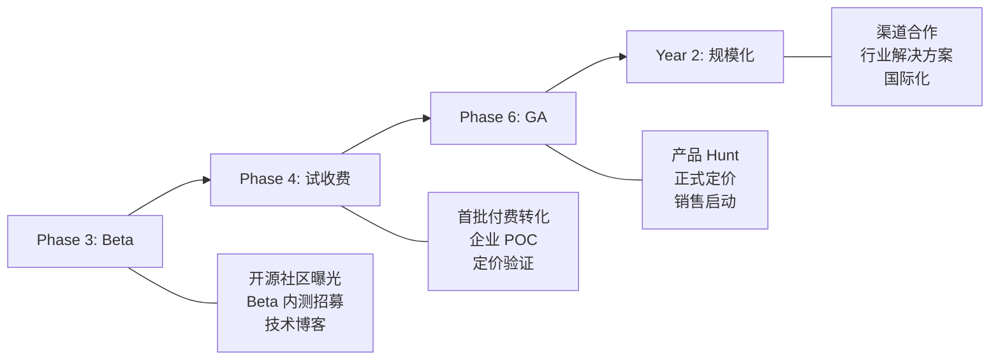

# EnvNexus 商业化计划

> 基于产品定位、技术架构和开发路线图，制定从 Beta 到 GA 的商业化路径。
>
> 最后更新：2026-03-23

---

## 一、产品定位与市场机会

### 1.1 一句话定位

EnvNexus（环枢）是面向开发者和 IT 运维团队的 **AI 原生环境治理平台**，通过"默认只读、审批式修复"的安全模型，帮助团队快速诊断和修复终端环境问题。

### 1.2 市场缺口

当前市场存在两极分化：

- **重型 RMM/MDM 工具**（如 Jamf、Microsoft Intune、ConnectWise）：功能全面但部署复杂、价格高、面向大型 IT 部门，不适合中小团队和开发者场景
- **轻型诊断脚本/AI 助手**（如 ChatGPT + 终端、各类 AI Shell 工具）：灵活但缺乏审计、审批、策略控制，无法满足企业合规要求

EnvNexus 填补中间地带：

```
轻型 AI 助手 <---- EnvNexus ----> 重型 RMM/MDM
（灵活但无治理）   （AI + 治理 + 审计）  （治理但无 AI）
```

### 1.3 核心差异化

| 能力 | ChatGPT + 终端 | 传统 RMM | EnvNexus |
|---|---|---|---|
| AI 诊断 | 有（但无结构化工具） | 无 | 有（结构化工具 + LLM） |
| 审批控制 | 无 | 部分 | 完整状态机 |
| 全量审计 | 无 | 有 | 有 |
| 多 LLM 支持 | 单一 | 不适用 | 7 种 Provider |
| 私有化部署 | 不可能 | 困难 | 原生支持 |
| 部署门槛 | 无 | 高 | 低（Docker Compose 或 K8s） |
| 价格 | 低/免费 | 高（$2-10/设备/月） | 中（$0-5/设备/月） |

---

## 二、目标客户画像

### 2.1 三级客户分层

#### Tier 1：个人开发者与小团队（Free / Pro）

- **画像**：1-10 人技术团队，独立开发者，技术创业者
- **痛点**：环境问题排查耗时、缺乏标准化诊断流程、不愿为重型 RMM 付费
- **获客渠道**：技术社区（GitHub、HackerNews、V2EX）、搜索引擎、技术博客
- **价值主张**：免费使用基础诊断，Pro 版解锁修复和多设备管理

#### Tier 2：中型技术团队（Enterprise）

- **画像**：20-200 人技术公司，有 IT 支持角色但非专职 IT 部门
- **痛点**：团队成员环境不一致导致 onboarding 慢、问题排查靠高级工程师、缺乏审计追踪
- **获客渠道**：Beta 内测 -> 口碑传播、技术决策者直达、合作伙伴推荐
- **价值主张**：标准化环境治理、减少高级工程师排障时间、完整审计链

#### Tier 3：大型企业 / 政企（Private）

- **画像**：500+ 人企业，有专职 IT/安全部门，合规要求严格
- **痛点**：终端环境管控要求高、需要私有化部署、外部 SaaS 不符合数据驻留要求
- **获客渠道**：企业销售 + 合作伙伴、行业展会、案例推荐
- **价值主张**：私有化部署、内网 LLM 接入、合规审计、RBAC 精细控制

### 2.2 买家角色矩阵

| 角色 | 关注点 | 决策权重 |
|---|---|---|
| 开发者 | 好用、快速、省时间 | 使用者（自下而上推动） |
| 技术 Lead | 团队标准化、减少排障时间 | 影响者 |
| IT 管理员 | 设备管控、合规审计 | 影响者 / 决策者 |
| CTO / VP of Eng | ROI、安全合规、可扩展性 | 最终决策者 |
| 安全负责人 | 数据安全、审计可追溯、私有化 | 否决权 |

---

## 三、定价模型

### 3.1 四档定价

| 档位 | 月价（按设备） | 年价（按设备） | 目标客户 |
|---|---|---|---|
| **Free** | $0 | $0 | 个人开发者 |
| **Pro** | $3/设备 | $30/设备 | 小团队 |
| **Enterprise** | $5/设备 | $50/设备 | 中型技术团队 |
| **Private** | 定制报价 | 定制报价 | 大型企业/政企 |

### 3.2 功能矩阵

| 功能 | Free | Pro | Enterprise | Private |
|---|---|---|---|---|
| 设备数量 | 3 台 | 50 台 | 无限 | 无限 |
| 只读诊断工具 | 全部 | 全部 | 全部 | 全部 |
| 审批式修复工具 | 3 个 | 全部 | 全部 | 全部 + 自定义 |
| LLM Provider | Ollama（本地） | 全部 | 全部 | 全部 + 内网模型 |
| LLM 调用次数/月 | 100 次 | 5,000 次 | 50,000 次 | 无限 |
| WebSocket 会话 | 1 并发 | 10 并发 | 50 并发 | 无限 |
| 审计保留 | 30 天 | 180 天 | 365 天 | 自定义 |
| RBAC | 单一管理员 | 3 种角色 | 5 种角色 | 自定义角色 |
| Webhook | 不支持 | 不支持 | 支持 | 支持 |
| 审计导出 | 不支持 | CSV | CSV + JSON | 全格式 + API |
| SSO / LDAP | 不支持 | 不支持 | OIDC | OIDC + LDAP + SAML |
| 私有化部署 | 不支持 | 不支持 | 不支持 | 支持 |
| SLA | 无 | 99.5% | 99.9% | 自定义 |
| 技术支持 | 社区 | 邮件（48h） | 工单（8h） | 专属支持 |

### 3.3 私有化定价

| 规模 | 年费参考 | 包含内容 |
|---|---|---|
| 小型（<100 设备） | ¥50,000 - ¥100,000 | 基础部署 + 1 年升级 + 邮件支持 |
| 中型（100-500 设备） | ¥150,000 - ¥300,000 | 完整部署 + 定制 + 1 年升级 + 工单支持 |
| 大型（500+ 设备） | ¥300,000+ | 完整部署 + 深度定制 + 驻场支持 + SLA |

### 3.4 附加收费项

| 项目 | 价格 |
|---|---|
| LLM 调用超量 | $0.01/次 |
| 额外存储（审计归档） | $0.5/GB/月 |
| 定制工具开发 | 按工时报价 |
| 培训服务 | ¥5,000/天 |
| 合规认证协助 | 按项目报价 |

---

## 四、收入预测模型

### 4.1 假设条件

- Phase 3（Beta 发布）后开始获客
- Beta 阶段免费使用，Phase 4 开始试收费
- Phase 6（GA）后正式商业化

### 4.2 用户增长预测（保守）

| 时间节点 | 累计注册 | Free | Pro | Enterprise | Private | MRR |
|---|---|---|---|---|---|---|
| M6（Beta 发布） | 50 | 48 | 2 | 0 | 0 | $0（Beta 免费） |
| M8（GA 候选） | 200 | 180 | 15 | 3 | 0 | $2,250 |
| M10（GA 发布） | 500 | 440 | 40 | 8 | 1 | $8,200 + 私有化 |
| M12 | 1,200 | 1,040 | 100 | 20 | 2 | $22,000 + 私有化 |
| M18 | 3,000 | 2,600 | 250 | 50 | 5 | $60,000 + 私有化 |

> MRR 计算：Pro 按平均 5 台设备 x $3 = $15/用户；Enterprise 按平均 30 台 x $5 = $150/用户

### 4.3 年度收入预测

| 年份 | SaaS ARR | 私有化收入 | 总收入 |
|---|---|---|---|
| Year 1 (M1-M12) | ~$100K | ~¥200K (~$28K) | ~$128K |
| Year 2 (M13-M24) | ~$500K | ~¥1,000K (~$140K) | ~$640K |
| Year 3 (M25-M36) | ~$1.5M | ~¥3,000K (~$420K) | ~$1.9M |

### 4.4 盈亏平衡分析

| 成本项 | 月均估算 |
|---|---|
| 云基础设施（SaaS 平台） | $500 - $2,000 |
| LLM API 费用（Hosted 模式） | $200 - $1,000 |
| 人力成本（2-3 人） | $8,000 - $15,000 |
| 其他（域名、证书、工具） | $200 |
| **总月成本** | **$8,900 - $18,200** |

盈亏平衡点：约 **M12-M14**（取决于私有化签单速度）。

关键假设：
- LLM 调用成本通过 Ollama 本地模型 + 用量上限控制
- 私有化客户贡献高 ARPU，是早期盈利的关键
- 人力成本控制在 2-3 人核心团队

---

## 五、GTM（Go-to-Market）策略

### 5.1 阶段化 GTM



### 5.2 Beta 阶段策略（Phase 3 后）

| 动作 | 目标 | 说明 |
|---|---|---|
| 开源核心组件 | 建立信任和社区 | agent-core 开源，platform 商业版 |
| 技术博客 | 曝光 + SEO | "AI 环境诊断" 系列文章（至少 5 篇） |
| Beta 内测计划 | 50 个注册用户 | 提供 Beta 通道，收集反馈 |
| 社区运营 | 用户粘性 | Discord/微信群，每周答疑 |

### 5.3 GA 阶段策略（Phase 6 后）

| 动作 | 目标 | 说明 |
|---|---|---|
| Product Hunt 发布 | 首周 500 注册 | 准备 Demo 视频 + 落地页 |
| 技术决策者直达 | 企业 Lead | LinkedIn + 技术会议 + 合作伙伴 |
| 案例输出 | 转化素材 | 至少 2 个 Beta 客户案例 |
| SEO + 内容营销 | 持续获客 | 产品文档站 + 博客 + 教程 |

### 5.4 获客漏斗

```
                ┌─────────────────────────────┐
                │  曝光（博客、社区、搜索）       │  目标: 10,000 访问/月
                └──────────────┬──────────────┘
                               ▼
                ┌─────────────────────────────┐
                │  注册（Free Plan）             │  转化率: 5% = 500 注册/月
                └──────────────┬──────────────┘
                               ▼
                ┌─────────────────────────────┐
                │  激活（完成首次诊断）           │  转化率: 40% = 200 激活/月
                └──────────────┬──────────────┘
                               ▼
                ┌─────────────────────────────┐
                │  付费转化（Pro/Enterprise）    │  转化率: 8% = 16 付费/月
                └──────────────┬──────────────┘
                               ▼
                ┌─────────────────────────────┐
                │  留存与扩展（加设备、升级档位） │  年留存: 80%
                └─────────────────────────────┘
```

---

## 六、竞品分析

### 6.1 竞品矩阵

| 产品 | 类型 | AI 能力 | 审批控制 | 审计 | 私有化 | 价格区间 |
|---|---|---|---|---|---|---|
| **Datadog Agent** | 监控平台 | 有限 | 无 | 完整 | 有 | $15-33/主机/月 |
| **Tailscale** | 网络连接 | 无 | 无 | 基础 | 有 | $0-18/用户/月 |
| **ConnectWise** | RMM | 无 | 有 | 完整 | 无 | $2-10/设备/月 |
| **Jamf** | MDM (Apple) | 有限 | 有 | 完整 | 有 | $3-15/设备/月 |
| **GitHub Copilot** | AI 编码 | 强 | 无 | 无 | 有 | $10-39/用户/月 |
| **Cursor/Windsurf** | AI IDE | 强 | 无 | 无 | 无 | $20-40/用户/月 |
| **EnvNexus** | AI 环境治理 | 强 | 完整 | 完整 | 有 | $0-5/设备/月 |

### 6.2 竞争定位

EnvNexus 不直接与上述任何产品竞争，而是填补交叉地带：

- 比 Datadog 更轻量、更专注于诊断修复（非全栈监控）
- 比 ConnectWise/Jamf 更现代、有 AI 能力、面向开发者
- 比 AI IDE 工具更专注于环境层面（非代码层面）
- 比纯 AI 助手有完整的治理、审批、审计能力

### 6.3 竞争壁垒

| 壁垒 | 说明 |
|---|---|
| 结构化工具体系 | 不是 AI 直接执行 Shell，而是通过白名单工具 + 审批链 |
| 多 LLM 路由 | 7 种 Provider + 本地兜底，不锁定单一 AI 供应商 |
| 安全审批模型 | 完整的 9 状态审批状态机，企业可信赖 |
| 私有化原生 | 架构从第一天支持私有化，非事后改造 |
| 全量审计 | 端到端可追溯，满足合规要求 |

---

## 七、成本结构

### 7.1 固定成本

| 项目 | 月费 | 说明 |
|---|---|---|
| 云服务器（SaaS 平台） | $300-1,000 | AWS/阿里云，初期小规模 |
| 域名 + SSL | $20 | envnexus.io + 通配符证书 |
| GitHub Team | $25 | 代码托管 + CI |
| 设计工具 | $15 | Figma |
| 监控与日志 | $50-200 | Grafana Cloud 或自建 |

### 7.2 可变成本

| 项目 | 单价 | 说明 |
|---|---|---|
| LLM API（OpenAI） | $0.003-0.06/千 token | Hosted 模式下由平台承担 |
| LLM API（DeepSeek） | $0.001-0.016/千 token | 低成本替代 |
| MinIO 存储 | $0.023/GB/月 | 审计归档 + 分发包 |
| 带宽 | 按量 | WS 长连接 + 包分发 |

### 7.3 人力成本

| 阶段 | 团队规模 | 月成本估算 |
|---|---|---|
| Phase 0-2 | 1-2 人 | $5,000-10,000 |
| Phase 3-4 | 2-3 人 | $10,000-18,000 |
| Phase 5-6 | 3-4 人 | $15,000-25,000 |
| GA 后运营 | 3-5 人 | $18,000-35,000 |

### 7.4 LLM 成本控制策略

LLM 调用是 SaaS 模式下最大的可变成本风险，控制策略：

| 策略 | 说明 |
|---|---|
| Ollama 本地优先 | Free/Pro 默认使用本地 Ollama，平台不承担 LLM 费用 |
| 用量上限 | 每档设置月度调用上限，超量需付费 |
| 模型分级 | 简单诊断用轻量模型（DeepSeek），复杂推理用高级模型 |
| 缓存 | 相似问题的诊断结果缓存，减少重复调用 |
| 批量定价 | 与 LLM Provider 谈企业级折扣 |

---

## 八、Beta 用户计划

### 8.1 Beta 招募目标

- **时间**：Phase 3 完成后（约第 18 周）
- **规模**：50 个注册用户，10 个活跃用户
- **构成**：
  - 30% 个人开发者（验证基础体验）
  - 50% 小团队（验证多设备管理）
  - 20% 企业用户（验证 RBAC + 审计需求）

### 8.2 Beta 招募渠道

| 渠道 | 预期转化 | 行动 |
|---|---|---|
| GitHub 开源社区 | 15 人 | agent-core 开源 + README 引导 |
| 技术博客/公众号 | 10 人 | 3-5 篇技术深度文章 |
| 技术社群（V2EX/掘金/HN） | 15 人 | 产品发布帖 + AMA |
| 个人网络 | 10 人 | 直接邀请 |

### 8.3 Beta 反馈框架

| 维度 | 收集方式 | 频率 |
|---|---|---|
| 功能满意度 | 问卷（NPS） | 每 2 周 |
| 使用障碍 | 用户访谈 | 每周 1-2 个 |
| Bug 反馈 | GitHub Issues | 持续 |
| 功能需求 | 反馈看板 | 持续 |
| 付费意愿 | 定价访谈 | Beta 中后期 |

---

## 九、首单目标

### 9.1 首单画像

- **类型**：中型技术团队或企业 IT 部门
- **规模**：20-50 台设备
- **需求**：环境标准化 + 问题排查效率提升 + 审计合规
- **预算**：$100-250/月（SaaS）或 ¥50,000-150,000/年（私有化）
- **决策者**：CTO 或 IT 负责人

### 9.2 首单时间线

| 时间 | 动作 |
|---|---|
| Phase 3 (M4.5) | Beta 发布，开始 POC 对接 |
| Phase 4 (M5.5) | 企业 POC 评估（2-4 周） |
| Phase 5 (M7) | 私有化部署试用（如需要） |
| Phase 6 (M8) | 正式签约 |

### 9.3 首单成功标准

- [ ] 客户环境中完成安装部署
- [ ] 客户完成至少 10 台设备注册
- [ ] 客户使用过诊断和修复功能
- [ ] 客户确认审计和审批满足合规要求
- [ ] 签署正式合同（年付或月付）

---

## 十、关键指标（KPI）

### 10.1 产品指标

| 指标 | Beta 目标 | GA 目标 | Year 1 目标 |
|---|---|---|---|
| 注册用户 | 50 | 500 | 3,000 |
| 月活跃用户 | 10 | 100 | 500 |
| 设备总数 | 50 | 1,000 | 10,000 |
| 首次诊断成功率 | > 80% | > 90% | > 95% |
| NPS | > 20 | > 40 | > 50 |

### 10.2 商业指标

| 指标 | GA 目标 | Year 1 目标 | Year 2 目标 |
|---|---|---|---|
| MRR | $2,000 | $20,000 | $50,000 |
| 付费客户数 | 5 | 50 | 200 |
| 私有化签约 | 0 | 2 | 5 |
| 客户留存率 | 70% | 80% | 85% |
| 平均 ARPU | $100/月 | $150/月 | $200/月 |

### 10.3 运营指标

| 指标 | 目标 |
|---|---|
| 客户获取成本 (CAC) | < $200 (SaaS), < ¥10,000 (私有化) |
| 客户生命周期价值 (LTV) | > 3x CAC |
| LLM 成本占收入比 | < 15% |
| 平台可用性 | > 99.5% |
| 平均响应时间（支持） | < 24h (Pro), < 8h (Enterprise) |

---

## 十一、风险与缓解

| 风险 | 概率 | 影响 | 缓解 |
|---|---|---|---|
| LLM 成本失控 | 中 | 高 | 本地模型优先 + 用量上限 + 缓存 |
| 竞品出现 | 高 | 中 | 尽早建立品牌 + 社区 + 客户锁定 |
| 企业客户销售周期长 | 高 | 中 | 同时推进 SaaS 小客户 + 企业大客户双线 |
| 私有化交付成本高 | 中 | 高 | 标准化 Helm Chart + 自动化部署 + 文档化 |
| 技术人才招聘困难 | 中 | 中 | 开源吸引贡献者 + 远程工作 |
| 合规认证要求 | 低 | 高 | 提前了解目标行业认证要求 |
| Free 用户不转化 | 中 | 中 | 优化 Free->Pro 引导 + 功能差异化 |

---

## 十二、开源策略

### 12.1 开源范围

| 组件 | 开源 | 说明 |
|---|---|---|
| agent-core | 开源 (Apache 2.0) | 核心诊断引擎，吸引社区贡献 |
| 工具插件 | 开源 (Apache 2.0) | 降低工具开发门槛 |
| libs/go | 开源 (Apache 2.0) | 共享库 |
| platform-api | 商业 | 核心商业价值 |
| session-gateway | 商业 | 核心商业价值 |
| console-web | 商业 | 前端体验 |
| agent-desktop | 商业 | 桌面体验 |

### 12.2 开源目标

- 建立技术社区信任
- 吸引工具贡献者（扩展诊断/修复工具集）
- 降低个人开发者使用门槛（agent-core 可独立使用）
- 形成"免费试用 -> 需要管理 -> 付费平台"的自然升级路径

---

## 附录：商业化时间线与路线图对齐

| 路线图阶段 | 商业化动作 | 收入状态 |
|---|---|---|
| Phase 0 (W1-2) | 注册品牌域名、准备官网 | - |
| Phase 1 (W3-7) | 产品落地页上线、Demo 视频制作 | - |
| Phase 2 (W8-14) | 定价模型初稿、Beta 招募页面 | - |
| Phase 3 (W15-18) | **Beta 发布**、首批用户入驻、客户访谈 | $0（Beta 免费） |
| Phase 4 (W19-23) | 试收费、企业 POC、合同准备 | 首批小额收入 |
| Phase 5 (W24-28) | 私有化报价、企业意向客户 | 私有化意向金 |
| Phase 6 (W29-32) | **GA 发布**、计费上线、首单签约 | **正式收入开始** |
