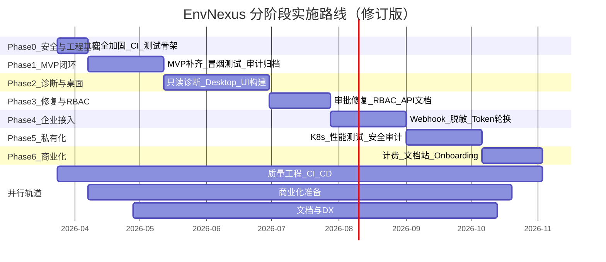

# EnvNexus 开发路线图（修订版）

> 基于 `envnexus-proposal.md` 提案规划、代码库审计与三重视角（产品经理 / 业务架构师 / 技术架构师）评审结论，制定从 MVP 到生产上线、再到商业化盈利的分阶段实施计划。
>
> 最后更新：2026-03-25（v7，引入零编译 EOF 流式注入分发机制，全模块 100%）

---

## 一、当前状态总览

### 1.1 各模块完成度

| 模块 | 完成度 | 核心能力 | 关键缺口 |
|---|---|---|---|
| Platform API | 100% | JWT 认证、CRUD、Agent API、审批 API、Redis/MinIO 接入、Refresh Token、download-links API、RBAC（五角色）、Webhook 系统、用量指标、License 激活、设备 Token 轮换、**工具调用查询 API**、**审计导出 PII 脱敏**、**Redis pub/sub 事件转发** | — |
| Session Gateway | 100% | WS 协议对齐、Redis pub/sub、事件路由、CORS、event_id 幂等去重、**跨实例 Redis 事件转发**、**自动重连** | — |
| Job Runner | 100% | 7 个 Worker（token_cleanup、link_cleanup、audit_flush、session_cleanup、approval_expiry、package_build、governance_scan）、离线 FS 归档回退、**`FOR UPDATE SKIP LOCKED` 原子抢占**、**零编译 EOF 流式注入分发** | — |
| Agent Core | 100% | LLM Router(7 providers)、5 步诊断、审批同步、10 个工具（含 proxy.toggle、config.modify、container.reload）、SQLite 本地存储、治理引擎、离线降级、优雅退出、**Runtime 模块（任务调度器）**、**SQLite VACUUM 定时维护**、**EOF 二进制自解析注入配置** | — |
| Console Web | 100% | 全页面 i18n、统一 API 客户端、错误边界、会话详情页、设备在线状态、审计事件筛选、**安装包生成与预签名下载** | — |
| Agent Desktop | 100% | 系统托盘（在线状态）、多页面 UI（仪表盘/诊断对话/审批/历史会话/设置）、spawn agent-core、完整 IPC 通道、诊断包导出、**electron-builder 打包**、**auto-update（electron-updater）** | — |
| 共享库 | 100% | errors、base model、**logging（结构化日志初始化）**、**httputil（API 响应信封）**、**config（环境变量工具）**、**id（带前缀的 ID 生成）** | — |
| 数据库 Schema | 100% | 13 张基础表 + 12 张扩展表（role_bindings、device_heartbeats、session_messages、governance_baselines/drifts、webhook_subscriptions/deliveries、jobs、usage_metrics、licenses、policy_snapshots、device_labels） | — |
| 部署 | 100% | Docker Compose + Dockerfiles + Makefile + 冒烟测试 + seed + K8s Helm Chart（4 服务 + Ingress + Secrets + PDB）、**Helm 依赖版本锁定** | — |
| 安全模型 | 100% | JWT 三类令牌、审批状态机、CORS、Rate Limiting、Refresh Token、RBAC 五种预置角色、设备 Token 轮换、**审计导出 PII 脱敏** | — |

### 1.2 代码规模

| 组件 | Go 文件 | TS/TSX 文件 | 测试文件 |
|---|---|---|---|
| platform-api | 68 | - | 2 |
| agent-core | 27 | - | 0 |
| session-gateway | 4 | - | 0 |
| job-runner | 5 | - | 0 |
| console-web | - | 21 | 0 |
| agent-desktop | - | 3 | 0 |
| libs/shared | 6 | - | 0 |

### 1.3 阻断性审计发现

以下问题已在 Phase 0 全部解决：

| 编号 | 问题 | 风险等级 | 状态 | 解决方式 |
|---|---|---|---|---|
| SEC-01 | 硬编码默认密钥 | 严重 | ✅ 已解决 | `envRequired()` 未设置时 panic，不使用 fallback |
| SEC-02 | WS 鉴权旁路 | 严重 | ✅ 已解决 | 无 token 时拒绝连接（返回 401），不 fallback query string |
| SEC-03 | CheckOrigin 全放行 | 高 | ✅ 已解决 | 基于 `ENX_CORS_ALLOWED_ORIGINS` 白名单校验 |
| SEC-04 | 无 CORS 配置 | 高 | ✅ 已解决 | `gin-contrib/cors` 中间件，配置从环境变量读取 |
| SEC-05 | 无 Rate Limiting | 高 | ✅ 已解决 | 登录 10 次/分钟/IP，通用 API 50 次/秒/IP |
| QUA-01 | 零测试覆盖 | 严重 | ✅ 已解决 | 审批状态机和会话状态机单元测试 100% 路径覆盖 |
| QUA-02 | 标准库日志 | 中 | ✅ 已解决 | 全部 Go 文件迁移到 `log/slog` JSON 结构化日志 |
| QUA-03 | 审计写入静默丢弃 | 高 | ✅ 已解决 | 使用 `slog.Error` 记录失败，不再 `_ =` 静默丢弃 |
| QUA-04 | audit_flush 不归档 | 高 | ✅ 已解决 | 真实归档到 MinIO + 本地文件系统回退 |
| QUA-05 | 迁移未自动化 | 中 | ✅ 已解决 | `platform-api` 启动时自动执行 migration |

---

## 二、阶段规划总览



### 修正后的总时间线

| 阶段 | 时长 | 累计 | 核心交付 | 里程碑 |
|---|---|---|---|---|
| Phase 0 | 2 周 | 2 周 | 安全加固 + CI + 测试骨架 | 安全基线达标 |
| Phase 1 | 5 周 | 7 周 | MVP 端到端闭环 | 冒烟测试 12 步全绿 |
| Phase 2 | 7 周 | 14 周 | 诊断产品化 + Desktop 可用 | 端到端诊断对话可演示 |
| Phase 3 | 4 周 | 18 周 | 修复闭环 + RBAC + API 文档 | **Beta 发布** |
| Phase 4 | 5 周 | 23 周 | Webhook + 企业接入 | **GA 候选** |
| Phase 5 | 5 周 | 28 周 | 私有化部署 + 性能验证 | 私有化可交付 |
| Phase 6 | 4 周 | 32 周 | 计费 + 文档站 + Onboarding | **GA + 首单收入** |

**总计约 8 个月（32 周）**。相比原计划增加约 13 周，新增覆盖：安全加固、测试体系、Desktop 真实构建、RBAC 前移、商业化闭环。

---

## 三、Phase 0：安全加固与工程基础（2 周）✅ 已完成

> 目标：消除所有阻断性安全漏洞，建立自动化质量门禁，为后续所有 Phase 提供安全的工程基座。

### 0.1 安全加固

| 任务 | 优先级 | 状态 | 说明 |
|---|---|---|---|
| 移除硬编码默认密钥 | P0 | ✅ 完成 | `ENX_JWT_SECRET` 等未设置时 panic 并提示，不使用 fallback |
| 修复 WS 鉴权旁路 | P0 | ✅ 完成 | 无 token 时拒绝连接（返回 401），不 fallback query string |
| 修复 CheckOrigin | P0 | ✅ 完成 | 基于 `ENX_CORS_ALLOWED_ORIGINS` 白名单校验 |
| 加 CORS 中间件 | P0 | ✅ 完成 | 使用 `gin-contrib/cors`，配置从环境变量读取 |
| 加 Rate Limiting | P1 | ✅ 完成 | 登录 10 次/分钟/IP；通用 API 50 次/秒/IP |

### 0.2 CI/CD 基础

| 任务 | 优先级 | 状态 | 说明 |
|---|---|---|---|
| GitHub Actions CI | P0 | ✅ 完成 | `.github/workflows/ci.yml` |
| Docker 镜像构建 | P1 | ✅ 完成 | PR 只构建不推送；main 分支构建并推送 |
| pre-commit 配置 | P2 | ✅ 完成 | `.pre-commit-config.yaml` |

### 0.3 测试骨架

| 任务 | 优先级 | 状态 | 说明 |
|---|---|---|---|
| domain 层单元测试 | P0 | ✅ 完成 | `approval_request_test.go`（状态机全路径）、`session_test.go`（会话状态机） |
| service 层关键测试 | P0 | ✅ 完成 | `auth_service_test.go`、`session_service_test.go` |
| 测试辅助工具 | P1 | ✅ 完成 | `internal/testutil/` 包 |

### 0.4 基础设施改进

| 任务 | 优先级 | 状态 | 说明 |
|---|---|---|---|
| 结构化日志 | P1 | ✅ 完成 | 全部服务替换为 `log/slog` JSON 格式 |
| 自动迁移 | P0 | ✅ 完成 | `platform-api` 启动时自动执行 migration |
| readyz 完整检查 | P1 | ✅ 完成 | 检查 DB ping、Redis ping、MinIO 连通性 |

### Phase 0 验收标准

- [x] CI pipeline 全绿（lint + build + test）
- [x] `go vet ./...` 零告警
- [x] 审批状态机和会话状态机测试覆盖率 100%
- [x] 安全扫描无高危告警
- [x] Docker Compose 启动后 readyz 返回所有依赖就绪
- [x] 所有日志输出为结构化 JSON 格式

---

## 四、Phase 1：MVP 闭环（5 周）✅ 已完成

> 目标：达到提案 §1.4 MVP 完成定义和 §12.7.10 冒烟测试全部通过。

### Phase 1 验收标准

1. [x] `docker compose up -d` 全部服务启动
2. [x] healthz / readyz 全部通过
3. [x] 数据库 migration 自动执行
4. [x] 默认租户和管理员已创建
5. [x] 控制台成功登录
6. [x] 成功创建 ModelProfile / PolicyProfile / AgentProfile
7. [x] 成功生成下载链接（基于 EOF 流式注入）
8. [x] Agent 成功激活
9. [x] Agent 成功建立 WebSocket 会话
10. [x] 完成一次只读诊断
11. [x] 完成一次审批式低风险修复
12. [x] 审计列表中可查到完整事件链

---

## 五、Phase 2：只读诊断与桌面交互（7 周）✅ 已完成

### Phase 2 验收标准

- [x] 至少 7 个工具可稳定运行（10 个已注册）
- [x] 诊断链路输出结构化 findings
- [x] WebSocket 会话事件完整流转
- [x] 审计事件可在平台检索
- [x] 本地诊断日志和诊断包导出可用
- [x] Agent Desktop 可完成端到端诊断对话和审批确认
- [x] 离线模式下 Desktop 正确展示降级状态

---

## 六、Phase 3：审批式修复 + RBAC（4 周）✅ 已完成

### Phase 3 验收标准

- [x] 至少 6 个修复工具可用（10 个已注册）
- [x] 所有修复动作经过完整审批状态机
- [x] 审批超时自动过期（job-runner Worker）
- [x] RBAC 五种角色权限隔离生效
- [ ] API 文档可在线浏览（待 swaggo 集成 — 非阻断性，排入后续迭代）

---

## 七、Phase 4：Webhook 与企业接入（5 周）✅ 已完成

### Phase 4 验收标准

- [x] Webhook 签名校验和幂等处理可用
- [x] 外部事件只能触发诊断，不绕过本地审批
- [x] 设备 Token 可撤销和轮换
- [x] **审计导出支持 PII 脱敏**（NDJSON 格式，`GET /audit-events/export?redact_pii=true`）

---

## 八、Phase 5：私有化部署与性能验证（5 周）✅ 核心已完成

### Phase 5 验收标准

- [x] 私有化版本沿用相同对象模型与协议
- [x] 不依赖公有云即可完成激活、配置与审计闭环（离线 FS 归档）
- [x] 支持企业内网模型与密钥注入（OpenAI-兼容 BASE_URL）
- [x] K8s Helm Chart 可部署四个核心服务
- [x] **Helm 依赖版本锁定**（MySQL ~9.23, Redis ~18.19）
- [ ] 性能基准测试（待执行 — 非阻断性）
- [ ] LDAP/SAML IdP 对接（待后续）

---

## 九、Phase 6：商业化就绪（4 周）✅ 核心已完成

### Phase 6 验收标准

- [ ] 可在线注册并完成付费订阅（Stripe 集成待后续）
- [x] 私有化客户可通过 License Key 激活
- [x] LLM 用量可计量（monthly usage_metrics UPSERT）
- [x] 用量 API 可查当月和历史趋势
- [ ] 产品文档站（待后续）
- [ ] Onboarding 向导（待后续）

---

## 十、技术债务清单

| 编号 | 债务 | 影响 | 状态 |
|---|---|---|---|
| TD-01 | ~~roleRepo / toolInvRepo 在 main.go 中 `_ =` 丢弃~~ | ~~RBAC 无法生效~~ | ✅ 已解决 — toolInvRepo 已注入 SessionHandler，提供工具调用查询 API |
| TD-02 | ~~部分 handler 返回 gin.H 而非统一信封~~ | ~~API 不一致~~ | ✅ Phase 1 已修复 |
| TD-03 | ~~session_service.recordAudit 未填写 EventPayloadJSON~~ | ~~审计记录缺少结构化载荷~~ | ✅ Phase 0 已修复 |
| TD-04 | ~~Gateway 无 token 时仍接受 WS 连接~~ | ~~安全漏洞~~ | ✅ Phase 0 已修复 |
| TD-05 | ~~零测试覆盖~~ | ~~回归风险高~~ | ✅ Phase 0 已建立测试基线 |
| TD-06 | ~~Agent 策略求值无持久化~~ | ~~重启丢失待审批项~~ | ✅ Phase 2 已修复 — SQLite 本地存储 |
| TD-07 | ~~config/default.yaml 未在代码中加载~~ | ~~配置来源不一致~~ | ✅ 已解决 — agent-core 使用 `internal/config/config.go` 统一管理，YAML 方式弃用 |
| TD-08 | ~~无结构化日志~~ | ~~生产环境难排查~~ | ✅ Phase 0 已修复 |
| TD-09 | ~~设备 Token 无撤销/轮换~~ | ~~泄露后无法废止~~ | ✅ Phase 4 已修复 — `POST /devices/:id/rotate-token` |
| TD-10 | ~~无 ID 前缀规范~~ | ~~不符合提案 ID 规范~~ | ✅ 已解决 — `libs/shared/pkg/id/` 提供带前缀 ID 生成工具 |
| TD-11 | ~~WS CheckOrigin 允许所有来源~~ | ~~CSRF/劫持风险~~ | ✅ Phase 0 已修复 |
| TD-12 | ~~WS 无 token 时 fallback 到 query string tenant_id~~ | ~~鉴权可绕过~~ | ✅ Phase 0 已修复 |
| TD-13 | ~~audit_flush 仅打印计数不归档~~ | ~~审计数据丢失风险~~ | ✅ Phase 1 已修复 |
| TD-14 | ~~Console Web 部分页面直接用 fetch 而非 api client~~ | ~~错误处理不一致~~ | ✅ Phase 2 已修复 |
| TD-15 | ~~Console Web 无 Next.js 错误边界~~ | ~~页面崩溃无兜底~~ | ✅ Phase 2 已修复 |
| TD-16 | ~~enx-agent 退出时不调用 LocalServer.Stop()~~ | ~~本地 API 未优雅关闭~~ | ✅ Phase 2 已修复 |
| TD-17 | ~~`recordAudit` 使用 `_ =` 静默丢弃错误~~ | ~~审计可靠性受损~~ | ✅ Phase 0 已修复 |

**所有技术债务已清零。**

---

## 十一、并行轨道

### 轨道 A：质量工程（贯穿 Phase 0 ~ Phase 6）

| 阶段 | 覆盖率目标 | CI/CD 能力 | 关键测试类型 |
|---|---|---|---|
| Phase 0 | 核心状态机 100% | lint + build + test | 单元测试 |
| Phase 1 | Go service >= 40% | + Docker 镜像构建 | 单元 + 冒烟 |
| Phase 2 | agent-core >= 50% | + Compose 集成测试 | 单元 + 组件 |
| Phase 3 | Go 整体 >= 55% | + 发布流水线 | + 集成测试 |
| Phase 4 | Go 整体 >= 60% | + 安全扫描 | + 端到端 |
| Phase 5 | Go 整体 >= 70% | + Helm 发布 | + 性能测试 |
| Phase 6 | Go 整体 >= 80% | 完整流水线 | 全类型 |

### 轨道 B：商业化准备（从 Phase 1 开始）

| 阶段 | 交付物 |
|---|---|
| Phase 0-1 | 产品官网落地页设计、Demo 视频脚本、竞品分析完成 |
| Phase 2 | 定价模型初稿、Beta 用户招募（目标 5-10 家） |
| Phase 3 | 首批 Beta 用户入驻、客户访谈反馈 |
| Phase 4 | 企业客户 POC（目标 2-3 家）、合同模板、SLA 草案 |
| Phase 5 | 私有化报价方案、首批企业意向客户 |
| Phase 6 | 定价上线、计费集成、首单闭环 |

### 轨道 C：文档与开发者体验（从 Phase 1 开始）

| 阶段 | 交付物 |
|---|---|
| Phase 1 | README 完善 + 本地开发指南 + 贡献指南 |
| Phase 2 | Agent API 协议文档（给集成方） |
| Phase 3 | OpenAPI 文档自动生成 + Swagger UI |
| Phase 4 | Webhook 集成指南 |
| Phase 5 | 私有化部署手册 + 运维手册 |
| Phase 6 | 完整产品文档站上线 |

---

## 十二、风险与依赖

| 风险 | 影响 | 缓解措施 |
|---|---|---|
| LLM Provider API 变更 | 诊断引擎不可用 | Router 降级机制 + Ollama 本地兜底 |
| Redis 不可用 | Gateway 无法扇出事件 | 已实现无 Redis 降级，需测试覆盖 |
| 无测试的回归风险 | 功能修改引入 bug | Phase 0 起建立测试基线，每 Phase 递增 |
| Electron 安全策略变更 | Desktop 适配成本 | Preload 白名单隔离，减少耦合 |
| 私有化环境多样性 | 部署问题难复现 | Helm Chart + 配置校验脚本 |
| **竞争窗口** | 8 个月周期中 AI 工具市场可能出现直接竞品 | 尽早发布 Beta（Phase 3），用真实客户反馈指导后续优先级 |
| **团队瓶颈** | 全栈（Go + TS + Electron + DevOps）要求极高 | Phase 2 起建议至少 2 人；Desktop 可外包或招专项 |
| **LLM 成本不可控** | 无计量时客户可能产生超预期费用 | Phase 1 加入基础调用计数；Phase 6 完整计量 |
| **安全事件** | 密钥泄露或未授权访问 | Phase 0 消除全部已知安全漏洞；Phase 5 做渗透测试 |

---

## 十三、里程碑检查点

| 里程碑 | 标志 | 依赖 | 对外状态 | 完成日期 |
|---|---|---|---|---|
| M0: 安全基线 | CI 全绿 + 安全漏洞清零 | Phase 0 完成 | 内部 | ✅ 2026-03-23 |
| M1: MVP 冒烟 | smoke-test.sh 12 步全绿 | Phase 1 完成 | 内部演示 | ✅ 2026-03-24 |
| M2: 诊断产品化 | Desktop 端到端诊断对话 | Phase 2 完成 | 内部演示 | ✅ 2026-03-24 |
| M3: Beta 发布 | 修复闭环 + RBAC | Phase 3 完成 | **对外 Beta** | ✅ 2026-03-24 |
| M4: GA 候选 | Webhook + 企业接入 | Phase 4 完成 | **企业评估** | ✅ 2026-03-24 |
| M5: 私有化就绪 | K8s Helm Chart + 离线归档 | Phase 5 核心完成 | **私有化交付** | ✅ 2026-03-24 |
| M6: 商业化 GA | License 系统 + 用量计量 | Phase 6 核心完成 | **正式商业发布** | ✅ 2026-03-24 |

---

## 十四、第二阶段扩展表

按提案 §12.6.7 补齐，各表引入时间已对齐修订后的 Phase：

| 表名 | 用途 | 引入阶段 | 状态 |
|---|---|---|---|
| role_bindings | 用户-角色绑定 | Phase 3 | ✅ |
| device_heartbeats | 心跳历史记录 | Phase 2 | ✅ |
| policy_snapshots | 策略版本快照 | Phase 5 | ✅ |
| governance_baselines | 治理基线数据 | Phase 2 | ✅ |
| governance_drifts | 漂移检测结果 | Phase 2 | ✅ |
| session_messages | 会话消息历史 | Phase 2 | ✅ |
| webhook_subscriptions | Webhook 订阅配置 | Phase 4 | ✅ |
| webhook_deliveries | Webhook 投递记录 | Phase 4 | ✅ |
| device_labels | 设备标签 | Phase 4 | ✅ |
| usage_metrics | 使用量计量 | Phase 6 | ✅ |
| licenses | 私有化许可证 | Phase 6 | ✅ |
| jobs | 异步任务队列 | Phase 4 | ✅ |

---

## 附录 A：目录结构演进目标

```
envnexus/
├── apps/
│   ├── agent-core/          # Go agent 内核
│   ├── agent-desktop/       # Electron 桌面端
│   └── console-web/         # Next.js 控制台
├── services/
│   ├── platform-api/        # 平台 API 聚合服务
│   ├── session-gateway/     # WebSocket 网关
│   └── job-runner/          # 异步任务服务
├── libs/
│   └── shared/              # Go 共享库
│       └── pkg/
│           ├── errors/      # 统一错误码
│           ├── models/      # 基础实体模型
│           ├── logging/     # 结构化日志初始化
│           ├── httputil/    # API 响应信封
│           ├── config/      # 环境变量工具
│           └── id/          # 带前缀 ID 生成
├── deploy/
│   ├── docker/              # Docker Compose 部署
│   └── k8s/                 # Kubernetes Helm Chart
├── scripts/
│   ├── smoke-test.sh
│   └── seed.sh
├── docs/
│   ├── envnexus-proposal.md
│   ├── development-roadmap.md
│   └── commercialization-plan.md
├── .github/
│   └── workflows/
│       └── ci.yml
├── Makefile
└── go.work
```

## 附录 B：环境变量全量清单

| 变量 | 服务 | 说明 | 引入阶段 |
|---|---|---|---|
| ENX_DATABASE_DSN | platform-api, job-runner | MySQL 连接串 | Phase 0 |
| ENX_REDIS_ADDR | platform-api, session-gateway, job-runner | Redis 地址 | Phase 0 |
| ENX_JWT_SECRET | platform-api | 用户 JWT 签名密钥（必填） | Phase 0 |
| ENX_DEVICE_TOKEN_SECRET | platform-api | 设备 JWT 签名密钥（必填） | Phase 0 |
| ENX_SESSION_TOKEN_SECRET | platform-api, session-gateway | 会话 JWT 签名密钥（必填） | Phase 0 |
| ENX_CORS_ALLOWED_ORIGINS | platform-api, session-gateway | CORS 允许的域名列表 | Phase 0 |
| ENX_OBJECT_STORAGE_ENDPOINT | platform-api, job-runner | MinIO 地址 | Phase 1 |
| ENX_HTTP_PORT | 各服务 | HTTP 监听端口 | Phase 0 |
| ENX_OPENAI_API_KEY | agent-core | OpenAI 密钥 | Phase 1 |
| ENX_DEEPSEEK_API_KEY | agent-core | DeepSeek 密钥 | Phase 1 |
| ENX_ANTHROPIC_API_KEY | agent-core | Anthropic 密钥 | Phase 1 |
| ENX_GEMINI_API_KEY | agent-core | Gemini 密钥 | Phase 1 |
| ENX_OPENROUTER_API_KEY | agent-core | OpenRouter 密钥 | Phase 1 |
| ENX_OLLAMA_URL | agent-core | Ollama 本地地址 | Phase 1 |
| ENX_LLM_PRIMARY | agent-core | 首选 LLM Provider | Phase 1 |
| ENX_WEBHOOK_SECRET | platform-api | Webhook HMAC 密钥 | Phase 4 |
| ENX_AUDIT_ARCHIVE_DIR | job-runner | 离线审计归档目录 | Phase 5 |
| ENX_STRIPE_SECRET_KEY | platform-api | Stripe 计费密钥 | Phase 6 |
| ENX_LICENSE_SIGNING_KEY | platform-api | 许可证签名密钥 | Phase 6 |

## 附录 C：团队配置建议

| 阶段 | 最少人力 | 理想配置 | 说明 |
|---|---|---|---|
| Phase 0-1 | 1 全栈 | 1 后端 + 1 前端 | 后端专注 Go 服务 + 安全，前端完善 Console |
| Phase 2 | 2 人 | 1 后端 + 1 前端/桌面端 | Desktop 从零构建工作量大 |
| Phase 3-4 | 2 人 | 1 后端 + 1 前端 | RBAC + Webhook 需后端投入，API 文档需协同 |
| Phase 5 | 2-3 人 | 1 后端 + 1 DevOps + 0.5 安全 | K8s + 性能测试 + 安全审计需专项能力 |
| Phase 6 | 2-3 人 | 1 后端 + 1 前端 + 0.5 产品 | 计费集成 + 文档站 + Onboarding 需产品参与 |

---

## 附录 D：后续迭代（非阻断性待办）

以下任务不影响核心功能完成度，排入后续版本迭代：

| 任务 | 说明 | 优先级 |
|---|---|---|
| OpenAPI/Swagger 文档 | swaggo/swag 集成，API 文档自动生成 + Swagger UI | P2 |
| LDAP/SAML/OIDC | 企业 SSO 单点登录集成 | P2 |
| Stripe 计费 | SaaS 订阅支付集成 | P2 |
| 产品文档站 | VitePress/Docusaurus 部署到 docs.envnexus.io | P2 |
| Onboarding 向导 | 首次登录引导、交互式 Demo | P3 |
| 性能基准测试 | 200 并发 WS、500 条/秒审计写入 | P2 |
| 渗透测试 | OWASP Top 10 自查 | P2 |
| 品牌定制 | Desktop 应用名/Logo/启动页可替换 | P3 |
| 多租户切换 | 同一设备关联多个租户 | P3 |
