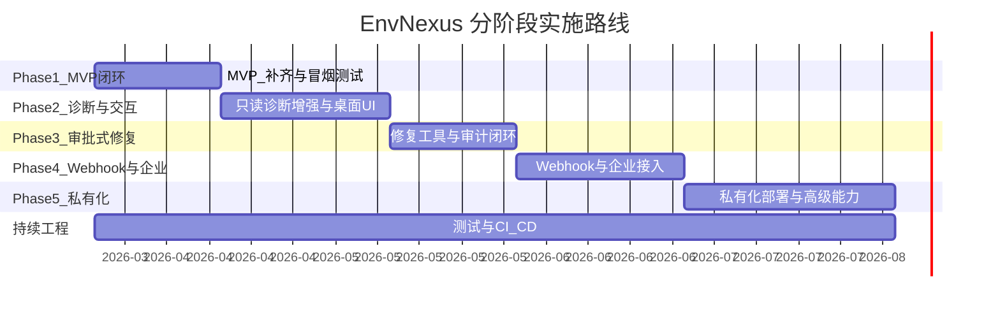

# EnvNexus 开发路线图

> 基于 `envnexus-proposal.md` 提案规划与当前代码库完成度评估，制定从 MVP 到成熟产品的分阶段实施计划。
>
> 最后更新：2026-03-23

---

## 一、当前状态总览

### 1.1 各模块完成度

| 模块 | 完成度 | 核心能力 | 关键缺口 |
|---|---|---|---|
| Platform API | 55% | JWT 认证、CRUD、Agent API、审批 API | Webhook、RBAC、Redis/MinIO 接入、readyz |
| Session Gateway | 50% | WS 协议对齐、Redis pub/sub、事件路由 | 严格鉴权、幂等处理、Platform 内部客户端 |
| Job Runner | 20% | 4 个清理 Worker | Job 模型/队列、package_build、audit_flush 实际归档 |
| Agent Core | 45% | LLM Router(7 providers)、5 步诊断、审批同步、5 个工具 | SQLite、治理引擎、完整本地 API |
| Console Web | 50% | 主要页面、AuthContext、API 客户端 | i18n 全覆盖、模块化结构 |
| Agent Desktop | 15% | Electron 骨架 + 1 个 IPC | 托盘、更新、诊断/审批/聊天 UI |
| 共享库 | 10% | errors + base model | 全部 libs/go 和 libs/ts 包 |
| 数据库 Schema | 90% | 13 张表 + seed | 自动迁移、第二阶段扩展表 |
| 部署 | 55% | Docker Compose + Dockerfiles + Makefile | CI/CD、冒烟测试、K8s |
| 安全模型 | 35% | JWT 三类令牌、审批状态机 | RBAC、Refresh Token、设备轮换 |

### 1.2 代码规模

| 组件 | Go 文件 | TS/TSX 文件 | 测试文件 |
|---|---|---|---|
| platform-api | 66 | - | 0 |
| agent-core | 25 | - | 0 |
| session-gateway | 4 | - | 0 |
| job-runner | 5 | - | 0 |
| console-web | - | 21 | 0 |
| agent-desktop | - | 2 | 0 |

**关键发现：整个项目无任何测试文件。**

---

## 二、阶段规划总览



---

## 三、Phase 1：MVP 闭环（预计 3 周）

> 目标：达到提案 §1.4 MVP 完成定义 和 §12.7.10 冒烟测试全部通过。

### 1.1 阻塞项：Platform API 补齐

| 任务 | 优先级 | 说明 |
|---|---|---|
| readyz 完整检查 | P0 | 检查 DB 连接、Redis 连接、MinIO 连接、migration 版本 |
| Redis 客户端接入 | P0 | platform-api main.go 初始化 Redis，用于缓存和短状态 |
| MinIO 客户端接入 | P1 | 初始化对象存储客户端，挂载到 package service |
| 自动 migration | P0 | 启动时自动执行 DB migration 或提供 init 命令 |
| 统一响应信封 | P1 | 所有 handler 统一使用 RespondSuccess/RespondError |
| download-links API | P1 | POST /tenants/:tenantId/download-links 签名 URL 语义 |
| Refresh Token | P1 | access_token + refresh_token 双 token 生命周期 |

**涉及文件：**
- `services/platform-api/cmd/platform-api/main.go` — Redis/MinIO 初始化
- `services/platform-api/internal/middleware/response.go` — 统一到所有 handler
- `services/platform-api/internal/handler/http/*.go` — 逐个修正为 RespondSuccess

### 1.2 阻塞项：Session Gateway 集成

| 任务 | 优先级 | 说明 |
|---|---|---|
| Platform API 内部客户端 | P0 | 会话创建后通过 HTTP 通知 Gateway 推送 session.created |
| 严格 WS 鉴权 | P0 | 无 token 时拒绝 WS 连接 |
| session.created 主动推送 | P0 | Platform 创建会话后通知 Gateway 向设备下发事件 |

**涉及文件：**
- `services/session-gateway/internal/handler/ws/handler.go` — 拒绝无 token 连接
- `services/platform-api/internal/service/session/session_service.go` — 创建后调用 Gateway

### 1.3 阻塞项：Agent Core 闭环

| 任务 | 优先级 | 说明 |
|---|---|---|
| WS 连接携带 token | P0 | bootstrap 获取 session token 后传入 WS client |
| 诊断会话端到端 | P0 | session.created -> diagnosis -> tool -> audit 完整链路 |
| 审批后工具执行上报 | P0 | 执行后通知 platform succeeded/failed |

### 1.4 冒烟测试脚本

| 任务 | 优先级 | 说明 |
|---|---|---|
| 编写 smoke-test.sh | P0 | 按 §12.7.10 的 12 步顺序自动化验证 |
| docker compose 健康检查增强 | P1 | 所有服务 healthcheck 对齐 readyz |

**产出文件：**
- `scripts/smoke-test.sh` — 自动化冒烟测试
- `scripts/seed.sh` — 初始化数据（租户 + 管理员）

### 1.5 Console Web 基础完善

| 任务 | 优先级 | 说明 |
|---|---|---|
| i18n 全覆盖 | P1 | 所有页面文案通过 i18n 字典管理 |
| 登录 + 配置 + 下载链路可操作 | P0 | 确保控制台可完成 §12.7.10 步骤 5-7 |

### Phase 1 验收标准

按提案 §12.7.10 冒烟测试：

1. `docker compose up -d` 全部服务启动
2. healthz / readyz 全部通过
3. 数据库 migration 自动执行
4. 默认租户和管理员已创建
5. 控制台成功登录
6. 成功创建 ModelProfile / PolicyProfile / AgentProfile
7. 成功生成下载链接
8. Agent 成功激活
9. Agent 成功建立 WebSocket 会话
10. 完成一次只读诊断
11. 完成一次审批式低风险修复
12. 审计列表中可查到完整事件链

---

## 四、Phase 2：只读诊断与本地交互（预计 4 周）

> 目标：达到提案 §13 Phase 2 验收标准。

### 2.1 Agent Core 增强

| 任务 | 说明 |
|---|---|
| SQLite 本地存储 | data/agent.db 用于会话、审计、配置缓存 |
| store 包抽象 | internal/store/ 统一管理本地持久化 |
| 治理引擎 v1 | CaptureBaseline / DetectDrift 基础实现 |
| 扩展只读工具 | 至少新增 2 个：read_disk_usage, read_process_list |
| runtime 模块 | 主事件循环和任务调度 |
| 诊断包导出 | POST /local/v1/diagnostics/export 生成本地诊断报告 |
| 离线降级模式 | 平台不可达时仅开放只读能力 |

### 2.2 Agent Desktop 核心 UI

| 任务 | 说明 |
|---|---|
| 系统托盘 | 最小化到托盘，显示连接状态 |
| Chat UI | 渲染诊断对话流（renderer/modules/chat） |
| 诊断结果展示 | 结构化展示 findings 和 recommended_actions |
| 审批确认 UI | 展示待审批工具、风险等级，支持确认/拒绝 |
| Preload 白名单 | 仅暴露安全 IPC 通道，renderer 不直接访问 FS/Shell |
| spawn agent-core | main 进程管理 agent-core 子进程生命周期 |

### 2.3 Console Web 增强

| 任务 | 说明 |
|---|---|
| 会话详情页 | 展示诊断过程、工具执行、审批链路 |
| 设备实时状态 | 在线/离线状态、最后心跳时间 |
| 审计事件关联 | audit-events 页面支持按 session_id 筛选和链路追踪 |

### Phase 2 验收标准

- 至少 5 个只读工具可稳定运行
- 诊断链路输出结构化 findings
- WebSocket 会话事件完整流转
- 审计事件可在平台检索
- 本地诊断日志和诊断包导出可用
- Agent Desktop 可展示诊断对话和审批确认

---

## 五、Phase 3：审批式修复增强（预计 3 周）

> 目标：达到提案 §13 Phase 3 验收标准。

### 3.1 审批流完善

| 任务 | 说明 |
|---|---|
| 变更预览 | 修复工具执行前展示将要执行的操作和影响范围 |
| 回滚机制 | 工具执行前创建回滚点，失败时自动恢复 |
| 审批超时自动过期 | 前端倒计时 + 后端定时清理 |
| 审批 - 审计关联 ID | 端到端 correlation_id 贯穿审批、执行、审计记录 |

### 3.2 修复工具扩展

| 任务 | 说明 |
|---|---|
| proxy.toggle | 打开/关闭应用层代理 |
| config.modify | 修改已知安全配置字段（白名单） |
| container.reload | 重载容器或进程级配置 |
| 风险等级细化 | L0/L1/L2/L3 四级完整实现和 UI 展示 |

### 3.3 RBAC 落地

| 任务 | 说明 |
|---|---|
| 权限模型实现 | 基于 roles 表实现路由级权限检查中间件 |
| role_bindings 表 | §12.6.7 第二阶段扩展表之一 |
| 控制台权限 UI | 角色管理页面，支持分配角色到用户 |

### Phase 3 验收标准

- 至少 3 个低风险修复工具可用（已满足）
- 所有修复动作经过完整审批状态机
- 执行失败给出结构化错误和回滚结果
- 审计中可关联审批单、执行记录和会话
- 审批与回滚链路具备端到端关联 ID

---

## 六、Phase 4：Webhook 与企业接入（预计 4 周）

> 目标：达到提案 §13 Phase 4 验收标准。

### 4.1 Webhook 系统

| 任务 | 说明 |
|---|---|
| webhook_subscriptions 表 | §12.6.7 扩展表 |
| webhook_deliveries 表 | 投递记录和重试状态 |
| POST /webhooks/v1/events | 接收外部事件，X-ENX-Signature 签名验证 |
| 控制台 Webhook 管理 | 创建、测试、查看投递状态 |
| job-runner webhook_retry | 失败投递自动重试 Worker |
| 幂等处理 | 基于 idempotency_key 去重 |

### 4.2 企业接入

| 任务 | 说明 |
|---|---|
| 外部工单系统联调 | 至少一种外部系统 demo（如 Jira / 企业微信） |
| 事件驱动诊断 | Webhook 触发诊断会话，不绕过审批 |
| 设备 Token 轮换 | 支持撤销和重新签发 device token |
| 数据脱敏管道 | 审计导出时自动脱敏 PII 字段 |

### 4.3 Job Runner 完善

| 任务 | 说明 |
|---|---|
| jobs 表 + 状态机 | queued -> running -> completed/failed，支持重试 |
| Redis 队列消费 | 替代纯定时器，支持任务优先级 |
| package_build Worker | 租户包构建 + 上传 MinIO |
| audit_flush Worker | 批量归档到对象存储 |
| governance_scan Worker | 周期性治理扫描 |

### Phase 4 验收标准

- Webhook 签名校验和幂等处理可用
- 外部事件只能触发诊断，不绕过本地审批
- 至少与一种外部系统完成 demo 联调
- 关键链路告警与业务事件可接入外部系统

---

## 七、Phase 5：私有化部署与高级能力（预计 5 周）

> 目标：达到提案 §13 Phase 5 验收标准。

### 5.1 私有化部署

| 任务 | 说明 |
|---|---|
| K8s Helm Chart | deploy/k8s/ 提供标准化 Kubernetes 部署 |
| 私有化配置裁剪 | 剥离 SaaS 计费模块，支持离线运行 |
| 内网模型网关 | 企业私有 LLM 接入（通过 OpenAI 兼容 BASE_URL） |
| 离线升级包 | 支持无互联网环境升级 agent-core |
| 离线审计归档 | 无 MinIO 时落盘本地文件系统 |

### 5.2 高级安全

| 任务 | 说明 |
|---|---|
| 内网 IdP 对接 | LDAP/SAML/OIDC 单点登录 |
| 本地密钥托管 | 加密存储 agent 凭证，支持 KMS 集成 |
| 高合规审计 | 审计记录签名、防篡改、可导出 |
| policy_snapshots 表 | 策略变更历史追溯 |

### 5.3 Agent Desktop 成熟

| 任务 | 说明 |
|---|---|
| 自动更新 | electron-updater 集成，兼容性检查 |
| 多租户切换 | 支持同一设备关联多个租户 |
| 历史会话浏览 | renderer/modules/history |
| 诊断包一键导出 | 打包诊断日志、配置快照、事件链 |
| 品牌定制 | 替换应用名、Logo、启动页 |

### 5.4 第二阶段扩展表

按提案 §12.6.7 补齐：

| 表名 | 用途 |
|---|---|
| role_bindings | 用户-角色绑定（Phase 3 如未引入则在此补齐） |
| device_heartbeats | 心跳历史记录 |
| policy_snapshots | 策略版本快照 |
| governance_baselines | 治理基线数据 |
| governance_drifts | 漂移检测结果 |
| session_messages | 会话消息历史 |
| webhook_subscriptions | Webhook 订阅配置（Phase 4 引入） |
| webhook_deliveries | Webhook 投递记录（Phase 4 引入） |
| package_channels | 分发渠道管理 |
| device_labels | 设备标签 |

### Phase 5 验收标准

- 私有化版本沿用相同对象模型与协议
- 不依赖公有云即可完成激活、配置与审计闭环
- 支持企业内网模型与密钥注入
- 私有化模式下具备本地可观测与审计归档闭环

---

## 八、持续工程：测试与 CI/CD

> 贯穿所有 Phase，从 Phase 1 开始逐步建设。

### 8.1 测试体系

| 阶段 | 任务 | 覆盖目标 |
|---|---|---|
| Phase 1 | Go 服务单元测试骨架 | domain / service 层 核心逻辑 |
| Phase 1 | 冒烟测试脚本 | 端到端 12 步验证 |
| Phase 2 | Agent Core 单元测试 | diagnosis / policy / tools |
| Phase 2 | Console Web 组件测试 | 关键页面渲染 + API mock |
| Phase 3 | 集成测试 | Platform API <-> Gateway <-> Agent 完整链路 |
| Phase 4 | Webhook 端到端测试 | 签名验证 + 投递 + 重试 |
| Phase 5 | 性能测试 | 并发 WS 连接、批量审计写入 |

### 8.2 CI/CD 流水线

| 阶段 | 任务 | 说明 |
|---|---|---|
| Phase 1 | GitHub Actions 基础 | lint + build + unit test |
| Phase 1 | Docker 镜像构建 | 自动构建并推送镜像 |
| Phase 2 | Compose 集成测试 | CI 中启动全套服务运行冒烟测试 |
| Phase 3 | 发布流水线 | 版本号管理 + 自动 tag + changelog |
| Phase 4 | 安全扫描 | 依赖漏洞扫描 + SAST |
| Phase 5 | Helm Chart 发布 | K8s 部署自动化 |

### 8.3 共享库建设

| 阶段 | 包 | 用途 |
|---|---|---|
| Phase 1 | libs/go/config | 统一配置加载（env + yaml + defaults） |
| Phase 1 | libs/go/logging | 结构化日志（JSON 格式） |
| Phase 2 | libs/go/events | 事件信封定义和序列化 |
| Phase 2 | libs/go/auth | JWT 签发/验证共享逻辑 |
| Phase 3 | libs/go/policy | 策略求值共享逻辑 |
| Phase 3 | libs/ts/api-client | 前端 API SDK 包 |
| Phase 4 | libs/ts/ui-kit | 共享 UI 组件库 |
| Phase 5 | libs/go/sdk | 外部集成 SDK |

---

## 九、技术债务清单

以下为当前代码中已识别的技术债务，应在对应 Phase 中解决：

| 编号 | 债务 | 影响 | 目标 Phase |
|---|---|---|---|
| TD-01 | roleRepo / toolInvRepo 在 main.go 中 `_ = ` 丢弃 | RBAC 无法生效 | Phase 3 |
| TD-02 | 部分 handler 返回 gin.H 而非统一信封 | API 不一致 | Phase 1 |
| TD-03 | session_service.recordAudit 未填写 EventPayloadJSON | 审计记录缺少结构化载荷 | Phase 1 |
| TD-04 | Gateway 无 token 时仍接受 WS 连接 | 安全漏洞 | Phase 1 |
| TD-05 | 零测试覆盖 | 回归风险高 | Phase 1-2 |
| TD-06 | Agent 策略求值无持久化 | 重启丢失待审批项 | Phase 2 |
| TD-07 | config/default.yaml 未在代码中加载 | 配置来源不一致 | Phase 2 |
| TD-08 | 无结构化日志 | 生产环境难排查 | Phase 2 |
| TD-09 | 设备 Token 无撤销/轮换 | 泄露后无法废止 | Phase 4 |
| TD-10 | 无 ID 前缀规范（enx_dev_ / enx_sess_） | 不符合提案 ID 规范 | Phase 3 |

---

## 十、风险与依赖

| 风险 | 影响 | 缓解措施 |
|---|---|---|
| LLM Provider API 变更 | 诊断引擎不可用 | Router 降级机制 + Ollama 本地兜底 |
| Redis 不可用 | Gateway 无法扇出事件 | 已实现无 Redis 降级，需确保测试覆盖 |
| 无测试的回归风险 | 功能修改引入 bug | Phase 1 起建立测试基线 |
| Electron 安全策略变更 | Desktop 适配成本 | Preload 白名单隔离，减少 main/renderer 耦合 |
| 私有化环境多样性 | 部署问题难复现 | Helm Chart + 配置校验脚本 |

---

## 十一、里程碑检查点

| 里程碑 | 标志 | 依赖 |
|---|---|---|
| M1: MVP 冒烟通过 | smoke-test.sh 12 步全绿 | Phase 1 完成 |
| M2: 诊断产品化 | Desktop 可完成端到端诊断对话 | Phase 2 完成 |
| M3: 修复闭环 | 审批 -> 执行 -> 回滚 -> 审计全链路 | Phase 3 完成 |
| M4: 企业就绪 | Webhook + RBAC + 外部系统联调 | Phase 4 完成 |
| M5: 私有化发布 | K8s 部署 + 离线运行 + 安全审计 | Phase 5 完成 |

---

## 附录 A：目录结构演进目标

```
envnexus/
├── apps/
│   ├── agent-core/          # Go agent 内核
│   ├── agent-desktop/       # Electron 桌面端
│   └── console-web/         # Next.js 控制台
├── services/
│   ├── platform-api/        # 平台 API 聚合服务
│   ├── session-gateway/     # WebSocket 网关
│   └── job-runner/          # 异步任务服务
├── libs/
│   ├── go/                  # Go 共享库
│   │   ├── auth/
│   │   ├── config/
│   │   ├── db/
│   │   ├── events/
│   │   ├── logging/
│   │   ├── policy/
│   │   ├── sdk/
│   │   └── types/
│   └── ts/                  # TypeScript 共享库
│       ├── api-client/
│       └── ui-kit/
├── deploy/
│   ├── docker/              # Docker Compose 部署
│   ├── k8s/                 # Kubernetes Helm Chart
│   └── private/             # 私有化部署配置
├── scripts/
│   ├── smoke-test.sh
│   ├── seed.sh
│   └── migrate.sh
├── docs/
│   ├── envnexus-proposal.md
│   └── development-roadmap.md
├── .github/
│   └── workflows/
│       ├── ci.yml
│       └── release.yml
├── Makefile
├── deploy.sh
└── go.work
```

## 附录 B：环境变量全量清单

| 变量 | 服务 | 说明 | 引入阶段 |
|---|---|---|---|
| ENX_DATABASE_DSN | platform-api, job-runner | MySQL 连接串 | Phase 1 |
| ENX_REDIS_ADDR | platform-api, session-gateway, job-runner | Redis 地址 | Phase 1 |
| ENX_JWT_SECRET | platform-api | 用户 JWT 签名密钥 | Phase 1 |
| ENX_DEVICE_TOKEN_SECRET | platform-api | 设备 JWT 签名密钥 | Phase 1 |
| ENX_SESSION_TOKEN_SECRET | platform-api, session-gateway | 会话 JWT 签名密钥 | Phase 1 |
| ENX_OBJECT_STORAGE_ENDPOINT | platform-api, job-runner | MinIO 地址 | Phase 1 |
| ENX_HTTP_PORT | 各服务 | HTTP 监听端口 | Phase 1 |
| ENX_OPENAI_API_KEY | agent-core | OpenAI 密钥 | Phase 1 |
| ENX_DEEPSEEK_API_KEY | agent-core | DeepSeek 密钥 | Phase 1 |
| ENX_ANTHROPIC_API_KEY | agent-core | Anthropic 密钥 | Phase 1 |
| ENX_GEMINI_API_KEY | agent-core | Gemini 密钥 | Phase 1 |
| ENX_OPENROUTER_API_KEY | agent-core | OpenRouter 密钥 | Phase 1 |
| ENX_OLLAMA_URL | agent-core | Ollama 本地地址 | Phase 1 |
| ENX_LLM_PRIMARY | agent-core | 首选 LLM Provider | Phase 1 |
| ENX_WEBHOOK_SECRET | platform-api | Webhook HMAC 密钥 | Phase 4 |
