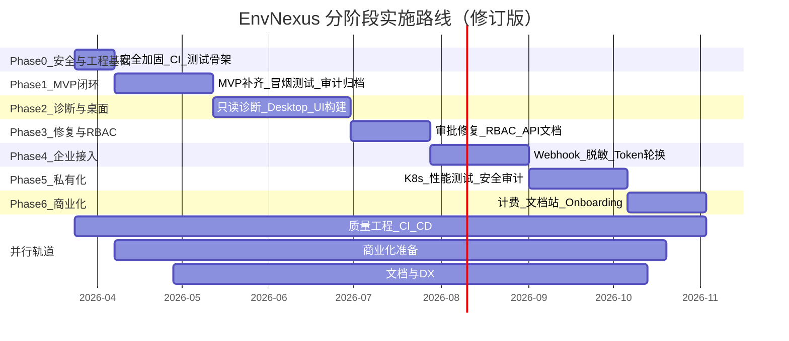

# EnvNexus 开发路线图（修订版）

> 基于 `envnexus-proposal.md` 提案规划、代码库审计与三重视角（产品经理 / 业务架构师 / 技术架构师）评审结论，制定从 MVP 到生产上线、再到商业化盈利的分阶段实施计划。
>
> 最后更新：2026-03-23（v2，含安全加固、测试门禁与商业化轨道）

---

## 一、当前状态总览

### 1.1 各模块完成度

| 模块 | 完成度 | 核心能力 | 关键缺口 |
|---|---|---|---|
| Platform API | 55% | JWT 认证、CRUD、Agent API、审批 API | Webhook、RBAC、Redis/MinIO 接入、readyz 真实检查 |
| Session Gateway | 50% | WS 协议对齐、Redis pub/sub、事件路由 | WS 鉴权旁路、无 CORS、幂等处理、Platform 内部客户端 |
| Job Runner | 20% | 4 个清理 Worker | Job 模型/队列、package_build、audit_flush 实际归档 |
| Agent Core | 45% | LLM Router(7 providers)、5 步诊断、审批同步、5 个工具 | SQLite、治理引擎、完整本地 API、退出不调 Stop |
| Console Web | 50% | 主要页面、AuthContext、API 客户端 | i18n 全覆盖、错误边界、部分页面直接 fetch |
| Agent Desktop | 15% | Electron 骨架 + 1 个 IPC | 托盘、更新、诊断/审批/聊天 UI 全部缺失 |
| 共享库 | 10% | errors + base model | 全部 libs/go 和 libs/ts 包 |
| 数据库 Schema | 90% | 13 张表 + seed | 自动迁移、第二阶段扩展表 |
| 部署 | 55% | Docker Compose + Dockerfiles + Makefile | CI/CD、冒烟测试、K8s |
| 安全模型 | 20% | JWT 三类令牌、审批状态机 | RBAC、Refresh Token、设备轮换、CORS、Rate Limiting |

### 1.2 代码规模

| 组件 | Go 文件 | TS/TSX 文件 | 测试文件 |
|---|---|---|---|
| platform-api | 66 | - | 0 |
| agent-core | 25 | - | 0 |
| session-gateway | 4 | - | 0 |
| job-runner | 5 | - | 0 |
| console-web | - | 21 | 0 |
| agent-desktop | - | 2 | 0 |

### 1.3 阻断性审计发现

以下问题必须在业务功能开发之前解决（Phase 0）：

| 编号 | 问题 | 风险等级 | 说明 |
|---|---|---|---|
| SEC-01 | 硬编码默认密钥 | 严重 | `main.go` 使用 `dev-jwt-secret-change-me` 等 fallback，生产忘设环境变量则密钥可预测 |
| SEC-02 | WS 鉴权旁路 | 严重 | `tokenSecret` 为空或客户端未携带 token 时，直接从 query string 取 tenant_id |
| SEC-03 | CheckOrigin 全放行 | 高 | WebSocket `CheckOrigin` 返回 `true`，允许任意来源跨站连接 |
| SEC-04 | 无 CORS 配置 | 高 | 后端无 CORS 中间件，浏览器跨域请求不受控 |
| SEC-05 | 无 Rate Limiting | 高 | 登录等高危端点无请求频率限制 |
| QUA-01 | 零测试覆盖 | 严重 | 102 个 Go 文件 + 23 个 TS 文件，无任何自动化测试 |
| QUA-02 | 标准库日志 | 中 | 仅 `log.Println`，无结构化日志，生产排障困难 |
| QUA-03 | 审计写入静默丢弃 | 高 | `_ = s.auditRepo.Create(...)` 静默忽略失败 |
| QUA-04 | audit_flush 不归档 | 高 | Worker 只 `SELECT COUNT(*)` 打印，不写 MinIO 不清理 |
| QUA-05 | 迁移未自动化 | 中 | SQL 文件存在但启动不执行，Docker Compose 无 init 容器 |

---

## 二、阶段规划总览



### 修正后的总时间线

| 阶段 | 时长 | 累计 | 核心交付 | 里程碑 |
|---|---|---|---|---|
| Phase 0 | 2 周 | 2 周 | 安全加固 + CI + 测试骨架 | 安全基线达标 |
| Phase 1 | 5 周 | 7 周 | MVP 端到端闭环 | 冒烟测试 12 步全绿 |
| Phase 2 | 7 周 | 14 周 | 诊断产品化 + Desktop 可用 | 端到端诊断对话可演示 |
| Phase 3 | 4 周 | 18 周 | 修复闭环 + RBAC + API 文档 | **Beta 发布** |
| Phase 4 | 5 周 | 23 周 | Webhook + 企业接入 | **GA 候选** |
| Phase 5 | 5 周 | 28 周 | 私有化部署 + 性能验证 | 私有化可交付 |
| Phase 6 | 4 周 | 32 周 | 计费 + 文档站 + Onboarding | **GA + 首单收入** |

**总计约 8 个月（32 周）**。相比原计划增加约 13 周，新增覆盖：安全加固、测试体系、Desktop 真实构建、RBAC 前移、商业化闭环。

---

## 三、Phase 0：安全加固与工程基础（2 周）

> 目标：消除所有阻断性安全漏洞，建立自动化质量门禁，为后续所有 Phase 提供安全的工程基座。

### 0.1 安全加固

| 任务 | 优先级 | 涉及文件 | 说明 |
|---|---|---|---|
| 移除硬编码默认密钥 | P0 | `services/platform-api/cmd/platform-api/main.go`、`services/session-gateway/cmd/session-gateway/main.go` | `ENX_JWT_SECRET` 等未设置时 panic 并提示，不使用 fallback |
| 修复 WS 鉴权旁路 | P0 | `services/session-gateway/internal/handler/ws/handler.go` | 无 token 时拒绝连接（返回 401），不 fallback query string |
| 修复 CheckOrigin | P0 | 同上 | 基于 `ENX_CORS_ALLOWED_ORIGINS` 白名单校验 |
| 加 CORS 中间件 | P0 | `services/platform-api/cmd/platform-api/main.go` | 使用 `gin-contrib/cors`，配置从环境变量读取 |
| 加 Rate Limiting | P1 | `services/platform-api/internal/middleware/` | `/api/v1/auth/login` 限制每 IP 每分钟 10 次；其他 API 限制每 IP 每秒 50 次 |

### 0.2 CI/CD 基础

| 任务 | 优先级 | 产出文件 | 说明 |
|---|---|---|---|
| GitHub Actions CI | P0 | `.github/workflows/ci.yml` | 触发条件: push/PR；步骤: golangci-lint + go vet + go build + go test + npm lint |
| Docker 镜像构建 | P1 | `.github/workflows/ci.yml` | PR 只构建不推送；main 分支构建并推送 |
| pre-commit 配置 | P2 | `.pre-commit-config.yaml` | gofmt + eslint + commit message 格式检查 |

### 0.3 测试骨架

| 任务 | 优先级 | 说明 |
|---|---|---|
| domain 层单元测试 | P0 | `approval_request_test.go`（状态机转移全路径）、`session_test.go`（会话状态机） |
| service 层关键测试 | P0 | `auth_service_test.go`（JWT 签发/验证）、`session_service_test.go`（创建/转移） |
| 测试辅助工具 | P1 | `internal/testutil/` 包，提供 mock repo、test DB 等基础设施 |

### 0.4 基础设施改进

| 任务 | 优先级 | 说明 |
|---|---|---|
| 结构化日志 | P1 | 全部服务替换 `log` 为 `log/slog`（Go 1.21+ 内置），输出 JSON 格式 |
| 自动迁移 | P0 | `platform-api` 启动时自动执行 migration；或 Docker Compose 增加 init 容器 |
| readyz 完整检查 | P1 | 检查 DB ping、Redis ping、MinIO 连通性、migration 版本 |

### Phase 0 验收标准

- [ ] CI pipeline 全绿（lint + build + test）
- [ ] `go vet ./...` 零告警
- [ ] 审批状态机和会话状态机测试覆盖率 100%
- [ ] 安全扫描无高危告警（密钥、鉴权旁路已修复）
- [ ] Docker Compose 启动后 readyz 返回所有依赖就绪
- [ ] 所有日志输出为结构化 JSON 格式

---

## 四、Phase 1：MVP 闭环（5 周）

> 目标：达到提案 §1.4 MVP 完成定义和 §12.7.10 冒烟测试全部通过。

### 1.1 Platform API 补齐

| 任务 | 优先级 | 说明 |
|---|---|---|
| Redis 客户端接入 | P0 | `main.go` 初始化 Redis，用于缓存和短状态 |
| MinIO 客户端接入 | P0 | 初始化对象存储客户端，挂载到 package service |
| 统一响应信封 | P1 | 所有 handler 统一使用 `RespondSuccess`/`RespondError`，消除裸 `gin.H` |
| download-links API 对齐 | P0 | 路径对齐提案 `POST /tenants/:tenantId/download-links`（当前为 `/tokens`） |
| Refresh Token | P1 | access_token + refresh_token 双 token 生命周期 |
| `recordAudit` 错误处理 | P0 | 不再 `_ =` 静默丢弃审计写入失败，改为日志告警 + 重试 |
| `EventPayloadJSON` 填充 | P0 | 审计事件必须包含结构化载荷 |

### 1.2 Session Gateway 集成

| 任务 | 优先级 | 说明 |
|---|---|---|
| Platform 内部客户端 | P0 | 会话创建后通过 HTTP 通知 Gateway 推送 `session.created` |
| session.created 主动推送 | P0 | Platform 创建会话后通知 Gateway 向设备下发事件 |
| WS 幂等处理 | P1 | 基于 event_id 去重，防止重连时重复处理 |

### 1.3 Agent Core 闭环

| 任务 | 优先级 | 说明 |
|---|---|---|
| WS 连接携带 token | P0 | bootstrap 获取 session token 后传入 WS client |
| 诊断会话端到端 | P0 | `session.created` -> diagnosis -> tool -> audit 完整链路 |
| 审批后工具执行上报 | P0 | 执行后通知 platform succeeded/failed |

### 1.4 审计归档管道

| 任务 | 优先级 | 说明 |
|---|---|---|
| audit_flush 真实归档 | P0 | 批量读取过期审计事件 -> 写入 MinIO -> 标记已归档 |
| 归档数据可查询 | P1 | 控制台审计页面支持查询归档数据（或至少提示已归档） |

### 1.5 冒烟测试与开发体验

| 任务 | 优先级 | 产出文件 |
|---|---|---|
| smoke-test.sh | P0 | `scripts/smoke-test.sh`（按 §12.7.10 的 12 步验证） |
| seed.sh | P1 | `scripts/seed.sh`（初始化默认租户 + 管理员） |
| 本地开发 README | P1 | `README.md` 补充本地开发指南 |
| Docker healthcheck 完善 | P1 | 所有服务 healthcheck 对齐 readyz |

### 1.6 Console Web 基础完善

| 任务 | 优先级 | 说明 |
|---|---|---|
| i18n 全覆盖 | P1 | 所有页面文案通过 i18n 字典管理 |
| 登录 + 配置 + 下载链路可操作 | P0 | 确保控制台可完成 §12.7.10 步骤 5-7 |

### 1.7 测试门禁

| 指标 | 要求 |
|---|---|
| Go service 层覆盖率 | >= 40% |
| handler 层 | 关键路径（登录、创建会话、审批）有集成测试 |
| 冒烟测试 | 12 步全绿 |

### Phase 1 验收标准

按提案 §12.7.10 冒烟测试：

1. `docker compose up -d` 全部服务启动
2. healthz / readyz 全部通过（含 DB、Redis、MinIO 真实检查）
3. 数据库 migration 自动执行
4. 默认租户和管理员已创建
5. 控制台成功登录
6. 成功创建 ModelProfile / PolicyProfile / AgentProfile
7. 成功生成下载链接
8. Agent 成功激活
9. Agent 成功建立 WebSocket 会话
10. 完成一次只读诊断
11. 完成一次审批式低风险修复
12. 审计列表中可查到完整事件链（含结构化 payload）

---

## 五、Phase 2：只读诊断与桌面交互（7 周）

> 目标：达到提案 §13 Phase 2 验收标准。Desktop 端可完成端到端诊断对话。

### 2.1 Agent Core 增强（2 周）

| 任务 | 说明 |
|---|---|
| SQLite 本地存储 | `data/agent.db` 用于会话、审计、配置缓存 |
| store 包抽象 | `internal/store/` 统一管理本地持久化 |
| 治理引擎 v1 | CaptureBaseline / DetectDrift 基础实现 |
| 扩展只读工具 | 至少新增 2 个：`read_disk_usage`、`read_process_list` |
| runtime 模块 | 主事件循环和任务调度 |
| 诊断包导出 | `POST /local/v1/diagnostics/export` 生成本地诊断报告 |
| 离线降级模式 | 平台不可达时仅开放只读能力 |
| 退出时调用 Stop | `enx-agent` 退出时正确调用 `LocalServer.Stop()` |

### 2.2 Agent Desktop 核心 UI（4-5 周）

> 当前状态：仅 2 个 TS 文件（main.ts + preload.ts），无 React 渲染层。需从零构建。

| 任务 | 说明 |
|---|---|
| React + TypeScript 渲染层 | 初始化 renderer/ 目录结构，配置构建工具链 |
| 系统托盘 | 最小化到托盘，显示连接状态 |
| Chat UI | `renderer/modules/chat/`，渲染诊断对话流 |
| 诊断结果展示 | 结构化展示 findings 和 recommended_actions |
| 审批确认 UI | 展示待审批工具、风险等级，支持确认/拒绝 |
| Preload 白名单 | 仅暴露安全 IPC 通道，renderer 不直接访问 FS/Shell |
| spawn agent-core | main 进程管理 agent-core 子进程生命周期 |
| 设置页面 | 语言切换、平台地址配置、日志级别 |
| 错误降级页 | agent-core 不可用时展示错误说明和诊断包导出入口 |

### 2.3 Console Web 增强（1 周）

| 任务 | 说明 |
|---|---|
| 全局错误边界 | 添加 Next.js `error.tsx` / `loading.tsx` |
| 统一 API 调用 | 消除直接 `fetch` 调用（如 tenants 页面），全部通过 `api` client |
| 会话详情页 | 展示诊断过程、工具执行、审批链路 |
| 设备实时状态 | 在线/离线状态、最后心跳时间 |
| 审计事件关联 | audit-events 页面支持按 session_id 筛选 |

### 2.4 测试门禁

| 指标 | 要求 |
|---|---|
| agent-core 覆盖率 | 诊断/策略/工具 >= 50% |
| console-web | 关键页面（登录、设备列表、会话详情）有组件测试 |
| agent-desktop | 至少 IPC 通道有集成测试 |

### Phase 2 验收标准

- 至少 7 个工具可稳定运行（5 个只读 + 2 个新增）
- 诊断链路输出结构化 findings
- WebSocket 会话事件完整流转
- 审计事件可在平台检索
- 本地诊断日志和诊断包导出可用
- **Agent Desktop 可完成端到端诊断对话和审批确认**
- 离线模式下 Desktop 正确展示降级状态

---

## 六、Phase 3：审批式修复 + RBAC（4 周）

> 目标：达到提案 §13 Phase 3 验收标准。RBAC 在此阶段必须完成。
>
> **里程碑：Beta 发布 -- 首次可向早期客户演示和试用。**

### 3.1 审批流完善

| 任务 | 说明 |
|---|---|
| 变更预览 | 修复工具执行前展示将要执行的操作和影响范围 |
| 回滚机制 | 工具执行前创建回滚点，失败时自动恢复 |
| 审批超时自动过期 | 前端倒计时 + 后端定时清理 |
| 审批-审计关联 ID | 端到端 correlation_id 贯穿审批、执行、审计记录 |

### 3.2 修复工具扩展

| 任务 | 说明 |
|---|---|
| proxy.toggle | 打开/关闭应用层代理 |
| config.modify | 修改已知安全配置字段（白名单） |
| container.reload | 重载容器或进程级配置 |
| 风险等级细化 | L0/L1/L2/L3 四级完整实现和 UI 展示 |

### 3.3 RBAC 落地

> RBAC 从原 Phase 5 前移至此。无角色权限控制的系统不具备 Beta 发布条件。

| 任务 | 说明 |
|---|---|
| 权限模型实现 | 基于 roles 表实现路由级权限检查中间件 |
| role_bindings 表 | 用户-角色绑定（§12.6.7 扩展表之一） |
| 五种预置角色 | `platform_super_admin`、`tenant_admin`、`security_auditor`、`ops_operator`、`read_only_observer` |
| 控制台权限 UI | 角色管理页面，支持分配角色到用户 |
| 接口权限隔离 | 生成下载链接、发布分发包、撤销设备需显式权限 |

### 3.4 API 文档

| 任务 | 说明 |
|---|---|
| OpenAPI 规范生成 | 使用 `swaggo/swag` 或手写 OpenAPI 3.0 YAML |
| Swagger UI 挂载 | 开发环境下 `/swagger/` 可访问 API 文档 |
| Agent API 文档 | `/agent/v1/*` 接口单独文档化 |

### 3.5 测试门禁

| 指标 | 要求 |
|---|---|
| 审批全链路 | drafted -> pending_user -> approved -> executing -> succeeded 集成测试 |
| RBAC 权限矩阵 | 5 种角色 x 关键操作的权限测试 |
| Go 整体覆盖率 | >= 55% |

### Phase 3 验收标准

- 至少 6 个修复工具可用（3 原有 + 3 新增）
- 所有修复动作经过完整审批状态机
- 执行失败给出结构化错误和回滚结果
- 审计中可关联审批单、执行记录和会话
- RBAC 五种角色权限隔离生效
- API 文档可在线浏览
- **可对外发布 Beta 版本**

---

## 七、Phase 4：Webhook 与企业接入（5 周）

> 目标：达到提案 §13 Phase 4 验收标准。
>
> **里程碑：GA 候选 -- 企业客户可进行 POC 评估。**

### 4.1 Webhook 系统

| 任务 | 说明 |
|---|---|
| webhook_subscriptions 表 | §12.6.7 扩展表 |
| webhook_deliveries 表 | 投递记录和重试状态 |
| POST /webhooks/v1/events | 接收外部事件，X-ENX-Signature 签名验证 |
| 控制台 Webhook 管理 | 创建、测试、查看投递状态 |
| job-runner webhook_retry | 失败投递自动重试 Worker |
| 幂等处理 | 基于 idempotency_key 去重 |

### 4.2 企业接入

| 任务 | 说明 |
|---|---|
| 外部工单系统联调 | 至少一种外部系统 demo（如 Jira / 企业微信） |
| 事件驱动诊断 | Webhook 触发诊断会话，不绕过审批 |
| 设备 Token 轮换 | 支持撤销和重新签发 device token |
| 数据脱敏管道 | 审计导出时自动脱敏 PII 字段 |
| 审计导出功能 | 支持按时间范围导出审计记录（CSV/JSON） |

### 4.3 Job Runner 完善

| 任务 | 说明 |
|---|---|
| jobs 表 + 状态机 | queued -> running -> completed/failed，支持重试 |
| Redis 队列消费 | 替代纯定时器，支持任务优先级 |
| package_build Worker | 租户包构建 + 上传 MinIO |
| governance_scan Worker | 周期性治理扫描 |

### 4.4 测试门禁

| 指标 | 要求 |
|---|---|
| Webhook | 签名验证 + 投递 + 重试端到端测试 |
| 任务队列 | 任务创建 -> 消费 -> 成功/失败/重试 集成测试 |
| Go 整体覆盖率 | >= 60% |

### Phase 4 验收标准

- Webhook 签名校验和幂等处理可用
- 外部事件只能触发诊断，不绕过本地审批
- 至少与一种外部系统完成 demo 联调
- 关键链路告警与业务事件可接入外部系统
- 设备 Token 可撤销和轮换
- 审计导出支持按时间范围和脱敏

---

## 八、Phase 5：私有化部署与性能验证（5 周）

> 目标：达到提案 §13 Phase 5 验收标准。

### 5.1 私有化部署

| 任务 | 说明 |
|---|---|
| K8s Helm Chart | deploy/k8s/ 提供标准化 Kubernetes 部署 |
| 私有化配置裁剪 | 剥离 SaaS 计费模块，支持离线运行 |
| 内网模型网关 | 企业私有 LLM 接入（通过 OpenAI 兼容 BASE_URL） |
| 离线升级包 | 支持无互联网环境升级 agent-core |
| 离线审计归档 | 无 MinIO 时落盘本地文件系统 |

### 5.2 高级安全

| 任务 | 说明 |
|---|---|
| 内网 IdP 对接 | LDAP/SAML/OIDC 单点登录 |
| 本地密钥托管 | 加密存储 agent 凭证，支持 KMS 集成 |
| 高合规审计 | 审计记录签名、防篡改、可导出 |
| policy_snapshots 表 | 策略变更历史追溯 |

### 5.3 Agent Desktop 成熟

| 任务 | 说明 |
|---|---|
| 自动更新 | electron-updater 集成，兼容性检查 |
| 多租户切换 | 支持同一设备关联多个租户 |
| 历史会话浏览 | renderer/modules/history |
| 诊断包一键导出 | 打包诊断日志、配置快照、事件链 |
| 品牌定制 | 替换应用名、Logo、启动页 |

### 5.4 性能验证

| 任务 | 目标值 |
|---|---|
| 并发 WS 连接 | 200 台设备同时在线 |
| 批量审计写入 | 每秒 500 条审计事件 |
| 诊断延迟 | P95 < 30 秒（含 LLM 调用） |
| 分发包构建 | 常规引导包 < 5 分钟 |

### 5.5 安全审计

| 任务 | 说明 |
|---|---|
| 渗透测试清单 | OWASP Top 10 自查或第三方评估 |
| 依赖漏洞扫描 | `govulncheck` + `npm audit`，CI 中强制执行 |
| 密钥管理审计 | 确认所有密钥可轮换、无泄露路径 |

### 5.6 测试门禁

| 指标 | 要求 |
|---|---|
| K8s 部署 | Helm install + smoke test 自动化 |
| 性能基准 | 回归测试确保不劣化 |
| Go 整体覆盖率 | >= 70% |

### Phase 5 验收标准

- 私有化版本沿用相同对象模型与协议
- 不依赖公有云即可完成激活、配置与审计闭环
- 支持企业内网模型与密钥注入
- 私有化模式下具备本地可观测与审计归档闭环
- 性能指标全部达标

---

## 九、Phase 6：商业化就绪（4 周）

> 目标：具备面向付费客户交付的完整能力。
>
> **里程碑：GA 发布 + 首单收入。**

### 6.1 使用量计量

| 任务 | 说明 |
|---|---|
| 计量数据模型 | 设备数、会话数、LLM 调用次数、存储用量 |
| 实时计量 Pipeline | 基于审计事件实时统计，写入计量表 |
| 预算告警 | LLM 调用接近预算上限时告警 |
| 用量仪表盘 | 控制台展示租户用量趋势和明细 |

### 6.2 计费集成

| 任务 | 说明 |
|---|---|
| 定价模型落地 | Free / Pro / Enterprise / Private 四档 |
| Stripe 集成（SaaS） | 订阅创建、Webhook 回调、发票生成 |
| 许可证系统（私有化） | 离线 License Key 校验，限制设备数和功能模块 |

### 6.3 产品文档站

| 任务 | 说明 |
|---|---|
| 文档站框架 | VitePress 或 Docusaurus，部署到 `docs.envnexus.io` |
| 快速入门指南 | 从零到第一次诊断的 15 分钟教程 |
| API 参考 | 基于 OpenAPI 自动生成 |
| 部署指南 | Docker Compose（单机）+ K8s（集群）+ 私有化 |
| 用户手册 | 控制台操作指南 + Desktop 使用指南 |

### 6.4 Onboarding 体验

| 任务 | 说明 |
|---|---|
| 首次登录向导 | 引导创建租户 -> 配置模型 -> 生成下载链接 |
| 交互式 Demo | 提供沙盒环境或录屏演示 |
| 客户成功流程 | 激活后 7 天内邮件引导 + 反馈收集 |

### 6.5 测试门禁

| 指标 | 要求 |
|---|---|
| 计费链路 | 订阅创建 -> 计量 -> 账单生成端到端测试 |
| License 校验 | 有效/过期/超限场景测试 |
| Go 整体覆盖率 | >= 80% |

### Phase 6 验收标准

- 可在线注册并完成付费订阅
- 私有化客户可通过 License Key 激活
- 产品文档站可公开访问
- Onboarding 向导可引导完成首次配置
- LLM 用量可计量并产生预算告警
- **首个付费客户完成签约**

---

## 十、并行轨道

### 轨道 A：质量工程（贯穿 Phase 0 ~ Phase 6）

| 阶段 | 覆盖率目标 | CI/CD 能力 | 关键测试类型 |
|---|---|---|---|
| Phase 0 | 核心状态机 100% | lint + build + test | 单元测试 |
| Phase 1 | Go service >= 40% | + Docker 镜像构建 | 单元 + 冒烟 |
| Phase 2 | agent-core >= 50% | + Compose 集成测试 | 单元 + 组件 |
| Phase 3 | Go 整体 >= 55% | + 发布流水线 | + 集成测试 |
| Phase 4 | Go 整体 >= 60% | + 安全扫描 | + 端到端 |
| Phase 5 | Go 整体 >= 70% | + Helm 发布 | + 性能测试 |
| Phase 6 | Go 整体 >= 80% | 完整流水线 | 全类型 |

### 轨道 B：商业化准备（从 Phase 1 开始）

| 阶段 | 交付物 |
|---|---|
| Phase 0-1 | 产品官网落地页设计、Demo 视频脚本、竞品分析完成 |
| Phase 2 | 定价模型初稿、Beta 用户招募（目标 5-10 家） |
| Phase 3 | 首批 Beta 用户入驻、客户访谈反馈 |
| Phase 4 | 企业客户 POC（目标 2-3 家）、合同模板、SLA 草案 |
| Phase 5 | 私有化报价方案、首批企业意向客户 |
| Phase 6 | 定价上线、计费集成、首单闭环 |

### 轨道 C：文档与开发者体验（从 Phase 1 开始）

| 阶段 | 交付物 |
|---|---|
| Phase 1 | README 完善 + 本地开发指南 + 贡献指南 |
| Phase 2 | Agent API 协议文档（给集成方） |
| Phase 3 | OpenAPI 文档自动生成 + Swagger UI |
| Phase 4 | Webhook 集成指南 |
| Phase 5 | 私有化部署手册 + 运维手册 |
| Phase 6 | 完整产品文档站上线 |

---

## 十一、技术债务清单

| 编号 | 债务 | 影响 | 目标 Phase |
|---|---|---|---|
| TD-01 | roleRepo / toolInvRepo 在 main.go 中 `_ =` 丢弃 | RBAC 无法生效 | Phase 3 |
| TD-02 | 部分 handler 返回 gin.H 而非统一信封 | API 不一致 | Phase 1 |
| TD-03 | session_service.recordAudit 未填写 EventPayloadJSON | 审计记录缺少结构化载荷 | Phase 1 |
| TD-04 | Gateway 无 token 时仍接受 WS 连接 | 安全漏洞 | **Phase 0** |
| TD-05 | 零测试覆盖 | 回归风险高 | **Phase 0** |
| TD-06 | Agent 策略求值无持久化 | 重启丢失待审批项 | Phase 2 |
| TD-07 | config/default.yaml 未在代码中加载 | 配置来源不一致 | Phase 2 |
| TD-08 | 无结构化日志 | 生产环境难排查 | **Phase 0** |
| TD-09 | 设备 Token 无撤销/轮换 | 泄露后无法废止 | Phase 4 |
| TD-10 | 无 ID 前缀规范（enx_dev_ / enx_sess_） | 不符合提案 ID 规范 | Phase 3 |
| TD-11 | WS CheckOrigin 允许所有来源 | CSRF/劫持风险 | **Phase 0** |
| TD-12 | WS 无 token 时 fallback 到 query string tenant_id | 鉴权可绕过 | **Phase 0** |
| TD-13 | audit_flush 仅打印计数不归档 | 审计数据丢失风险 | Phase 1 |
| TD-14 | Console Web 部分页面直接用 fetch 而非 api client | 错误处理不一致 | Phase 2 |
| TD-15 | Console Web 无 Next.js 错误边界 | 页面崩溃无兜底 | Phase 2 |
| TD-16 | enx-agent 退出时不调用 LocalServer.Stop() | 本地 API 未优雅关闭 | Phase 2 |
| TD-17 | `recordAudit` 使用 `_ =` 静默丢弃错误 | 审计可靠性受损 | Phase 1 |

---

## 十二、风险与依赖

| 风险 | 影响 | 缓解措施 |
|---|---|---|
| LLM Provider API 变更 | 诊断引擎不可用 | Router 降级机制 + Ollama 本地兜底 |
| Redis 不可用 | Gateway 无法扇出事件 | 已实现无 Redis 降级，需测试覆盖 |
| 无测试的回归风险 | 功能修改引入 bug | Phase 0 起建立测试基线，每 Phase 递增 |
| Electron 安全策略变更 | Desktop 适配成本 | Preload 白名单隔离，减少耦合 |
| 私有化环境多样性 | 部署问题难复现 | Helm Chart + 配置校验脚本 |
| **竞争窗口** | 8 个月周期中 AI 工具市场可能出现直接竞品 | 尽早发布 Beta（Phase 3），用真实客户反馈指导后续优先级 |
| **团队瓶颈** | 全栈（Go + TS + Electron + DevOps）要求极高 | Phase 2 起建议至少 2 人；Desktop 可外包或招专项 |
| **LLM 成本不可控** | 无计量时客户可能产生超预期费用 | Phase 1 加入基础调用计数；Phase 6 完整计量 |
| **安全事件** | 密钥泄露或未授权访问 | Phase 0 消除全部已知安全漏洞；Phase 5 做渗透测试 |

---

## 十三、里程碑检查点

| 里程碑 | 标志 | 依赖 | 对外状态 |
|---|---|---|---|
| M0: 安全基线 | CI 全绿 + 安全漏洞清零 | Phase 0 完成 | 内部 |
| M1: MVP 冒烟 | smoke-test.sh 12 步全绿 | Phase 1 完成 | 内部演示 |
| M2: 诊断产品化 | Desktop 端到端诊断对话 | Phase 2 完成 | 内部演示 |
| M3: Beta 发布 | 修复闭环 + RBAC + API 文档 | Phase 3 完成 | **对外 Beta** |
| M4: GA 候选 | Webhook + 企业 POC 完成 | Phase 4 完成 | **企业评估** |
| M5: 私有化就绪 | K8s + 性能 + 安全审计 | Phase 5 完成 | **私有化交付** |
| M6: 商业化 GA | 计费 + 文档 + Onboarding | Phase 6 完成 | **正式商业发布** |

---

## 十四、第二阶段扩展表

按提案 §12.6.7 补齐，各表引入时间已对齐修订后的 Phase：

| 表名 | 用途 | 引入阶段 |
|---|---|---|
| role_bindings | 用户-角色绑定 | Phase 3 |
| device_heartbeats | 心跳历史记录 | Phase 2 |
| policy_snapshots | 策略版本快照 | Phase 5 |
| governance_baselines | 治理基线数据 | Phase 2 |
| governance_drifts | 漂移检测结果 | Phase 2 |
| session_messages | 会话消息历史 | Phase 2 |
| webhook_subscriptions | Webhook 订阅配置 | Phase 4 |
| webhook_deliveries | Webhook 投递记录 | Phase 4 |
| package_channels | 分发渠道管理 | Phase 5 |
| device_labels | 设备标签 | Phase 4 |
| usage_metrics | 使用量计量 | Phase 6 |
| billing_subscriptions | 订阅与计费 | Phase 6 |
| licenses | 私有化许可证 | Phase 6 |

---

## 附录 A：目录结构演进目标

```
envnexus/
├── apps/
│   ├── agent-core/          # Go agent 内核
│   ├── agent-desktop/       # Electron 桌面端
│   └── console-web/         # Next.js 控制台
├── services/
│   ├── platform-api/        # 平台 API 聚合服务
│   ├── session-gateway/     # WebSocket 网关
│   └── job-runner/          # 异步任务服务
├── libs/
│   ├── go/                  # Go 共享库
│   │   ├── auth/
│   │   ├── config/
│   │   ├── db/
│   │   ├── events/
│   │   ├── logging/
│   │   ├── policy/
│   │   ├── sdk/
│   │   └── types/
│   └── ts/                  # TypeScript 共享库
│       ├── api-client/
│       └── ui-kit/
├── deploy/
│   ├── docker/              # Docker Compose 部署
│   ├── k8s/                 # Kubernetes Helm Chart
│   └── private/             # 私有化部署配置
├── scripts/
│   ├── smoke-test.sh
│   ├── seed.sh
│   └── migrate.sh
├── docs/
│   ├── envnexus-proposal.md
│   ├── development-roadmap.md
│   └── commercialization-plan.md
├── .github/
│   └── workflows/
│       ├── ci.yml
│       └── release.yml
├── Makefile
├── deploy.sh
└── go.work
```

## 附录 B：环境变量全量清单

| 变量 | 服务 | 说明 | 引入阶段 |
|---|---|---|---|
| ENX_DATABASE_DSN | platform-api, job-runner | MySQL 连接串 | Phase 0 |
| ENX_REDIS_ADDR | platform-api, session-gateway, job-runner | Redis 地址 | Phase 0 |
| ENX_JWT_SECRET | platform-api | 用户 JWT 签名密钥（必填） | Phase 0 |
| ENX_DEVICE_TOKEN_SECRET | platform-api | 设备 JWT 签名密钥（必填） | Phase 0 |
| ENX_SESSION_TOKEN_SECRET | platform-api, session-gateway | 会话 JWT 签名密钥（必填） | Phase 0 |
| ENX_CORS_ALLOWED_ORIGINS | platform-api, session-gateway | CORS 允许的域名列表 | Phase 0 |
| ENX_OBJECT_STORAGE_ENDPOINT | platform-api, job-runner | MinIO 地址 | Phase 1 |
| ENX_HTTP_PORT | 各服务 | HTTP 监听端口 | Phase 0 |
| ENX_OPENAI_API_KEY | agent-core | OpenAI 密钥 | Phase 1 |
| ENX_DEEPSEEK_API_KEY | agent-core | DeepSeek 密钥 | Phase 1 |
| ENX_ANTHROPIC_API_KEY | agent-core | Anthropic 密钥 | Phase 1 |
| ENX_GEMINI_API_KEY | agent-core | Gemini 密钥 | Phase 1 |
| ENX_OPENROUTER_API_KEY | agent-core | OpenRouter 密钥 | Phase 1 |
| ENX_OLLAMA_URL | agent-core | Ollama 本地地址 | Phase 1 |
| ENX_LLM_PRIMARY | agent-core | 首选 LLM Provider | Phase 1 |
| ENX_WEBHOOK_SECRET | platform-api | Webhook HMAC 密钥 | Phase 4 |
| ENX_STRIPE_SECRET_KEY | platform-api | Stripe 计费密钥 | Phase 6 |
| ENX_LICENSE_SIGNING_KEY | platform-api | 许可证签名密钥 | Phase 6 |

## 附录 C：团队配置建议

| 阶段 | 最少人力 | 理想配置 | 说明 |
|---|---|---|---|
| Phase 0-1 | 1 全栈 | 1 后端 + 1 前端 | 后端专注 Go 服务 + 安全，前端完善 Console |
| Phase 2 | 2 人 | 1 后端 + 1 前端/桌面端 | Desktop 从零构建工作量大 |
| Phase 3-4 | 2 人 | 1 后端 + 1 前端 | RBAC + Webhook 需后端投入，API 文档需协同 |
| Phase 5 | 2-3 人 | 1 后端 + 1 DevOps + 0.5 安全 | K8s + 性能测试 + 安全审计需专项能力 |
| Phase 6 | 2-3 人 | 1 后端 + 1 前端 + 0.5 产品 | 计费集成 + 文档站 + Onboarding 需产品参与 |
