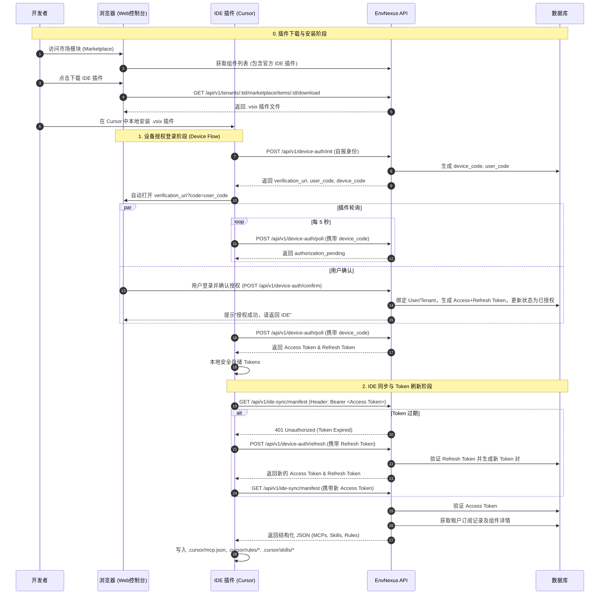

# OmniDev Phase 1: 蓝图设计 - 市场模块 (Marketplace Module)

## 1. 需求解析 (Requirement Analysis)

**目标**: 实现一个“市场”模块，用于管理 skill、mcp、subagent 和 plugin。
**核心特性**:
1. **AI IDE 集成**: 诸如 Cursor 等工具可以从该市场模块拉取用户订阅的组件（skills、MCPs 等），实现 AI IDE 的同步。
2. **官方插件分发**: EnvNexus 官方提供的 IDE 同步插件（如 Cursor/VSCode Extension）将作为市场模块中的一个 `plugin` 供用户下载安装。
3. **高安全性认证**: 市场模块必须安全地验证连接者（AI IDE 插件）的身份。要求采用业界安全可靠的方案。

### 1.1 核心实体 (Core Entities)
- **市场组件 (Marketplace Item)**: 代表一个 skill、MCP、subagent 或 plugin。包含元数据（名称、描述、类型、版本、配置、下载链接或具体内容）。**EnvNexus 官方 IDE 插件本身也是一个 Marketplace Item。**
- **订阅记录 (Subscription)**: 关联租户/用户与市场组件，表示该租户已“安装”或“订阅”了该组件。
- **设备授权码 (Device Auth Code)**: 用于处理无浏览器设备或 IDE 插件的安全登录流程的临时凭证。
- **IDE 客户端凭证 (IDE Client Token)**: AI IDE 授权成功后获取的凭证，包含短效的**访问令牌 (Access Token)** 和长效的**刷新令牌 (Refresh Token)**。

### 1.2 安全与认证策略 (Security & Authentication Strategy)
为了提供类似 Cursor Agent 的无缝且安全的登录体验，我们将采用 **OAuth 2.0 设备授权码流程 (Device Authorization Grant, RFC 8628)**，并结合**双 Token 机制 (Access Token + Refresh Token)** 确保凭证的时效性和安全性。
- **策略**: 
  1. **初始化**: IDE 插件向 EnvNexus 后端发起登录请求，自报身份（如插件版本、机器名）。
  2. **获取授权链接**: 后端返回一个 `device_code`（供插件轮询使用）、一个 `user_code`（用户识别码）以及一个 `verification_uri`（验证链接）。
  3. **用户确认**: 插件自动在用户的浏览器中打开 `verification_uri`（URL中可携带 `user_code`）。用户在 Web 控制台登录后，确认授权该 IDE 插件。
  4. **插件轮询**: 在用户确认期间，IDE 插件不断轮询后端。一旦用户确认授权，后端将生成一对 Token（短效 Access Token + 长效 Refresh Token）返回给插件。
  5. **后续访问**: 插件使用 Access Token 调用 `/api/v1/ide-sync/manifest` 获取市场组件。
  6. **Token 刷新**: 当 Access Token 过期时，插件使用 Refresh Token 调用刷新接口获取新的 Token 对，保障安全性。
- **实现细节**:
  - 新增 `device_auth_codes` 临时表/缓存，用于存储授权会话状态。
  - 新增 `ide_client_tokens` 表，用于存储下发的凭证及其刷新状态。

### 1.2.1 潜在风险与缓解措施 (Risks & Mitigations)
为了确保上述架构的绝对安全，在具体实现时必须严格落实以下缓解措施：
1. **HTTPS 强制**: 所有 `/api/v1/device-auth/*` 和 `/api/v1/ide-sync/*` 接口必须强制使用 HTTPS，防止 Token 在传输过程中被嗅探。
2. **Token 存储安全 (后端)**: 数据库中**绝对不能**明文存储 Access Token 和 Refresh Token，必须存储它们的哈希值（如 SHA-256）。当插件使用 Token 请求时，后端对请求头中的 Token 进行哈希，然后与数据库中的哈希值比对。
3. **权限最小化 (Least Privilege)**: 下发给 IDE 插件的 Token 必须是**受限 Token**。它只能访问 `/api/v1/ide-sync/manifest` 等特定的只读接口，**绝对不能**拥有修改租户配置、删除设备或管理用户的权限。
4. **防重放攻击 (Refresh Token Rotation)**: Refresh Token 应该设计为**一次性使用**。每次插件使用旧的 Refresh Token 换取新的 Access Token 时，后端同时下发一个新的 Refresh Token，并作废旧的。如果后端发现一个旧的 Refresh Token 被再次使用，说明可能发生了泄露，应立即作废该设备的所有 Token 链。

### 1.3 同步机制 (Sync Mechanism)
由于标准的 AI IDE（如 Cursor）本身并不能直接与 EnvNexus 通信，因此需要通过 IDE 专属插件 (Plugin/Extension) 来发起请求并组装身份信息。完整流程如下：
1. **插件下载与安装**：EnvNexus 官方 IDE 插件作为一个 `plugin` 类型的组件上架在市场模块中。用户在 Web 控制台的市场页面找到该插件，点击下载 `.vsix` 文件，并在 Cursor/VSCode 中进行本地离线安装。
2. **授权登录**：插件安装启动后，触发设备授权流程，自报身份并打开浏览器让用户确认。
3. **拉取配置**：授权成功后，插件携带 Access Token 调用 `GET /api/v1/ide-sync/manifest` 接口。
4. **生成文件**：后端返回结构化的 JSON（包含该租户所有已订阅的 MCP、Skills 等），插件解析该 JSON 并在本地工作区自动生成或更新 `.cursor/mcp.json`、`.cursor/rules/` 和 `.cursor/skills/` 等配置文件。

## 2. 架构与数据流 (Architecture & Data Flow)

## 3. 数据库 Schema 设计 (Database Schema Changes)

1. **`marketplace_items` (市场组件表)**:
   - `id` (主键)
   - `type` (枚举: mcp, skill, subagent, plugin, rule)
   - `name`, `description`, `version`, `author`
   - `payload` (JSON格式: 包含 MCP 配置、Skill 的 Markdown 内容，或 Plugin 的下载链接/文件存储路径/S3 Object Key)
   - `status` (状态: published, draft, archived)

2. **`tenant_subscriptions` (租户订阅表)**:
   - `id`, `tenant_id`, `item_id`, `status`

3. **`device_auth_codes` (设备授权码表 - 可用 Redis 替代)**:
   - `device_code`, `user_code`, `status`, `expires_at`, `user_id`, `tenant_id`, `device_info`

4. **`ide_client_tokens` (IDE 客户端凭证表)**:
   - `id`, `user_id`, `tenant_id`, `name`
   - `access_token_hash`, `refresh_token_hash`
   - `access_expires_at`, `refresh_expires_at`, `last_used_at`

## 4. API 接口设计 (API Endpoints)

### 4.1 Web 控制台 API (基于 Session 鉴权)
- `GET /api/v1/tenants/:tenantId/marketplace/items` (获取可用市场组件列表)
- `GET /api/v1/tenants/:tenantId/marketplace/items/:itemId/download` (下载组件文件，如 `.vsix` 插件)
- `POST /api/v1/tenants/:tenantId/marketplace/subscriptions` (订阅组件)
- `DELETE /api/v1/tenants/:tenantId/marketplace/subscriptions/:itemId` (取消订阅)
- `GET /api/v1/tenants/:tenantId/marketplace/subscriptions` (获取我的订阅列表)
- `GET /api/v1/tenants/:tenantId/ide-tokens` (获取已授权的 IDE 设备列表)
- `DELETE /api/v1/tenants/:tenantId/ide-tokens/:id` (撤销设备授权)

### 4.2 设备授权 API (Device Flow)
- `POST /api/v1/device-auth/init` (IDE 调用：初始化授权)
- `POST /api/v1/device-auth/poll` (IDE 调用：轮询授权状态)
- `POST /api/v1/device-auth/refresh` (IDE 调用：刷新 Token)
- `POST /api/v1/tenants/:tenantId/device-auth/confirm` (Web 控制台调用：用户确认授权)

### 4.3 IDE 同步 API (基于 Access Token 鉴权)
- `GET /api/v1/ide-sync/manifest` (返回所有已订阅组件)

## 5. 前端影响 (Frontend Impact)
- **市场页面**: 新增页面浏览和订阅市场组件。对于 `plugin` 类型的组件，提供直接下载文件的按钮。
- **设备授权确认页**: 新增 `/device-auth/confirm` 页面，接收 URL 中的 `code`，展示请求授权的设备信息，并提供“同意”或“拒绝”按钮。
- **已授权设备管理页**: 新增页面展示当前用户已授权的 IDE 设备列表，并允许撤销（吊销 Refresh Token）。