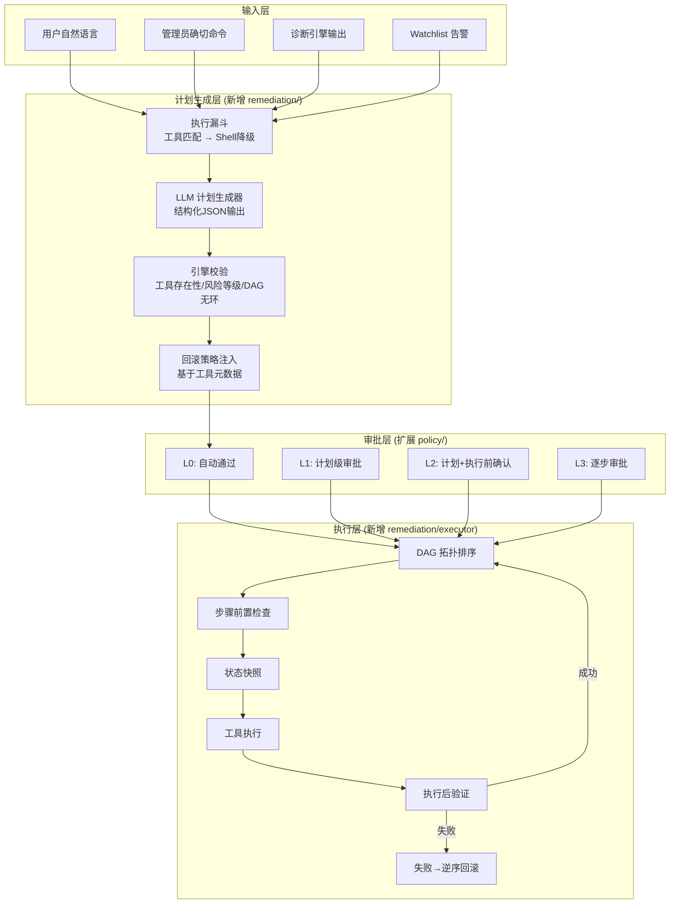
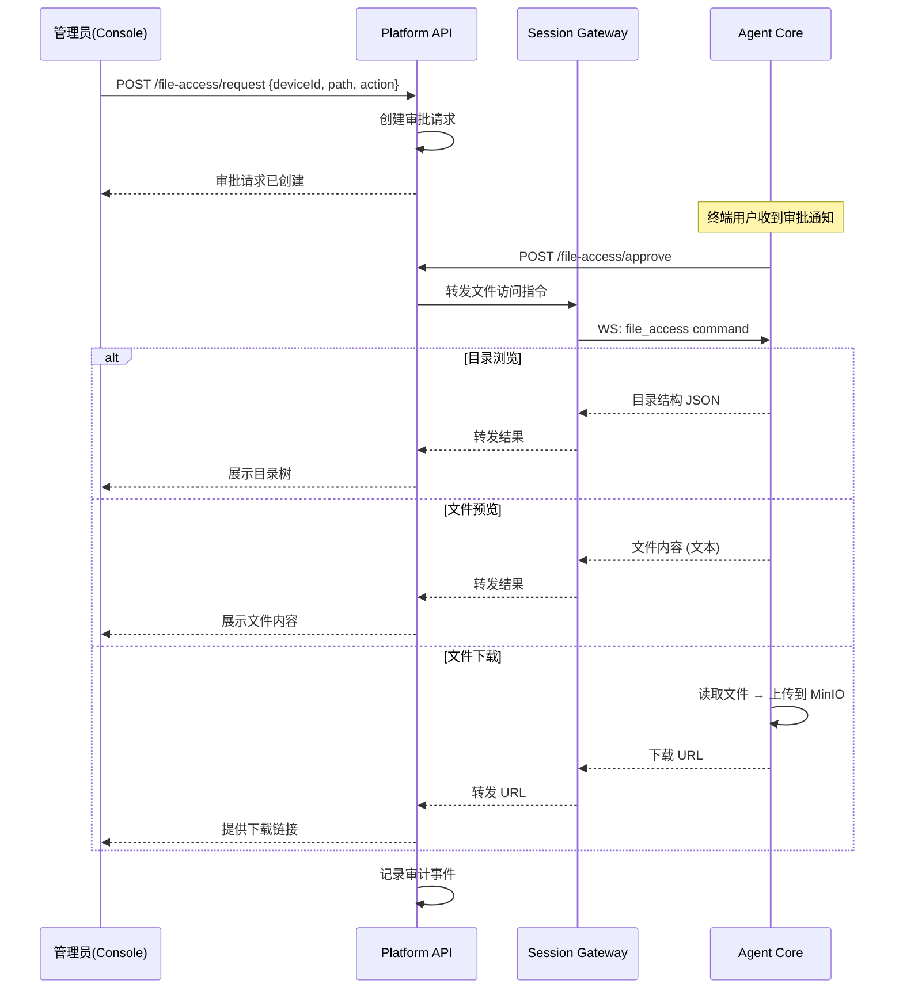
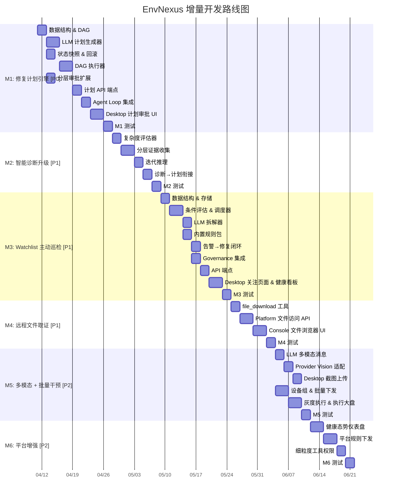

# Phase 1 Blueprint: EnvNexus 全功能增量路线图

> **基准**: 产品白皮书 v4.0 (`docs/product-manual.md`)
> **方法**: 对比产品愿景中的每项能力与当前代码实现，识别 Gap，输出增量开发蓝图
> **原则**: 在现有功能基础上增量增强，不重写、不破坏已有功能

---

## 1. 功能 Gap 全景矩阵

### 1.1 已实现功能基线

| 组件 | 已实现能力 | 完成度 |
|------|-----------|--------|
| **platform-api** | 多租户管理、用户/RBAC、设备管理、会话管理、审计事件、模型/策略/Agent配置、客户端分发（含构建流水线）、环境治理（基线+漂移）、远程命令任务（含NL生成+审批策略+风险评估）、Webhook、IM通知、License、飞书集成 | 85% |
| **session-gateway** | WebSocket 会话、命令转发、Redis pub/sub、健康检查 | 90% |
| **job-runner** | Token/Link/Session清理、审计归档、审批过期、安装包构建、治理扫描 | 90% |
| **agent-core** | Chat Loop（LLM迭代工具调用）、诊断引擎（4步管线）、34个结构化工具、策略引擎（逐工具审批）、治理引擎（基线+漂移）、多Provider LLM路由、OTA自更新、本地SQLite、设备激活/注册 | 70% |
| **agent-desktop** | 5页面（仪表盘/诊断对话/待审批/历史会话/设置）、Chat UI、逐工具审批卡片、系统托盘、加密配置、OTA更新 | 70% |
| **console-web** | 全管理后台（租户/用户/角色/设备/会话/审计/配置/分发/治理/命令任务/审批/策略）、i18n | 85% |
| **deploy** | 智能部署脚本、Docker Compose、交叉编译、Electron打包、MinIO上传 | 95% |

### 1.2 产品白皮书 vs 已实现 — Gap 分析

| # | 产品能力（白皮书） | 当前状态 | Gap 描述 | 优先级 |
|---|-------------------|---------|---------|--------|
| **G1** | 自然语言转受控执行（核心场景一） | 🟡 部分 | 有NL→命令生成（command task），但缺少**执行计划（DAG）**、**计划级审批**、**有序执行+回滚** | P0 |
| **G2** | 工具优先的执行漏斗 | 🟡 部分 | Chat Loop中LLM自行调用工具，但**无执行计划概念**、无降级漏斗（工具→Shell）、无预算控制 | P0 |
| **G3** | 分层审批（L0-L3） | 🟡 部分 | 策略引擎支持逐工具审批，但**无计划级审批**、无L0-L3分层矩阵、无步骤级二次确认 | P0 |
| **G4** | 自动回滚 | 🔴 缺失 | 无状态快照、无回滚策略生成、无逆序恢复 | P0 |
| **G5** | 确切命令的受控下发（核心场景二） | 🟢 已实现 | command task + NL生成 + 审批策略 + 风险评估 + WebSocket下发 | — |
| **G6** | 智能诊断与计划式修复（场景三） | 🟡 部分 | 诊断引擎存在但是4步固定管线，缺少**复杂度评估**、**分层证据收集**、**迭代推理**、**诊断→修复计划自动衔接** | P1 |
| **G7** | 远程文件系统查看与下载（场景五） | 🟡 部分 | agent-core有`dir_list`/`file_info`/`file_tail`工具，但**无文件下载能力**、**无文件审批流程**、**无平台端文件浏览UI** | P1 |
| **G8** | 本地环境Watchlist（场景四） | 🔴 缺失 | 治理引擎仅检测hostname/网卡/env变化，**无自然语言→WatchItem拆解**、**无巡检调度器**、**无内置规则包**、**无健康评分** | P1 |
| **G9** | 海量终端批量干预（场景六） | 🟡 部分 | command task支持单设备下发，但**无设备组选择**、**无批量下发**、**无灰度执行**、**无全局执行大盘** | P2 |
| **G10** | 多模态输入（截图诊断） | 🔴 缺失 | LLM Router的Message.Content是string，**不支持图像**、**无Vision Provider适配**、**Desktop无截图上传** | P2 |
| **G11** | 防失联灰度自更新（OTA） | 🟢 已实现 | agent-core有check-update/download/apply，Desktop有electron-updater，平台有版本管理 | — |
| **G12** | 全链路审计 | 🟢 已实现 | 诊断/工具调用/审批/命令执行全流程审计事件 | — |
| **G13** | 配置加密 | 🟢 已实现 | AES-256-GCM + DPAPI/Keychain | — |
| **G14** | 健康态势仪表盘（Platform） | 🟡 部分 | console-web有overview页面但仅显示设备数/会话数，**无健康评分聚合**、**无异常趋势**、**无修复状态** | P2 |
| **G15** | 策略配置中心（工具权限细粒度） | 🟡 部分 | 策略配置有只读/完整模式，但**无工具级白名单/黑名单**、**无路径级文件访问控制** | P2 |
| **G16** | 规则与基线管理（平台下发） | 🟡 部分 | 治理引擎有基线采集，但**无平台端规则配置UI**、**无规则下发到终端** | P2 |
| **G17** | 学习型规则（从修复中提取） | 🔴 缺失 | 无历史修复模式提取、无自动建议监控 | P3 |

### 1.3 Gap 优先级分层

```
P0 (核心差异化 — 必须优先)
├── G1: 执行计划引擎 (DAG)
├── G2: 工具优先执行漏斗
├── G3: 分层审批 (L0-L3)
└── G4: 自动回滚

P1 (产品完整性 — 紧随其后)
├── G6: 智能诊断升级
├── G7: 远程文件取证
└── G8: Watchlist 主动巡检

P2 (规模化 & 体验)
├── G9: 批量终端干预
├── G10: 多模态截图诊断
├── G14: 健康态势仪表盘
├── G15: 细粒度工具权限
└── G16: 平台规则下发

P3 (智能化演进)
└── G17: 学习型规则
```

---

## 2. 增量架构设计

### 2.1 修复计划引擎 (G1+G2+G3+G4)

这是产品核心差异化能力，将当前的"逐工具审批"升级为"计划级审批+有序执行+自动回滚"。



**核心数据结构**:

```go
type RemediationPlan struct {
    PlanID      string            `json:"plan_id"`
    Summary     string            `json:"summary"`
    RiskLevel   string            `json:"risk_level"`   // 整体最高风险
    Steps       []RemediationStep `json:"steps"`
    Verification *ToolCheck       `json:"verification"` // 最终验证
}

type RemediationStep struct {
    StepID      int                    `json:"step_id"`
    Description string                 `json:"description"`
    ToolName    string                 `json:"tool_name"`
    Params      map[string]interface{} `json:"params"`
    RiskLevel   string                 `json:"risk_level"`
    DependsOn   []int                  `json:"depends_on"`
    Rollback    *RollbackAction        `json:"rollback"`
    Verify      *ToolCheck             `json:"verify"`
    Timeout     time.Duration          `json:"timeout"`
}
```

**与现有代码的集成点**:
- `agent/loop.go`: 新增可选的 `RemediationPlanner`，检测到修复建议时生成计划
- `policy/engine.go`: 新增 `CheckPlan` 方法，保留现有 `Check` 不变
- `api/server.go`: 新增 `/local/v1/plan/*` 端点
- Desktop: 新增 `plan_generated` 等 SSE 事件处理

### 2.2 智能诊断升级 (G6)

在现有4步管线基础上增强，不改变外部接口。

```
现有管线:  意图分类 → 工具映射 → 并行采集 → LLM推理
                ↓           ↓           ↓          ↓
增强后:    意图分类 → 复杂度评估 → 分层采集 → 迭代推理
           (保留)    (新增)      (增强)     (增强)
```

- **复杂度评估器**: Simple/Moderate/Complex/Critical，决定工具预算和推理深度
- **分层证据收集**: 第一层基础工具 → 根据结果决定第二层深入工具
- **迭代推理**: 置信度 < 阈值时请求补充证据，最多 N 轮
- **诊断→修复衔接**: `DiagnosisResult.NeedsRemediation` 自动触发计划生成

### 2.3 远程文件取证 (G7)



**新增组件**:
- agent-core: `file_download` 工具 + MinIO 上传能力
- platform-api: 文件访问请求/审批 API + 审计
- console-web: 文件浏览器 UI（目录树 + 文件预览 + 下载）

### 2.4 Watchlist 主动巡检 (G8)

```
四层规则来源:
┌─────────────────────────────────────────────┐
│ 1. 用户自然语言 → LLM拆解 → 确认 → WatchItem │
│ 2. 内置规则包 (NET/SEC/PERF/DEP/SVC/CERT)   │
│ 3. 平台下发规则 (管理员配置)                   │
│ 4. 学习型规则 (修复后自动提取) [P3]            │
└─────────────────────────────────────────────┘
          ↓ 统一注册
┌─────────────────────────────────────────────┐
│         WatchItem 调度器                      │
│  按各项 Interval 调度 → 工具执行 → 条件评估    │
│  → 状态更新 → 告警生成 → 修复建议              │
└─────────────────────────────────────────────┘
```

**新增 package**: `governance/watchlist/`
- `types.go`: WatchItem, WatchCondition, WatchAlert
- `store.go`: SQLite CRUD
- `evaluator.go`: 条件评估引擎
- `decomposer.go`: LLM 自然语言拆解器
- `scheduler.go`: 巡检调度器
- `builtin_rules.go`: 9条内置规则
- `alerter.go`: 告警→修复建议闭环

### 2.5 批量终端干预 (G9)

在现有 command task 基础上扩展：

- **设备组**: 新增 `device_group` 域模型，支持按标签/部门/平台分组
- **批量下发**: command task 支持 `target_type: group`，下发到设备组
- **灰度执行**: 分批次执行（第一批 N 台 → 确认成功 → 下一批）
- **执行大盘**: console-web 新增批量任务进度页面

### 2.6 多模态截图诊断 (G10)

- `router.Message.Content` 从 `string` 改为 `interface{}`（兼容 string 和 `[]ContentPart`）
- Provider 新增 `SupportsVision() bool`
- OpenAI/Anthropic/Gemini 适配多模态
- Desktop Chat 支持粘贴/拖拽图片

---

## 3. 里程碑路线图



---

## 4. 关键设计决策

### D1: 修复计划由谁生成？
**决策**: LLM 生成 + 引擎校验。LLM 输出结构化 JSON，引擎校验工具存在性、强制注册表风险等级、DAG 无环、注入回滚策略。

### D2: 计划审批 vs 逐步审批？
**决策**: 两层并存，策略驱动。L0 自动通过、L1 计划级、L2 计划+确认、L3 逐步。保留现有逐工具审批作为 Chat Loop 的默认行为。

### D3: 执行漏斗降级策略？
**决策**: 工具优先。计划生成时优先匹配注册工具；无匹配工具时降级为 `shell_exec`（白名单），自动提升风险等级至 L3。

### D4: 文件下载的传输方式？
**决策**: Agent 读取文件 → 上传到 MinIO（presigned URL）→ 管理员通过 URL 下载。避免大文件通过 WebSocket 传输。

### D5: Watchlist 规则的优先级？
**决策**: 平台下发 > 内置规则 > 用户自定义。冲突时高优先级覆盖低优先级的同类规则。

### D6: 批量下发的防爆机制？
**决策**: 分批次 + 成功率门槛。每批次执行完成后检查成功率，低于阈值（默认 90%）自动暂停后续批次。

---

## 5. 安全约束（不可妥协）

1. 修复计划中的所有工具必须在注册表中 — LLM 不能发明工具
2. 风险等级以注册表为准 — LLM 不能降低风险等级
3. Shell 命令强制 L3 审批 — 执行漏斗降级时自动提升
4. 回滚动作也需要审批 — 回滚不是无条件执行
5. 文件下载受路径白名单控制 — 不允许访问 `/etc/shadow` 等敏感路径
6. 批量下发必须经过审批策略 — 不允许绕过审批直接群发
7. 主动发现只触发通知，不自动执行修复 — 除非用户明确启用

---

## 6. 与之前蓝图的变化说明

| 维度 | 之前蓝图 (v1) | 本次蓝图 (v2) | 变化原因 |
|------|-------------|-------------|---------|
| 范围 | 仅 agent-core 智能治理引擎 | 全产品 Gap 分析（含文件取证、批量干预、平台增强） | 产品白皮书 v4.0 新增了文件取证、批量干预等核心场景 |
| 里程碑 | 4 个 (M1-M4) | 6 个 (M1-M6) | 新增文件取证(M4)、批量干预(M5)、平台增强(M6) |
| 远程命令 | 未涉及 | 已实现，标记为完成 | M8-M12 已在 2026-04-03 完成 |
| 修复计划引擎 | M1 | M1（保持） | 核心优先级不变 |
| 智能诊断 | M2 | M2（保持） | 核心优先级不变 |
| Watchlist | M3 | M3（保持） | 核心优先级不变 |
| 多模态 | M4 | M5（降级） | 文件取证优先级更高，多模态推迟 |
| 文件取证 | 未涉及 | M4（新增） | 产品白皮书核心场景五 |
| 批量干预 | 未涉及 | M5（新增） | 产品白皮书核心场景六 |
| 平台增强 | 部分在 M4 | M6（独立） | 健康仪表盘、规则下发、工具权限独立为一个里程碑 |
