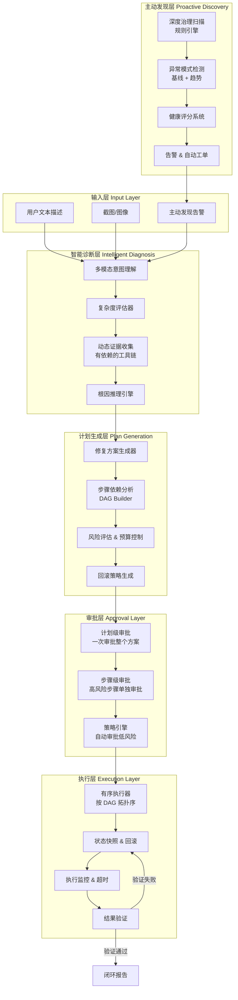
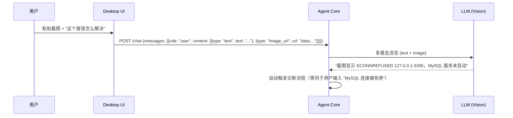
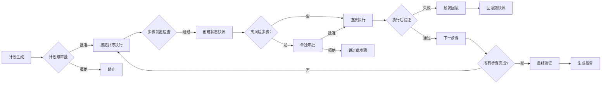
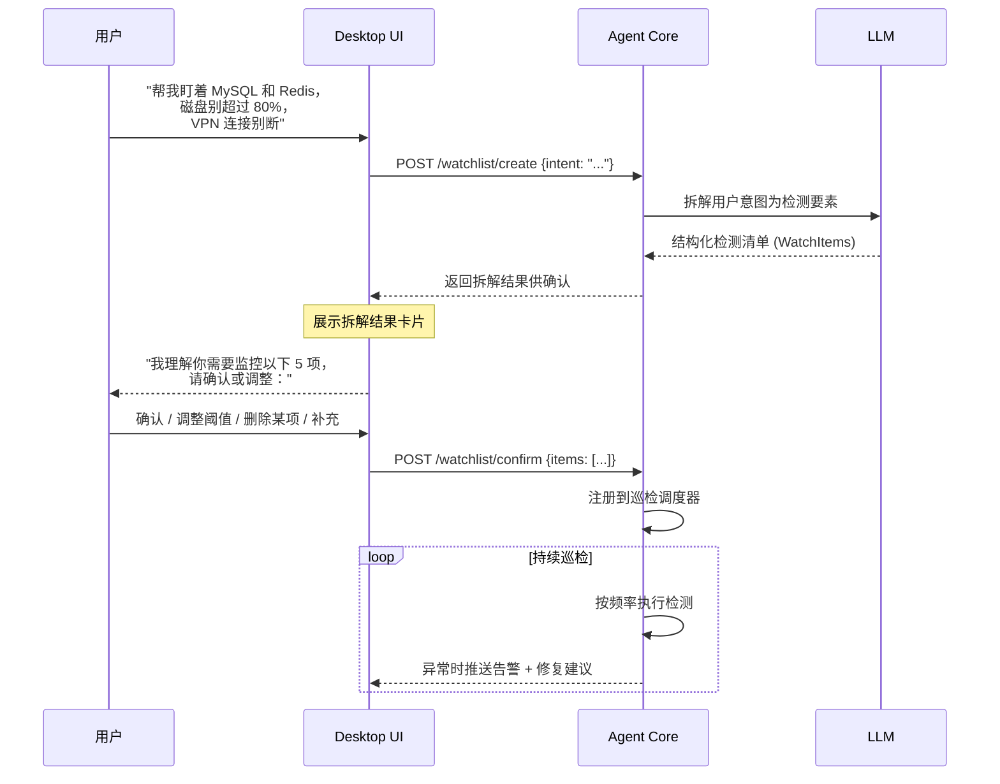
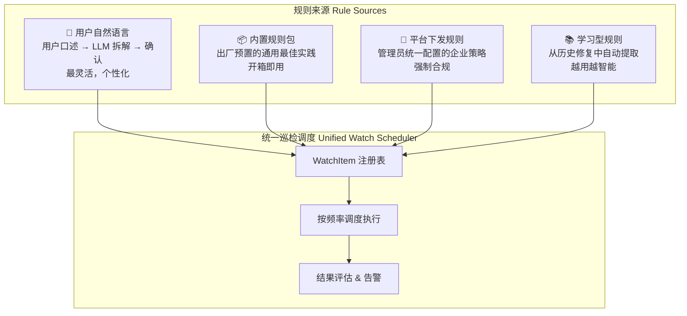
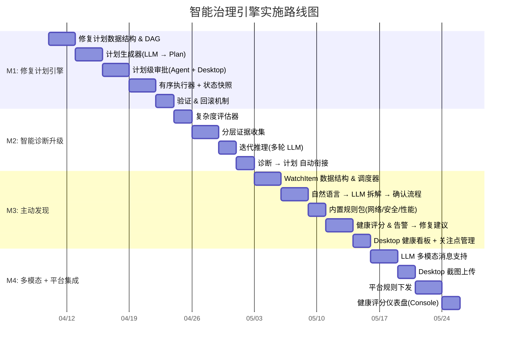

# Phase 1 Blueprint: 智能环境治理引擎

> **需求**: 将 EnvNexus 从"工具调用框架"升级为"智能环境治理引擎"
> **核心体验**: 用户描述问题 → Agent 自动诊断 → 生成修复计划 → 用户审批 → 自动执行 → 验证结果；同时具备主动发现问题的能力

---

## 1. 架构总览：从"工具循环"到"治理引擎"

### 1.1 当前架构的核心局限

当前 Agent Core 有两条独立的执行路径，但都缺乏"智能"：

**路径 A — Chat Loop (`agent/loop.go`)**:
```
用户消息 → LLM → 工具调用 → LLM → 工具调用 → ... → 最终回复
```
- LLM 自行决定调用什么工具、调用几次、什么顺序
- 没有执行计划，没有复杂度评估，没有预算控制
- 每次工具调用独立审批，用户无法看到"全局修复方案"

**路径 B — Diagnosis Engine (`diagnosis/engine.go`)**:
```
意图分类 → 硬编码工具映射 → 并行采集证据 → LLM 推理 → 建议列表
```
- 工具选择是静态映射表，不是动态推理
- 证据采集无序并行，无法处理有依赖的诊断链
- 建议列表是"建议"而非"可执行计划"，没有步骤间的因果关系

**目标架构 — 智能治理引擎**:
```
输入(文本/截图) → 智能诊断 → 修复计划(有序DAG) → 计划审批 → 自动执行 → 验证 → 闭环
                                                                    ↑
                                              主动发现 → 异常告警 → 自动生成修复计划
```

### 1.2 目标架构图



---

## 2. 六大核心工作流

### 工作流 S1: 多模态输入 → 智能意图理解

**当前**: `Message.Content` 是纯 `string`，API 只接受文本。

**目标**: 支持文本 + 图像混合输入，Agent 能从截图中提取错误信息并自动诊断。



**关键设计决策**:
- `router.Message.Content` 从 `string` 改为 `[]ContentPart` 联合类型（text/image_url）
- 图像通过 base64 data URI 传输（避免文件系统依赖）
- 仅在 Vision 能力的 Provider（GPT-4o, Gemini Pro, Claude）上启用图像
- 非 Vision Provider 自动降级：先用 Vision Provider 提取文本描述，再交给主 Provider 推理

### 工作流 S2: 复杂度感知的诊断编排

**当前**: 诊断引擎是固定 4 步管线，`risk_bias` 字段定义了但从未使用。

**目标**: 根据问题复杂度动态调整诊断深度、工具预算和推理策略。

```
┌──────────────────────────────────────────────────────────────────┐
│                    复杂度评估器 (Complexity Assessor)              │
├──────────┬──────────┬──────────┬─────────────────────────────────┤
│ 级别      │ 工具预算  │ 推理深度  │ 策略                            │
├──────────┼──────────┼──────────┼─────────────────────────────────┤
│ Simple   │ ≤3 tools │ 1 轮推理  │ 直接匹配已知模式，快速修复        │
│ Moderate │ ≤8 tools │ 2 轮推理  │ 证据收集 → 推理 → 补充证据 → 结论 │
│ Complex  │ ≤15 tools│ 3 轮推理  │ 多轮迭代，支持假设-验证循环        │
│ Critical │ 无上限    │ 深度推理  │ 全面扫描，人工介入点，保守策略      │
└──────────┴──────────┴──────────┴─────────────────────────────────┘
```

**关键改造点**:
- `DiagnosisPlan` 新增 `complexity` 字段（替代无用的 `risk_bias`）
- 证据收集从"全部并行"改为"分层收集"：先执行基础工具，根据结果决定是否需要深入工具
- LLM 推理支持多轮迭代：第一轮推理后如果置信度 < 阈值，自动请求补充证据

### 工作流 S3: 修复计划生成 + DAG 执行

**当前**: 诊断结果是一个扁平的 `RecommendedActions` 列表，无序、无依赖、无回滚。

**目标**: 生成有序的修复计划（DAG），每步有前置条件、验证条件和回滚策略。

```go
// 修复计划的核心数据结构
type RemediationPlan struct {
    PlanID      string           `json:"plan_id"`
    Summary     string           `json:"summary"`
    Complexity  string           `json:"complexity"`     // simple/moderate/complex/critical
    TotalSteps  int              `json:"total_steps"`
    RiskLevel   string           `json:"risk_level"`     // 整体风险等级
    Steps       []RemediationStep `json:"steps"`
    Verification *VerificationStep `json:"verification"` // 最终验证
}

type RemediationStep struct {
    StepID       int                    `json:"step_id"`
    Description  string                 `json:"description"`
    ToolName     string                 `json:"tool_name"`
    Params       map[string]interface{} `json:"params"`
    RiskLevel    string                 `json:"risk_level"`
    DependsOn    []int                  `json:"depends_on"`    // 前置步骤 ID
    Precondition *ToolCheck             `json:"precondition"`  // 执行前检查
    Rollback     *RollbackAction        `json:"rollback"`      // 回滚动作
    Verify       *ToolCheck             `json:"verify"`        // 执行后验证
    Timeout      time.Duration          `json:"timeout"`
}
```

**执行流程**:


### 工作流 S4: 分层审批机制

**当前**: 每个工具调用独立审批（`approval_required` SSE 事件），用户无法看到全局方案。

**目标**: 两层审批模型 — 计划级 + 步骤级。

```
┌─────────────────────────────────────────────────────────────────┐
│                        审批策略矩阵                               │
├──────────┬──────────────────────────────────────────────────────┤
│ 风险等级  │ 审批行为                                              │
├──────────┼──────────────────────────────────────────────────────┤
│ L0       │ 自动通过（只读工具，无需审批）                           │
│ L1       │ 计划级审批后自动执行（低风险写操作，如修改配置文件）        │
│ L2       │ 计划级审批 + 执行前确认（中风险，如重启服务、清缓存）      │
│ L3       │ 计划级审批 + 每步单独审批（高风险，如删除文件、修改注册表） │
└──────────┴──────────────────────────────────────────────────────┘
```

**用户体验**:
```
┌─────────────────────────────────────────────────┐
│  🔍 诊断完成：MySQL 连接被拒绝                     │
│                                                   │
│  📋 修复计划（共 3 步，整体风险: L2）               │
│                                                   │
│  Step 1 [L0] 检查 MySQL 进程状态                   │
│    → read_process_list {filter: "mysql"}          │
│                                                   │
│  Step 2 [L2] 重启 MySQL 服务                       │
│    → service.restart {name: "mysql"}              │
│    ⚠️ 此步骤将在执行前再次确认                      │
│    🔄 回滚: 如果失败，恢复原服务状态                 │
│                                                   │
│  Step 3 [L0] 验证 MySQL 连接恢复                   │
│    → mysql_check {host: "127.0.0.1", port: 3306} │
│                                                   │
│  [✅ 批准整个计划]  [❌ 拒绝]  [✏️ 修改]            │
└─────────────────────────────────────────────────┘
```

### 工作流 S5: 主动发现 — 用户自然语言定义关注点 + 智能巡检

**当前**: `governance/engine.go` 只检测 hostname、网卡、5 个环境变量的变化。

**目标**: 用户用自然语言描述关注的问题和指标，LLM 自动拆解为可执行的检测要素，用户确认后 Agent 持续巡检。

#### S5.1 核心交互流程：自然语言 → 检测要素 → 确认 → 持续巡检



#### S5.2 用户输入 → LLM 拆解的示例

**用户说**：`"帮我关注一下 MySQL 服务状态、Redis 能不能连上、C 盘别超过 80%、还有公司 VPN 别断"`

**LLM 拆解结果**（返回给用户确认）：

```
┌─────────────────────────────────────────────────────────────────┐
│  🔍 已理解你的关注点，拆解为以下 5 项检测：                        │
│                                                                   │
│  ┌─ 1. MySQL 服务存活 ──────────────────────────────────────┐    │
│  │  检测方式: mysql_check {host: "127.0.0.1", port: 3306}   │    │
│  │  判定标准: TCP 连接成功 + 握手正常                          │    │
│  │  检测频率: 每 5 分钟                                       │    │
│  │  告警级别: error                                           │    │
│  └──────────────────────────────────────────────────────────┘    │
│                                                                   │
│  ┌─ 2. Redis 连通性 ────────────────────────────────────────┐    │
│  │  检测方式: redis_check {host: "127.0.0.1", port: 6379}   │    │
│  │  判定标准: PING → PONG 响应正常                            │    │
│  │  检测频率: 每 5 分钟                                       │    │
│  │  告警级别: error                                           │    │
│  └──────────────────────────────────────────────────────────┘    │
│                                                                   │
│  ┌─ 3. C 盘磁盘使用率 ─────────────────────────────────────┐    │
│  │  检测方式: read_disk_usage {}                              │    │
│  │  判定标准: C: 盘使用率 < 80%                               │    │
│  │  检测频率: 每 30 分钟                                      │    │
│  │  告警级别: warning                                         │    │
│  └──────────────────────────────────────────────────────────┘    │
│                                                                   │
│  ┌─ 4. VPN 连接状态 ───────────────────────────────────────┐    │
│  │  检测方式: read_network_config {} + ping_host              │    │
│  │           {host: "vpn-gateway.company.com"}                │    │
│  │  判定标准: VPN 网卡存在且 UP + 网关可达                     │    │
│  │  检测频率: 每 5 分钟                                       │    │
│  │  告警级别: warning                                         │    │
│  └──────────────────────────────────────────────────────────┘    │
│                                                                   │
│  ┌─ 5. MySQL 进程资源 (LLM 补充建议) ──────────────────────┐    │
│  │  检测方式: read_process_list {filter: "mysql"}             │    │
│  │  判定标准: 内存占用 < 2GB, CPU < 80%                       │    │
│  │  检测频率: 每 15 分钟                                      │    │
│  │  告警级别: warning                                         │    │
│  │  💡 LLM 建议: "你关注 MySQL 服务，建议同时监控其资源占用"   │    │
│  └──────────────────────────────────────────────────────────┘    │
│                                                                   │
│  [✅ 全部确认]  [✏️ 调整]  [➕ 补充更多]  [❌ 取消]              │
└─────────────────────────────────────────────────────────────────┘
```

**关键设计点**：
- **LLM 主动补充**：用户说"关注 MySQL"，LLM 不仅拆解出连通性检测，还主动建议监控进程资源占用。用户可以接受或删除补充项。
- **阈值可调**：用户确认时可以修改阈值（如把 80% 改成 90%）、频率（如从 5 分钟改成 1 分钟）。
- **自然语言追加**：确认后用户随时可以说"再帮我加一个 Nginx 的监控"，LLM 增量拆解并追加。

#### S5.3 WatchItem 数据结构

```go
type WatchItem struct {
    ID            string                 `json:"id"`
    Label         string                 `json:"label"`           // 人类可读标签
    ToolName      string                 `json:"tool_name"`       // 检测使用的工具
    ToolParams    map[string]interface{} `json:"tool_params"`     // 工具参数
    Condition     WatchCondition         `json:"condition"`       // 判定条件
    Interval      time.Duration          `json:"interval"`        // 检测频率
    Severity      string                 `json:"severity"`        // info/warning/error/critical
    Source        string                 `json:"source"`          // user/llm_suggested/builtin/platform
    Enabled       bool                   `json:"enabled"`
    LastCheckAt   time.Time              `json:"last_check_at"`
    LastStatus    string                 `json:"last_status"`     // healthy/degraded/critical/unknown
    ConsecutiveFails int                 `json:"consecutive_fails"`
}

type WatchCondition struct {
    Type      string      `json:"type"`       // threshold/exists/reachable/contains/custom
    Field     string      `json:"field"`      // 从工具输出中提取的字段路径
    Operator  string      `json:"operator"`   // lt/gt/eq/ne/contains/not_contains
    Value     interface{} `json:"value"`      // 阈值
    Expression string     `json:"expression"` // 复杂条件的 CEL/JSONPath 表达式
}
```

#### S5.4 三层规则来源



| 来源 | 创建方式 | 可编辑 | 可删除 | 典型场景 |
|------|---------|--------|--------|---------|
| 用户自然语言 | 对话中描述 → LLM 拆解 → 确认 | ✅ 用户可调 | ✅ | "帮我盯着 MySQL 和磁盘" |
| 内置规则包 | Agent 出厂预置 | ✅ 可调阈值 | ❌ 只能禁用 | DNS 超时、磁盘满、证书过期 |
| 平台下发 | 管理员在 Console 配置 | ❌ 终端不可改 | ❌ | "全公司禁止 SSH 密码登录" |
| 学习型 | 修复成功后自动提取 | ✅ | ✅ | 上次修过 Redis 超时，自动加监控 |

#### S5.5 内置规则包（开箱即用）

| 规则 ID | 类别 | 检测内容 | 严重度 | 自动修复建议 |
|---------|------|---------|--------|-------------|
| NET-001 | 网络 | DNS 解析超时 > 2s | warning | 建议切换 DNS |
| NET-002 | 网络 | 代理配置不一致（env vs system） | warning | 建议统一配置 |
| SEC-001 | 安全 | 防火墙未启用 | critical | 建议启用 |
| SEC-002 | 安全 | SSH 允许密码登录 | warning | 建议禁用 |
| PERF-001 | 性能 | 磁盘使用率 > 90% | warning | 建议清理 |
| PERF-002 | 性能 | 内存使用率持续 > 85% (30min) | warning | 建议排查进程 |
| DEP-001 | 依赖 | 关键运行时版本过旧 | info | 建议升级 |
| SVC-001 | 服务 | 注册服务未运行 | error | 建议重启 |
| CERT-001 | 证书 | TLS 证书 30 天内过期 | warning | 提醒续期 |

#### S5.6 告警 → 自动修复建议的闭环

当巡检发现异常时：
1. **Desktop 弹出告警通知**：`"⚠️ MySQL 服务已停止（连续 2 次检测失败）"`
2. **自动生成修复建议**：Agent 调用诊断引擎，生成修复计划（如"重启 MySQL 服务"）
3. **用户一键处理**：点击通知 → 查看修复计划 → 审批 → 自动执行
4. **闭环验证**：修复后自动运行对应的 WatchItem 检测，确认恢复正常
5. **学习沉淀**：如果用户经常手动修复某类问题，LLM 建议将其加入自动修复白名单

### 工作流 S6: 闭环验证 + 学习

**执行完修复后**:
1. 运行验证步骤（修复计划中定义的 `Verify`）
2. 如果验证通过 → 记录成功模式到本地知识库
3. 如果验证失败 → 触发回滚 → 记录失败模式 → 建议人工介入
4. 生成结构化报告（问题描述、根因、修复步骤、验证结果）

---

## 3. 技术改造清单

### 3.1 Agent Core 改造

| 模块 | 改造内容 | 影响范围 |
|------|---------|---------|
| `llm/router` | `Message.Content` 支持 `[]ContentPart` 多模态 | router.go, 所有 provider |
| `diagnosis/engine.go` | 重构为分层诊断：复杂度评估 → 分层证据收集 → 迭代推理 | engine.go |
| **新增** `remediation/` | 修复计划生成器 + DAG 执行器 + 回滚管理器 | 新 package |
| `policy/engine.go` | 支持计划级审批 + 策略矩阵（按 risk level 分级） | engine.go |
| `governance/engine.go` | 重构为 WatchItem 调度器 + 规则引擎 + 健康评分 + 告警 | engine.go, 新增 watchlist/ |
| **新增** `governance/watchlist/` | WatchItem 数据结构、LLM 拆解器、调度执行、条件评估 | 新 package |
| `agent/loop.go` | 集成修复计划流程（诊断 → 计划 → 审批 → 执行） | loop.go |
| `api/server.go` | 新增计划审批 API、WatchList CRUD API、健康评分 API | server.go |
| `tools/` | 新增验证类工具（verify_*）和回滚类工具（rollback_*） | 新文件 |

### 3.2 Desktop 改造

| 模块 | 改造内容 |
|------|---------|
| 聊天界面 | 支持图片粘贴/拖拽上传 |
| 审批界面 | 从"单条审批"改为"计划审批"视图（展示完整修复方案） |
| 关注点管理 | 新增"我的关注"tab：展示所有 WatchItem、状态、最近检测结果；支持自然语言添加 |
| 拆解确认 UI | LLM 拆解结果的确认/调整卡片（调阈值、改频率、删除/追加项） |
| 健康看板 | 展示健康评分、告警历史、趋势图 |
| 通知 | 巡检异常时通过系统通知提醒用户，点击直达修复建议 |

### 3.3 Platform API 改造

| 模块 | 改造内容 |
|------|---------|
| 治理规则下发 | 新增 API：管理员配置规则包 → 下发到终端 |
| 健康评分聚合 | 新增 API：汇总所有设备健康评分，仪表盘展示 |
| 修复计划审计 | 审计日志记录完整的修复计划（而非单个工具调用） |

---

## 4. 分阶段实施路线图

考虑到改造范围大，建议分 4 个里程碑递进：



---

## 5. 关键设计决策

### D1: 修复计划由谁生成？

**决策**: LLM 生成 + 引擎校验。

LLM 负责根据诊断结果生成修复方案（包括步骤顺序、参数、回滚策略），引擎负责：
- 校验所有 `tool_name` 存在于注册表
- 强制使用注册表中的 `RiskLevel()`（不信任 LLM 的风险评估）
- 校验依赖关系无环（DAG 验证）
- 注入回滚策略（基于工具元数据）

### D2: 计划审批 vs 逐步审批？

**决策**: 两层并存，策略驱动。

- 默认：用户审批整个计划后，L0/L1 步骤自动执行，L2 执行前弹确认，L3 每步单独审批
- 策略可配置：管理员可通过 Platform 下发策略（如"所有 L2+ 都需要单独审批"）
- 紧急模式：用户可选"全部自动执行"（仅限本地模式，平台模式需管理员授权）

### D3: 主动发现的规则从哪来？

**决策**: 四层来源，用户自然语言优先。

1. **用户自然语言**（核心创新）：用户用口语描述关注点，LLM 拆解为结构化 WatchItem，用户确认后生效。这是最灵活、最个性化的方式。
2. **内置规则包**：出厂预置的通用最佳实践（DNS、磁盘、证书等），开箱即用。
3. **平台下发**：管理员在 Console 配置的企业级合规策略，终端不可修改。
4. **学习型规则**：从历史修复中自动提取（如"上次修过 Redis 超时，建议加入监控"）。

所有来源统一注册到 WatchItem 调度器，按各自频率执行检测。

### D6: 用户自然语言 → 检测要素的拆解策略？

**决策**: LLM 拆解 + 引擎校验 + 用户确认，三步闭环。

- LLM 负责理解用户意图、选择合适的工具和参数、设定合理的阈值和频率
- 引擎校验：验证 tool_name 存在、参数合法、频率不低于工具最小间隔
- LLM 可主动补充建议（如用户说"关注 MySQL"，LLM 额外建议监控进程资源）
- 用户有最终决定权：可以调整阈值、删除不需要的项、追加新的关注点
- 确认后才注册到调度器，未确认的拆解结果不会执行

### D4: 回滚的粒度？

**决策**: 步骤级快照 + 工具级回滚。

- 每个修改步骤执行前，记录当前状态（文件内容、配置值、服务状态）
- 回滚时按逆序执行回滚动作
- 不做系统级快照（太重），而是做精确的"变更前状态记录"

### D5: 离线模式下的主动发现？

**决策**: 内置规则本地执行，结果缓存等上线后同步。

- 内置规则包编译进 Agent 二进制
- 平台下发的自定义规则缓存在本地 SQLite
- 离线时扫描结果存本地，上线后批量上报

---

## 6. 安全约束（不可妥协）

1. **修复计划中的所有工具必须在注册表中** — LLM 不能发明工具
2. **风险等级以注册表为准** — LLM 不能降低风险等级
3. **回滚动作也需要审批** — 回滚不是无条件执行
4. **主动发现只触发通知，不自动执行修复** — 除非用户明确启用"自动修复"
5. **`command.execute` WS 路径必须经过 policy engine** — 修复当前的安全漏洞
6. **截图中的敏感信息自动脱敏** — 在发送给 LLM 前检测并遮盖密码/密钥

---

## 7. 与 Cursor 的类比 & 差异

| 维度 | Cursor | EnvNexus 智能治理引擎 |
|------|--------|---------------------|
| 输入 | 代码 + 自然语言 | 环境状态 + 自然语言 + 截图 |
| 分析对象 | 代码库 | 操作系统 + 网络 + 服务 + 容器 |
| 输出 | 代码变更 | 修复计划（命令序列） |
| 审批 | 用户 Accept/Reject 代码变更 | 用户审批修复计划 + 高风险步骤二次确认 |
| 执行 | 直接写入文件 | 通过工具执行系统命令（有回滚） |
| 主动性 | 被动（用户发起） | 主动发现 + 被动响应 |
| 安全模型 | 文件系统权限 | 零信任 + 策略矩阵 + 全链路审计 |

**EnvNexus 的独特价值**: Cursor 操作的是代码（可 git revert），EnvNexus 操作的是生产环境（不可轻易回滚）。因此 EnvNexus 的审批和回滚机制必须比 Cursor 更严格，这也是产品的核心竞争力。
