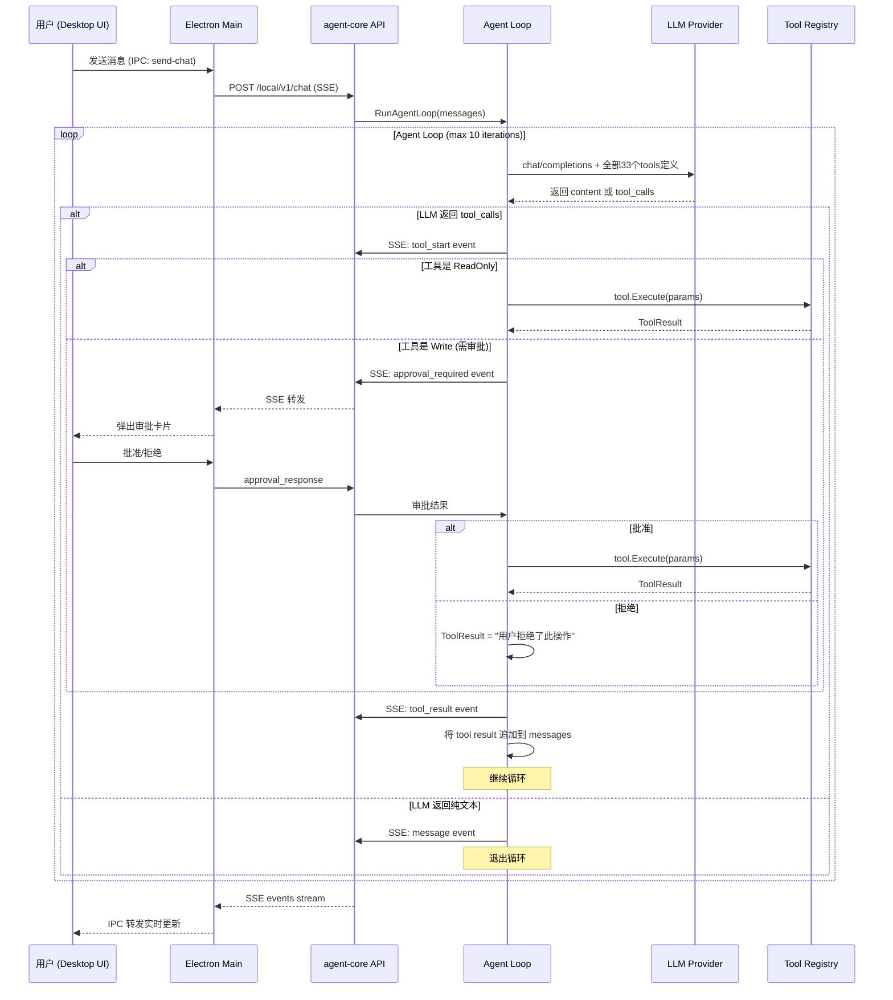

# 蓝图: Agent Loop (ReAct) 架构改造

## 1. 需求概述

将 agent-desktop 的诊断对话从"固定流水线"改造为"LLM 驱动的 Agent Loop"：
- 用户提出问题
- LLM 分析问题，自主决定调用哪个工具、传什么参数
- agent-core 执行工具，将结果反馈给 LLM
- LLM 整合结果后生成自然语言回复给用户
- 支持多轮对话上下文

## 2. 架构总览



## 3. 模块改动清单

### 3.1 Tool 接口扩展 (`internal/tools/tool.go`)

现有接口缺少参数 Schema 描述，LLM 无法知道工具接受什么参数。

**新增**:
- `ToolParamSchema` / `ToolParamProperty` 结构体
- `Tool` 接口增加 `Parameters() *ToolParamSchema` 方法
- `Registry` 增加 `ToOpenAITools()` 方法，批量生成 Function Calling 格式

### 3.2 所有 Tool 实现适配

33 个工具实现类各自新增 `Parameters()` 方法，返回各自的参数 JSON Schema。

### 3.3 LLM Router 协议层 (`internal/llm/router/router.go`)

**扩展**:
- `CompletionRequest` 增加 `Tools []ToolDefinition` 字段
- `CompletionResponse` 增加 `ToolCalls []ToolCall` 字段
- 新增 `ToolDefinition`、`ToolCall`、`FunctionCall` 结构体

### 3.4 LLM Provider 适配

**OpenAI Provider** (`providers/openai.go`):
- 请求体增加 `tools` 字段
- 响应解析 `tool_calls` 数组
- Message 支持 `role: "tool"` 类型

其他 Provider (DeepSeek/OpenRouter 走 OpenAI 兼容协议，天然支持；Anthropic/Gemini 需要各自适配)。

### 3.5 Agent Loop 引擎 (新建 `internal/agent/loop.go`)

核心 ReAct 循环:
1. 将用户 messages + system prompt + tools 定义发给 LLM
2. 如果 LLM 返回 `tool_calls`，逐个执行工具
3. 将工具结果作为 `role: "tool"` 消息追加
4. 重复步骤 1，直到 LLM 返回纯文本或达到最大迭代次数
5. 通过回调函数实时通知进度 (SSE)

**安全约束**:
- 最大迭代次数: 10 (防止无限循环)
- **上报全部 33 个工具**给 LLM（包括读和写），让 LLM 拥有完整能力
- ReadOnly 工具 (L0): 直接执行，无需审批
- ReadOnly 工具 (L1, 如 shell_exec): 走 Policy Engine 检查
- **Write 工具 (L1/L2)**: LLM 决定调用时，**暂停 Agent Loop**，通过 SSE 发送 `approval_required` 事件给前端，等待用户在 UI 上批准/拒绝后再继续

### 3.6 API Server (`internal/api/server.go`)

**新增端点**: `POST /local/v1/chat`
- 接受 `{ messages: [...], session_id: "..." }`
- SSE 流式输出: `thinking` / `tool_start` / `tool_result` / `message` / `error` 事件
- 保留现有 `/local/v1/diagnose` 不动 (向后兼容)

### 3.7 Desktop 前端

**Electron Main** (`main.ts`):
- 新增 `send-chat` IPC handler，调用 `/local/v1/chat`
- SSE 解析转发多种事件类型

**Renderer** (`index.html`):
- 诊断对话页面改用新的 chat 端点
- 支持显示工具调用过程 (折叠面板)
- 支持流式显示 LLM 回复

## 4. 工具上报策略

**全部 33 个工具上报给 LLM**，让模型拥有完整的工具能力。安全通过执行时的审批机制保障：

| 类别 | 工具数 | 执行策略 |
|------|--------|----------|
| ReadOnly + L0 | 27 个 | ✅ 直接执行，无需审批 |
| ReadOnly + L1 (`shell_exec`) | 1 个 | ✅ 走 Policy Engine 检查后执行 |
| Write + L1 (`proxy.toggle`, `config.modify`) | 2 个 | ⏸ 暂停循环，发送 `approval_required` 事件，等用户批准 |
| Write + L2 (`dns.flush_cache`, `service.restart`, `container.reload`, `cache.rebuild`) | 3 个 | ⏸ 暂停循环，发送 `approval_required` 事件，等用户批准 |

### 审批流程

```mermaid
sequenceDiagram
    participant LLM
    participant Loop as Agent Loop
    participant UI as Desktop UI

    LLM->>Loop: tool_calls: [{name: "service.restart", params: {service_name: "nginx"}}]
    Loop->>Loop: 检查 tool.IsReadOnly() == false → 需要审批
    Loop->>UI: SSE event: approval_required {tool_name, params, risk_level, description}
    UI->>UI: 弹出审批卡片，用户看到工具名、参数、风险等级
    
    alt 用户批准
        UI->>Loop: approval_response {approved: true}
        Loop->>Loop: tool.Execute(params)
        Loop->>LLM: tool result → 继续循环
    else 用户拒绝
        UI->>Loop: approval_response {approved: false}
        Loop->>LLM: tool result = "用户拒绝了此操作" → 继续循环
    end
```

## 5. 数据流示例

用户: "查看当前机器的 IP 地址"

```
1. LLM 收到 messages + 27个工具定义
2. LLM 返回: tool_calls: [{name: "read_network_config", arguments: {}}]
3. agent-core 执行 read_network_config → 返回网卡列表
4. 结果作为 tool message 追加到 messages
5. LLM 收到完整上下文，生成自然语言回复:
   "您的机器有以下网络接口:
    - 以太网 (Ethernet): 192.168.1.100
    - Wi-Fi: 192.168.1.101
    - Loopback: 127.0.0.1"
```

用户: "看看 /var/log 目录下有什么文件"

```
1. LLM 返回: tool_calls: [{name: "read_dir_list", arguments: {"path": "/var/log"}}]
2. agent-core 执行 read_dir_list → 返回文件列表
3. LLM 整合结果，自然语言回复文件列表
```

## 6. 写操作数据流示例

用户: "帮我重启一下 nginx 服务"

```
1. LLM 收到 messages + 全部33个工具定义
2. LLM 返回: tool_calls: [{name: "service.restart", arguments: {"service_name": "nginx"}}]
3. Agent Loop 检查: service.restart.IsReadOnly() == false → 需要审批
4. SSE 发送 approval_required 事件给前端
5. 前端弹出审批卡片: "🔧 service.restart — 重启 nginx 服务 [风险: L2]"
6a. 用户点击 [批准] → 执行工具 → 结果反馈 LLM → LLM 回复 "nginx 已成功重启"
6b. 用户点击 [拒绝] → 反馈 LLM "用户拒绝了此操作" → LLM 回复 "好的，已取消重启操作"
```

## 7. 兼容性

- 保留现有 `diagnosis.Engine` 和 `/local/v1/diagnose` 端点不动
- 新建 `agent.Loop` 和 `/local/v1/chat` 端点
- Desktop 前端诊断对话页面切换到新端点
- WebSocket 远程会话路径 (`session.WSClient`) 暂不改动
