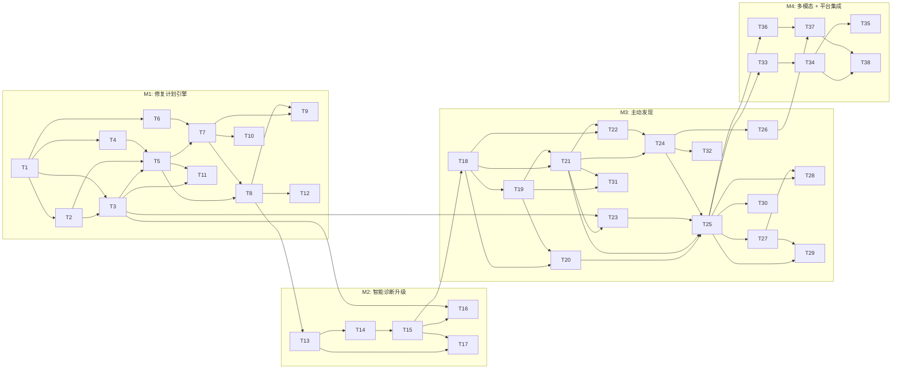

# Phase 2: 智能环境治理引擎 — 增量开发计划

> **核心原则**: 所有改造基于现有代码增量进行。现有的 Chat Loop、诊断引擎、策略引擎、
> 治理引擎、工具注册表、Desktop UI 均保持原有功能不变，在此基础上扩展新能力。
>
> 基于 `01-blueprint.md` 六大工作流，分解为 4 个里程碑、14 个并行组、38 个原子任务。

---

## 现有功能基线（不可破坏）

| 模块 | 现有能力 | 增强方向 |
|------|---------|---------|
| `agent/loop.go` | Chat Loop: LLM 迭代调用工具、SSE 事件流、逐工具审批 | 新增"修复计划"分支，与现有 Chat 并存 |
| `diagnosis/engine.go` | 4 步管线: 意图分类→工具映射→并行采集→LLM 推理 | 在 Plan 阶段插入复杂度评估，Execute 阶段改为分层采集 |
| `policy/engine.go` | Check/Resolve 审批流、Platform 同步 | 新增 CheckPlan 方法，保留原有 Check 路径 |
| `governance/engine.go` | 基线采集、漂移检测（hostname/网卡/env） | 新增 WatchlistManager 字段，Start() 同时启动巡检 |
| `tools/tool.go` | Tool 接口、Registry、ApprovalChecker | 不改接口，新增工具实现 |
| `api/server.go` | 12 个 API 端点（chat/diagnose/approvals/update） | 新增端点，不修改现有端点签名 |
| Desktop `index.html` | 5 页面（dashboard/diagnosis/history/logs/settings）、Chat UI、审批卡片 | 新增页面和 SSE 事件处理，保留现有 UI |

---

## Milestone 1: 修复计划引擎 (M1)

> 在现有 Chat Loop 基础上，新增"修复计划"能力。用户仍可正常使用 Chat 对话，
> 当诊断出需要修复的问题时，自动生成修复计划供审批。

### Group 1 (parallel — no prerequisites)

- [ ] **T1** [backend] 新增 `remediation/` package — 核心数据结构 · outputs: `apps/agent-core/internal/remediation/types.go`
  - 定义 `RemediationPlan`、`RemediationStep`、`RollbackAction`、`VerificationStep`、`ToolCheck`
  - 定义 `PlanStatus`/`StepStatus` 状态枚举
  - 定义 SSE 事件类型常量（`plan_generated`、`step_start`、`step_result`、`rollback_start`、`plan_complete`）
  - **不修改任何现有文件**

- [ ] **T2** [backend] 新增 `remediation/dag.go` — DAG 构建与拓扑排序 · depends: T1 · outputs: `apps/agent-core/internal/remediation/dag.go`
  - 从 `RemediationStep.DependsOn` 构建有向无环图
  - 拓扑排序 + 环检测
  - 输出按层级分组的执行序列
  - **不修改任何现有文件**

### Group 2 (parallel — after Group 1)

- [ ] **T3** [backend] 新增 `remediation/planner.go` — LLM 生成修复计划 · depends: T1, T2 · outputs: `apps/agent-core/internal/remediation/planner.go`
  - `NewPlanner(registry *tools.Registry, llmRouter *router.Router)`
  - `GeneratePlan(ctx, diagResult *diagnosis.DiagnosisResult) (*RemediationPlan, error)`
  - 构造 prompt 让 LLM 生成结构化修复计划 JSON
  - 引擎校验：验证 tool_name 存在于 Registry、强制使用注册表 `RiskLevel()`、DAG 无环
  - 注入回滚策略（基于工具 `IsReadOnly` + `RiskLevel` 元数据）
  - **不修改任何现有文件**

- [ ] **T4** [backend] 新增 `remediation/snapshot.go` — 状态快照管理 · depends: T1 · outputs: `apps/agent-core/internal/remediation/snapshot.go`
  - 步骤执行前捕获目标状态（文件内容、配置值、服务状态）
  - 快照存储到 SQLite（关联 plan_id + step_id）
  - `Capture(ctx, step) (*Snapshot, error)` 和 `Restore(ctx, snapshot) error`
  - **不修改任何现有文件**

### Group 3 (parallel — after Group 2)

- [ ] **T5** [backend] 新增 `remediation/executor.go` — DAG 执行器 · depends: T2, T3, T4 · outputs: `apps/agent-core/internal/remediation/executor.go`
  - 按拓扑序逐步执行：前置检查 → 快照 → 审批判断 → 工具执行 → 验证
  - 复用现有 `tools.Registry.Get()` + `tool.Execute()` 执行工具
  - L2 步骤执行前通过回调请求确认
  - L3 步骤每步单独走审批回调
  - 失败时按逆序恢复快照
  - 通过 `EventHandler` 回调发送进度事件（复用 `agent.Event` 模式）
  - **不修改任何现有文件**

- [ ] **T6** [backend] 扩展 Policy Engine — 新增 `CheckPlan` 方法 · depends: T1 · outputs: `apps/agent-core/internal/policy/plan_approval.go`
  - 新增 `PlanApprovalRequest` 结构（包含 `RemediationPlan` 引用）
  - 新增 `CheckPlan(ctx, plan *remediation.RemediationPlan) (bool, error)` — **新方法，不修改现有 Check/CheckWithSession**
  - 审批策略矩阵：L0 自动通过、L1 计划级、L2 计划+确认、L3 逐步审批
  - 复用现有 `pendingApprovals` map 和 `Resolve` 机制
  - **仅新增文件 + 在 engine.go 中添加方法，不改变现有方法签名**

### Group 4 (parallel — after Group 3)

- [ ] **T7** [backend] 新增修复计划 API 端点 · depends: T5, T6 · outputs: `apps/agent-core/internal/api/plan_handler.go`, `apps/agent-core/internal/api/server.go` (新增路由)
  - `POST /local/v1/plan/approve` — 审批修复计划
  - `POST /local/v1/plan/reject` — 拒绝修复计划
  - `POST /local/v1/plan/step/confirm` — L2 步骤执行确认
  - `POST /local/v1/plan/step/approve` — L3 步骤单独审批
  - `GET /local/v1/plan/:id` — 查询计划状态
  - **在 server.go 的路由组中追加新路由，不修改现有路由**

- [ ] **T8** [backend] 在 Agent Loop 中集成修复计划（可选分支） · depends: T5, T7 · outputs: `apps/agent-core/internal/agent/loop.go` (增量修改)
  - **保留现有 Run() 完整逻辑不变**
  - 新增 `WithRemediationPlanner(p *remediation.Planner) LoopOption`
  - 在 `executeTool` 返回后，检测 LLM 是否在 content 中包含修复建议标记
  - 当检测到修复建议时，调用 Planner 生成计划，通过现有 `emit()` 发送 `plan_generated` 事件
  - 计划审批和执行通过新的 API 端点异步处理
  - **现有 Chat 对话不受影响，修复计划是附加能力**

### Group 5 (frontend — after Group 4)

- [ ] **T9** [frontend] Desktop 新增修复计划 SSE 事件处理 · depends: T7, T8 · outputs: `apps/agent-desktop/src/renderer/index.html` (增量修改)
  - **在现有 `chat-event` switch 中新增 case**：`plan_generated`、`step_start`、`step_result`、`rollback_start`、`plan_complete`
  - `plan_generated`: 渲染修复计划卡片（摘要、步骤列表、风险等级、审批按钮）
  - `step_start`/`step_result`: 更新计划卡片中对应步骤的状态
  - `plan_complete`: 标记计划完成/失败
  - **复用现有 `.msg-approval` 样式模式，新增 `.msg-plan` 样式**

- [ ] **T10** [frontend] Desktop IPC 扩展 — 修复计划 · depends: T7 · outputs: `apps/agent-desktop/src/main/main.ts` (增量), `apps/agent-desktop/src/preload/preload.ts` (增量)
  - 新增 IPC handler：`plan-approve`、`plan-reject`、`plan-step-confirm`、`plan-step-approve`
  - 转发到 agent-core 对应新 API 端点
  - **追加到现有 ipcMain.handle 列表，不修改现有 handler**

### Group 6 (test — after Group 5)

- [ ] **T11** [test] 修复计划引擎单元测试 · depends: T3, T5 · outputs: `apps/agent-core/internal/remediation/*_test.go`
  - DAG 构建 & 拓扑排序（含环检测）
  - Planner 校验逻辑（工具不存在、风险等级覆盖）
  - Executor 正常流程 & 回滚流程（mock tools）

- [ ] **T12** [test] 回归测试 — 确保现有 Chat 和诊断不受影响 · depends: T8 · outputs: `apps/agent-core/internal/agent/loop_test.go`
  - 不设置 RemediationPlanner 时，Loop.Run 行为与改造前完全一致
  - 现有 SSE 事件类型不变

---

## Milestone 2: 智能诊断升级 (M2)

> 在现有诊断引擎的 4 步管线基础上增强，不改变 Plan/Execute 的外部接口。

### Group 7 (parallel — after M1 Group 4)

- [ ] **T13** [backend] 在诊断 Plan 阶段插入复杂度评估 · depends: T8 · outputs: `apps/agent-core/internal/diagnosis/complexity.go`, `apps/agent-core/internal/diagnosis/engine.go` (增量修改)
  - 新增 `ComplexityLevel` 枚举（Simple/Moderate/Complex/Critical）
  - 新增 `assessComplexity(ctx, input string) ComplexityLevel` — LLM 评估 + 关键词启发式降级
  - **在现有 `PlanWithProgress` 中，`stepIntentParse` 之后插入复杂度评估**
  - `DiagnosisPlan` 新增 `Complexity` 字段（替代未使用的 `RiskBias`）
  - **保留 `heuristicPlan` 降级路径不变**

- [ ] **T14** [backend] 重构证据收集为分层模式 · depends: T13 · outputs: `apps/agent-core/internal/diagnosis/engine.go` (增量修改)
  - **保留现有 `stepEvidenceCollect` 作为"全量并行"模式（Simple 级别使用）**
  - 新增 `stepLayeredEvidenceCollect`：第一层基础工具 → LLM 决定第二层深入工具
  - 在 `ExecuteWithProgress` 中根据 `plan.Complexity` 选择收集模式：
    - Simple: 使用现有 `stepEvidenceCollect`（全量并行，快速）
    - Moderate+: 使用 `stepLayeredEvidenceCollect`（分层，更精准）
  - 工具预算控制：按 ComplexityLevel 限制总工具调用数

### Group 8 (parallel — after Group 7)

- [ ] **T15** [backend] 新增迭代推理能力 · depends: T14 · outputs: `apps/agent-core/internal/diagnosis/engine.go` (增量修改)
  - **保留现有 `stepReasoning` 作为单轮推理（Simple 级别使用）**
  - 新增 `stepIterativeReasoning`：推理后评估置信度，< 阈值时请求补充证据
  - 在 `ExecuteWithProgress` 中根据 `plan.Complexity` 选择推理模式
  - 最多 N 轮迭代（N 由 ComplexityLevel 决定）

- [ ] **T16** [backend] 诊断结果自动衔接修复计划 · depends: T15, T3 · outputs: `apps/agent-core/internal/diagnosis/engine.go` (增量修改)
  - `DiagnosisResult` 新增 `NeedsRemediation bool` 字段
  - **在现有 `stepActionDraft` 末尾**：如果有 RecommendedActions 且包含写操作，设置 `NeedsRemediation = true`
  - 调用方（api/server.go 的 `handleDiagnose`）检测该字段后可选调用 Planner
  - **不改变 DiagnosisResult 的现有字段含义**

### Group 9 (test — after Group 8)

- [ ] **T17** [test] 诊断增强回归测试 · depends: T13, T15 · outputs: `apps/agent-core/internal/diagnosis/engine_test.go`
  - Simple 级别走现有快速路径
  - Moderate+ 走分层收集 + 迭代推理
  - 工具预算不超限

---

## Milestone 3: 主动发现 — Watchlist (M3)

> 在现有 Governance Engine 基础上新增 Watchlist 能力。现有基线/漂移检测保持不变。

### Group 10 (parallel — after M2 Group 8)

- [ ] **T18** [backend] 新增 `governance/watchlist/` package — 数据结构 & 存储 · depends: T15 · outputs: `apps/agent-core/internal/governance/watchlist/types.go`, `apps/agent-core/internal/governance/watchlist/store.go`
  - 定义 `WatchItem`、`WatchCondition` 结构体（按蓝图 S5.3）
  - 定义 `WatchAlert` 结构
  - SQLite 存储：CRUD、按 source 过滤、启用/禁用
  - **不修改现有 governance/engine.go**

- [ ] **T19** [backend] 新增条件评估引擎 · depends: T18 · outputs: `apps/agent-core/internal/governance/watchlist/evaluator.go`
  - 支持条件类型：threshold、exists、reachable、contains、custom
  - 从工具输出中按 Field（JSONPath）提取值
  - 运算符：lt/gt/eq/ne/contains/not_contains
  - **独立 package，不依赖现有 governance 代码**

### Group 11 (parallel — after Group 10)

- [ ] **T20** [backend] 新增 LLM 拆解器（自然语言 → WatchItems） · depends: T18, T19 · outputs: `apps/agent-core/internal/governance/watchlist/decomposer.go`
  - 接收用户自然语言描述，构造 prompt 让 LLM 输出结构化 WatchItem 数组
  - 引擎校验：验证 tool_name 存在于 Registry、参数合法
  - LLM 主动补充建议（source=llm_suggested）
  - 返回待确认列表
  - **不修改任何现有文件**

- [ ] **T21** [backend] 新增巡检调度器 · depends: T18, T19 · outputs: `apps/agent-core/internal/governance/watchlist/scheduler.go`
  - 按各 WatchItem.Interval 调度执行
  - 调用对应工具 → 评估条件 → 更新状态
  - 连续失败计数 + 告警生成
  - 支持动态注册/注销（不重启）
  - **不修改任何现有文件**

### Group 12 (parallel — after Group 11)

- [ ] **T22** [backend] 新增内置规则包 · depends: T18, T21 · outputs: `apps/agent-core/internal/governance/watchlist/builtin_rules.go`
  - 9 条内置规则（NET-001/002, SEC-001/002, PERF-001/002, DEP-001, SVC-001, CERT-001）
  - 每条映射为 WatchItem（source=builtin）
  - 启动时自动注册到调度器
  - **不修改任何现有文件**

- [ ] **T23** [backend] 告警 → 修复建议闭环 · depends: T21, T3 · outputs: `apps/agent-core/internal/governance/watchlist/alerter.go`
  - WatchAlert 触发时可选调用 Planner 生成修复建议
  - 通过回调推送告警 + 修复建议
  - 修复后自动运行对应 WatchItem 验证
  - **不修改任何现有文件**

- [ ] **T24** [backend] 扩展 Governance Engine — 集成 Watchlist · depends: T21, T22 · outputs: `apps/agent-core/internal/governance/engine.go` (增量修改)
  - **保留现有 CaptureBaseline/DetectDrift/RunBaselineCheck 完全不变**
  - 新增 `WatchlistManager` 字段
  - 新增 `SetWatchlistManager(wm)` setter
  - 修改 `Start(ctx)`: 在现有逻辑之后，如果 WatchlistManager 已设置则启动巡检调度器
  - 新增 `GetHealthScore() float64`（基于 WatchItem 状态加权）
  - 新增 `GetAlerts() []WatchAlert`

### Group 13 (parallel — after Group 12)

- [ ] **T25** [backend] Watchlist API 端点 · depends: T20, T21, T23, T24 · outputs: `apps/agent-core/internal/api/watchlist_handler.go`, `apps/agent-core/internal/api/server.go` (新增路由)
  - `POST /local/v1/watchlist/create` — 自然语言创建（调用 LLM 拆解器）
  - `POST /local/v1/watchlist/confirm` — 确认拆解结果
  - `GET /local/v1/watchlist` — 获取所有 WatchItem 及状态
  - `PUT /local/v1/watchlist/:id` — 修改（阈值、频率、启用/禁用）
  - `DELETE /local/v1/watchlist/:id` — 删除（仅 user/llm_suggested 来源）
  - `GET /local/v1/watchlist/alerts` — 告警列表
  - `GET /local/v1/health/score` — 健康评分
  - **在 server.go 路由组中追加，不修改现有路由**

- [ ] **T26** [backend] Bootstrap 集成 Watchlist · depends: T24 · outputs: `apps/agent-core/internal/bootstrap/bootstrap.go` (增量修改)
  - **在现有 governance engine 初始化之后**，创建 WatchlistManager
  - 注入 Registry、LLM Router、Store
  - 调用 `govEngine.SetWatchlistManager(wm)`
  - 注册内置规则包
  - **不改变现有启动顺序和依赖关系**

### Group 14 (frontend — after Group 13)

- [ ] **T27** [frontend] Desktop 新增"我的关注"页面 · depends: T25 · outputs: `apps/agent-desktop/src/renderer/index.html` (增量修改)
  - **在现有 sidebar nav 中追加** `watchlist` 导航项
  - 新增 `page-watchlist` div：WatchItem 列表、状态颜色编码、展开详情
  - 支持启用/禁用、修改阈值/频率、删除
  - **复用现有 `.card`、`.badge`、`.btn` 样式模式**
  - **新增 i18n keys 到现有 zh/en 对象**

- [ ] **T28** [frontend] Desktop 自然语言添加关注点 · depends: T25, T27 · outputs: `apps/agent-desktop/src/renderer/index.html` (增量修改)
  - Watchlist 页面顶部输入框
  - 调用 `POST /watchlist/create`，展示 LLM 拆解结果卡片
  - 确认/调整 UI（调阈值、改频率、删除、接受建议）
  - 确认后调用 `POST /watchlist/confirm`

- [ ] **T29** [frontend] Desktop 告警通知 & 健康看板 · depends: T25, T27 · outputs: `apps/agent-desktop/src/renderer/index.html` (增量修改), `apps/agent-desktop/src/main/main.ts` (增量修改)
  - **在现有 Dashboard 页面追加**健康评分卡片（调用 `/health/score`）
  - 巡检异常时通过 Electron `Notification` API 弹出系统通知
  - 点击通知跳转到 Watchlist 页面
  - **在现有 `latestFindings` 位置**接入告警数据（复用 `renderDashboardFindings`）

- [ ] **T30** [frontend] Desktop IPC 扩展 — Watchlist · depends: T25 · outputs: `apps/agent-desktop/src/main/main.ts` (增量), `apps/agent-desktop/src/preload/preload.ts` (增量)
  - 新增 IPC handler：`watchlist-create`、`watchlist-confirm`、`watchlist-list`、`watchlist-update`、`watchlist-delete`、`watchlist-alerts`、`health-score`
  - **追加到现有 ipcMain.handle 列表**

### Group 15 (test — after Group 14)

- [ ] **T31** [test] Watchlist 单元测试 · depends: T19, T21 · outputs: `apps/agent-core/internal/governance/watchlist/*_test.go`
  - 条件评估各类型测试
  - 调度器定时执行 & 动态注册测试
  - LLM 拆解结果校验测试

- [ ] **T32** [test] Governance Engine 回归测试 · depends: T24 · outputs: `apps/agent-core/internal/governance/engine_test.go`
  - 不设置 WatchlistManager 时，行为与改造前完全一致
  - 基线/漂移检测不受影响

---

## Milestone 4: 多模态 + 平台集成 (M4)

> 扩展 LLM Router 支持图像输入，扩展平台 API 支持规则下发。

### Group 16 (parallel — after M3 Group 13)

- [ ] **T33** [backend] 扩展 LLM Router — 多模态消息 · depends: T25 · outputs: `apps/agent-core/internal/llm/router/router.go` (增量修改)
  - `Message.Content` 从 `string` 改为 `interface{}`
  - 新增 `ContentPart` 类型：`TextPart` / `ImagePart`
  - **序列化兼容**：纯文本消息仍序列化为 string（所有现有调用方不受影响）
  - 新增 `Provider.SupportsVision() bool` 接口方法（默认 false，现有 Provider 不受影响）
  - **所有现有 `router.Message{Content: "text"}` 用法保持兼容**

- [ ] **T34** [backend] Provider 适配多模态 · depends: T33 · outputs: `apps/agent-core/internal/llm/providers/*.go` (增量修改)
  - OpenAI / Anthropic / Gemini：实现 `SupportsVision() = true`，Complete 中处理 `[]ContentPart`
  - DeepSeek / Ollama / OpenRouter：`SupportsVision() = false`，降级处理
  - **不改变现有 Complete 方法对纯文本消息的行为**

### Group 17 (parallel — after Group 16)

- [ ] **T35** [frontend] Desktop 截图上传支持 · depends: T34 · outputs: `apps/agent-desktop/src/renderer/index.html` (增量修改), `apps/agent-desktop/src/main/main.ts` (增量修改)
  - **在现有 Chat 输入框**增加粘贴图片（Ctrl+V）和拖拽上传
  - 图片预览 & 移除
  - 发送时将图片转为 base64 data URI，构造 `[]ContentPart` 格式
  - 聊天记录中展示图片缩略图
  - **不改变纯文本发送的现有行为**

- [ ] **T36** [backend] 平台治理规则下发 · depends: T25 · outputs: `services/platform-api/internal/handler/governance_handler.go`, `services/platform-api/internal/service/governance_service.go`, `services/platform-api/internal/domain/governance_rule.go`
  - 管理员配置规则包（WatchItem 模板）
  - 规则下发到终端（通过心跳拉取）
  - **新增 DDD 三层文件，遵循现有 platform-api 代码结构**

- [ ] **T37** [backend] Agent Core 接收平台规则 · depends: T36, T26 · outputs: `apps/agent-core/internal/governance/watchlist/platform_sync.go`
  - 通过心跳或 WebSocket 接收平台下发规则
  - 解析为 WatchItem（source=platform），注册到调度器
  - **新增文件，不修改现有 session/ws_client.go 核心逻辑**

### Group 18 (test — after Group 17)

- [ ] **T38** [test] 多模态 & 平台集成测试 · depends: T34, T37 · outputs: `apps/agent-core/internal/llm/router/router_test.go`, `apps/agent-core/internal/governance/watchlist/platform_sync_test.go`
  - ContentPart 序列化兼容性测试（string 和 []ContentPart 均正常）
  - Vision Provider 降级测试
  - 平台规则同步测试

---

## 依赖关系总览



## 增量改造原则清单

每个任务执行时必须遵守：

| # | 原则 | 说明 |
|---|------|------|
| 1 | **新增优先于修改** | 优先创建新文件/新方法，最小化对现有文件的修改 |
| 2 | **接口兼容** | 不改变现有 `Tool`、`Provider`、`Engine` 接口的已有方法签名 |
| 3 | **行为兼容** | 不设置新功能时，所有现有行为保持不变（通过 nil 检查或 Option 模式） |
| 4 | **路由追加** | 新 API 端点追加到路由组，不修改现有端点 |
| 5 | **SSE 扩展** | 新事件类型追加到现有 switch，不修改现有事件的 payload 格式 |
| 6 | **UI 追加** | 新页面/组件追加到现有结构，不重构现有 UI |
| 7 | **回归验证** | 每个里程碑包含回归测试任务，确保现有功能不受影响 |

## 关键路径

```
T1(数据结构) → T3(Planner) → T5(Executor) → T6(Policy扩展) → T7(API)
→ T13(复杂度) → T14(分层证据) → T15(迭代推理) → T19(条件评估)
→ T20(LLM拆解) → T22(内置规则) → T24(Governance集成) → T30(Desktop IPC)
→ T31(测试) → T33(多模态) → T35(截图上传)
```

## 里程碑交付物

| 里程碑 | 核心交付 | 用户可感知的变化 | 现有功能影响 |
|--------|---------|----------------|-------------|
| **M1** | 修复计划引擎 + 计划审批 UI | 诊断后看到完整修复方案，一键审批 | Chat 对话照常使用，修复计划是新增能力 |
| **M2** | 智能诊断升级 | 复杂问题更精准，自动衔接修复计划 | 简单问题走原有快速路径，复杂问题自动升级 |
| **M3** | Watchlist + 主动发现 | 自然语言定义关注点，持续巡检 | 基线/漂移检测照常运行，Watchlist 是新增能力 |
| **M4** | 截图诊断 + 平台规则下发 | 粘贴截图即可诊断 | 纯文本对话不受影响，截图是新增输入方式 |
