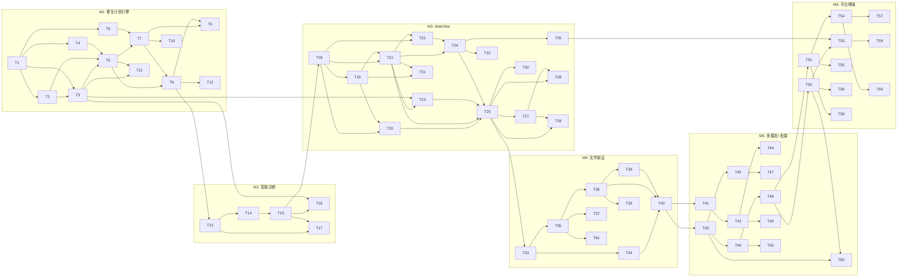

# Phase 2: EnvNexus 全功能增量开发计划

> **基于**: `01-blueprint.md` v2 — 17 项 Gap 分析、6 个里程碑
> **核心原则**: 新增优先于修改；接口兼容；行为兼容；路由追加；回归验证

---

## 现有功能基线（不可破坏）

| 模块 | 现有能力 | 增强方向 |
|------|---------|---------|
| `agent/loop.go` | Chat Loop: LLM 迭代调用工具、SSE 事件流、逐工具审批 | 新增"修复计划"分支，与现有 Chat 并存 |
| `diagnosis/engine.go` | 4 步管线: 意图分类→工具映射→并行采集→LLM 推理 | 插入复杂度评估，Execute 改为分层采集 |
| `policy/engine.go` | Check/Resolve 审批流、Platform 同步 | 新增 CheckPlan 方法 |
| `governance/engine.go` | 基线采集、漂移检测 | 新增 WatchlistManager |
| `tools/tool.go` | Tool 接口、Registry、34 个工具 | 不改接口，新增工具实现 |
| `api/server.go` | 12+ API 端点 | 新增端点，不修改现有签名 |
| Desktop `index.html` | 5 页面、Chat UI、审批卡片 | 新增页面和 SSE 事件 |
| platform-api | 全管理 REST API + Agent API | 新增端点，不修改现有 |
| console-web | 全管理后台 20+ 页面 | 新增页面 |

---

## Milestone 1: 修复计划引擎 [P0] (G1+G2+G3+G4)

> 核心差异化能力。在现有 Chat Loop 基础上新增"修复计划"能力。

### Group 1 (parallel — no prerequisites)

- [ ] **T1** [backend] 新增 `remediation/types.go` — 核心数据结构 · outputs: `apps/agent-core/internal/remediation/types.go`
  - 定义 `RemediationPlan`、`RemediationStep`、`RollbackAction`、`VerificationStep`、`ToolCheck`
  - 定义 `PlanStatus`/`StepStatus` 状态枚举
  - 定义 SSE 事件类型常量（`plan_generated`、`step_start`、`step_result`、`rollback_start`、`plan_complete`）

- [ ] **T2** [backend] 新增 `remediation/dag.go` — DAG 构建与拓扑排序 · depends: T1 · outputs: `apps/agent-core/internal/remediation/dag.go`
  - 从 `RemediationStep.DependsOn` 构建有向无环图
  - 拓扑排序 + 环检测
  - 输出按层级分组的执行序列

### Group 2 (parallel — after Group 1)

- [ ] **T3** [backend] 新增 `remediation/planner.go` — LLM 生成修复计划 · depends: T1, T2 · outputs: `apps/agent-core/internal/remediation/planner.go`
  - `GeneratePlan(ctx, diagResult) (*RemediationPlan, error)`
  - 构造 prompt 让 LLM 生成结构化修复计划 JSON
  - 引擎校验：tool_name 存在于 Registry、强制注册表 RiskLevel、DAG 无环
  - 执行漏斗：无匹配工具时降级为 shell_exec + 自动提升至 L3
  - 注入回滚策略（基于工具 IsReadOnly + RiskLevel 元数据）

- [ ] **T4** [backend] 新增 `remediation/snapshot.go` — 状态快照管理 · depends: T1 · outputs: `apps/agent-core/internal/remediation/snapshot.go`
  - 步骤执行前捕获目标状态
  - 快照存储到 SQLite（关联 plan_id + step_id）
  - `Capture(ctx, step)` 和 `Restore(ctx, snapshot)`

### Group 3 (parallel — after Group 2)

- [ ] **T5** [backend] 新增 `remediation/executor.go` — DAG 执行器 · depends: T2, T3, T4 · outputs: `apps/agent-core/internal/remediation/executor.go`
  - 按拓扑序逐步执行：前置检查 → 快照 → 审批判断 → 工具执行 → 验证
  - 复用现有 `tools.Registry.Get()` + `tool.Execute()`
  - L2 步骤执行前回调请求确认，L3 逐步审批
  - 失败时按逆序恢复快照
  - 通过 `EventHandler` 回调发送进度事件

- [ ] **T6** [backend] 扩展 Policy Engine — 新增 `CheckPlan` · depends: T1 · outputs: `apps/agent-core/internal/policy/plan_approval.go`
  - 新增 `CheckPlan(ctx, plan *RemediationPlan) (bool, error)`
  - 审批策略矩阵：L0 自动通过、L1 计划级、L2 计划+确认、L3 逐步
  - 复用现有 `pendingApprovals` map 和 `Resolve` 机制

### Group 4 (parallel — after Group 3)

- [ ] **T7** [backend] 新增修复计划 API 端点 · depends: T5, T6 · outputs: `apps/agent-core/internal/api/plan_handler.go`
  - `POST /local/v1/plan/approve`、`POST /plan/reject`
  - `POST /local/v1/plan/step/confirm`、`POST /plan/step/approve`
  - `GET /local/v1/plan/:id`
  - 在 server.go 路由组中追加

- [ ] **T8** [backend] Agent Loop 集成修复计划 · depends: T5, T7 · outputs: `apps/agent-core/internal/agent/loop.go` (增量)
  - 新增 `WithRemediationPlanner(p) LoopOption`
  - 检测 LLM 修复建议标记时调用 Planner 生成计划
  - 通过 `emit()` 发送 `plan_generated` 事件
  - 现有 Chat 对话不受影响

### Group 5 (frontend — after Group 4)

- [ ] **T9** [frontend] Desktop 修复计划 SSE 事件处理 · depends: T7, T8 · outputs: `apps/agent-desktop/src/renderer/index.html` (增量)
  - 新增 SSE case：`plan_generated`、`step_start`、`step_result`、`rollback_start`、`plan_complete`
  - 渲染修复计划卡片（摘要、步骤列表、风险等级、审批按钮）
  - 步骤状态实时更新

- [ ] **T10** [frontend] Desktop IPC 扩展 — 修复计划 · depends: T7 · outputs: `apps/agent-desktop/src/main/main.ts` (增量), `apps/agent-desktop/src/preload/preload.ts` (增量)
  - 新增 IPC handler：`plan-approve`、`plan-reject`、`plan-step-confirm`、`plan-step-approve`
  - 转发到 agent-core 对应 API 端点

### Group 6 (test — after Group 5)

- [ ] **T11** [test] 修复计划引擎单元测试 · depends: T3, T5 · outputs: `apps/agent-core/internal/remediation/*_test.go`
  - DAG 构建 & 拓扑排序（含环检测）
  - Planner 校验逻辑（工具不存在、风险等级覆盖、Shell 降级）
  - Executor 正常流程 & 回滚流程（mock tools）

- [ ] **T12** [test] 回归测试 — Chat 和诊断不受影响 · depends: T8 · outputs: `apps/agent-core/internal/agent/loop_test.go`
  - 不设置 RemediationPlanner 时行为与改造前一致
  - 现有 SSE 事件类型不变

---

## Milestone 2: 智能诊断升级 [P1] (G6)

> 在现有诊断引擎的 4 步管线基础上增强。

### Group 7 (parallel — after M1)

- [ ] **T13** [backend] 复杂度评估器 · depends: T8 · outputs: `apps/agent-core/internal/diagnosis/complexity.go`, `apps/agent-core/internal/diagnosis/engine.go` (增量)
  - `ComplexityLevel` 枚举（Simple/Moderate/Complex/Critical）
  - `assessComplexity(ctx, input string) ComplexityLevel`
  - 在 `PlanWithProgress` 的 `stepIntentParse` 之后插入
  - `DiagnosisPlan` 新增 `Complexity` 字段

- [ ] **T14** [backend] 分层证据收集 · depends: T13 · outputs: `apps/agent-core/internal/diagnosis/engine.go` (增量)
  - 保留现有 `stepEvidenceCollect` 作为 Simple 快速路径
  - 新增 `stepLayeredEvidenceCollect`：第一层基础 → LLM 决定第二层
  - 根据 `plan.Complexity` 选择收集模式
  - 工具预算控制

### Group 8 (parallel — after Group 7)

- [ ] **T15** [backend] 迭代推理 · depends: T14 · outputs: `apps/agent-core/internal/diagnosis/engine.go` (增量)
  - 保留现有 `stepReasoning` 作为 Simple 单轮推理
  - 新增 `stepIterativeReasoning`：置信度 < 阈值时请求补充证据
  - 最多 N 轮迭代（N 由 ComplexityLevel 决定）

- [ ] **T16** [backend] 诊断→修复计划自动衔接 · depends: T15, T3 · outputs: `apps/agent-core/internal/diagnosis/engine.go` (增量)
  - `DiagnosisResult` 新增 `NeedsRemediation bool`
  - 有 RecommendedActions 且包含写操作时设置为 true
  - 调用方可选调用 Planner

### Group 9 (test — after Group 8)

- [ ] **T17** [test] 诊断增强回归测试 · depends: T13, T15 · outputs: `apps/agent-core/internal/diagnosis/engine_test.go`
  - Simple 走现有快速路径
  - Moderate+ 走分层收集 + 迭代推理
  - 工具预算不超限

---

## Milestone 3: Watchlist 主动巡检 [P1] (G8)

> 在现有 Governance Engine 基础上新增 Watchlist 能力。

### Group 10 (parallel — after M2)

- [ ] **T18** [backend] `governance/watchlist/types.go` + `store.go` — 数据结构 & 存储 · depends: T15 · outputs: `apps/agent-core/internal/governance/watchlist/types.go`, `apps/agent-core/internal/governance/watchlist/store.go`
  - `WatchItem`、`WatchCondition`、`WatchAlert` 结构体
  - SQLite CRUD、按 source 过滤、启用/禁用

- [ ] **T19** [backend] 条件评估引擎 · depends: T18 · outputs: `apps/agent-core/internal/governance/watchlist/evaluator.go`
  - 条件类型：threshold、exists、reachable、contains、custom
  - 从工具输出按 JSONPath 提取值
  - 运算符：lt/gt/eq/ne/contains/not_contains

### Group 11 (parallel — after Group 10)

- [ ] **T20** [backend] LLM 拆解器（自然语言 → WatchItems） · depends: T18, T19 · outputs: `apps/agent-core/internal/governance/watchlist/decomposer.go`
  - 构造 prompt 让 LLM 输出结构化 WatchItem 数组
  - 引擎校验：tool_name 存在、参数合法
  - LLM 主动补充建议（source=llm_suggested）

- [ ] **T21** [backend] 巡检调度器 · depends: T18, T19 · outputs: `apps/agent-core/internal/governance/watchlist/scheduler.go`
  - 按各 WatchItem.Interval 调度执行
  - 调用工具 → 评估条件 → 更新状态
  - 连续失败计数 + 告警生成
  - 动态注册/注销

### Group 12 (parallel — after Group 11)

- [ ] **T22** [backend] 内置规则包 · depends: T18, T21 · outputs: `apps/agent-core/internal/governance/watchlist/builtin_rules.go`
  - 9 条内置规则（NET-001/002, SEC-001/002, PERF-001/002, DEP-001, SVC-001, CERT-001）
  - 启动时自动注册到调度器

- [ ] **T23** [backend] 告警 → 修复建议闭环 · depends: T21, T3 · outputs: `apps/agent-core/internal/governance/watchlist/alerter.go`
  - WatchAlert 触发时可选调用 Planner 生成修复建议
  - 修复后自动运行对应 WatchItem 验证

- [ ] **T24** [backend] Governance Engine 集成 Watchlist · depends: T21, T22 · outputs: `apps/agent-core/internal/governance/engine.go` (增量)
  - 保留现有 CaptureBaseline/DetectDrift 不变
  - 新增 `WatchlistManager` 字段 + `SetWatchlistManager(wm)` setter
  - `Start(ctx)` 中启动巡检调度器
  - 新增 `GetHealthScore()` 和 `GetAlerts()`

### Group 13 (parallel — after Group 12)

- [ ] **T25** [backend] Watchlist API 端点 · depends: T20, T21, T23, T24 · outputs: `apps/agent-core/internal/api/watchlist_handler.go`
  - `POST /local/v1/watchlist/create` — 自然语言创建
  - `POST /local/v1/watchlist/confirm` — 确认拆解结果
  - `GET /local/v1/watchlist` — 获取所有 WatchItem
  - `PUT /local/v1/watchlist/:id` — 修改
  - `DELETE /local/v1/watchlist/:id` — 删除
  - `GET /local/v1/watchlist/alerts` — 告警列表
  - `GET /local/v1/health/score` — 健康评分

- [ ] **T26** [backend] Bootstrap 集成 Watchlist · depends: T24 · outputs: `apps/agent-core/internal/bootstrap/bootstrap.go` (增量)
  - 创建 WatchlistManager，注入 Registry、LLM Router、Store
  - 注册内置规则包

### Group 14 (frontend — after Group 13)

- [ ] **T27** [frontend] Desktop "我的关注"页面 · depends: T25 · outputs: `apps/agent-desktop/src/renderer/index.html` (增量)
  - sidebar 追加 `watchlist` 导航项
  - WatchItem 列表、状态颜色编码、展开详情
  - 启用/禁用、修改阈值/频率、删除

- [ ] **T28** [frontend] Desktop 自然语言添加关注点 · depends: T25, T27 · outputs: `apps/agent-desktop/src/renderer/index.html` (增量)
  - Watchlist 页面顶部输入框
  - LLM 拆解结果确认/调整 UI

- [ ] **T29** [frontend] Desktop 告警通知 & 健康看板 · depends: T25, T27 · outputs: `apps/agent-desktop/src/renderer/index.html` (增量), `apps/agent-desktop/src/main/main.ts` (增量)
  - Dashboard 追加健康评分卡片
  - Electron Notification 系统通知
  - 告警数据接入 Dashboard

- [ ] **T30** [frontend] Desktop IPC 扩展 — Watchlist · depends: T25 · outputs: `apps/agent-desktop/src/main/main.ts` (增量), `apps/agent-desktop/src/preload/preload.ts` (增量)
  - 新增 IPC handler：`watchlist-*`、`health-score`

### Group 15 (test — after Group 14)

- [ ] **T31** [test] Watchlist 单元测试 · depends: T19, T21 · outputs: `apps/agent-core/internal/governance/watchlist/*_test.go`
  - 条件评估各类型、调度器定时执行、LLM 拆解校验

- [ ] **T32** [test] Governance 回归测试 · depends: T24 · outputs: `apps/agent-core/internal/governance/engine_test.go`
  - 不设置 WatchlistManager 时行为不变
  - 基线/漂移检测不受影响

---

## Milestone 4: 远程文件取证 [P1] (G7)

> 新增文件下载能力 + 平台端文件浏览审批流程。

### Group 16 (parallel — after M3)

- [ ] **T33** [backend] agent-core `file_download` 工具 · depends: T25 · outputs: `apps/agent-core/internal/tools/system/file_download.go`
  - 读取指定路径文件 → 上传到 MinIO（presigned URL）
  - 路径白名单校验（禁止 `/etc/shadow` 等敏感路径）
  - 风险等级 L2，需审批
  - 文件大小限制（默认 100MB）

- [ ] **T34** [backend] agent-core 文件访问 API · depends: T33 · outputs: `apps/agent-core/internal/api/file_handler.go`
  - `POST /local/v1/files/browse` — 目录浏览（复用 dir_list 工具）
  - `POST /local/v1/files/preview` — 文件预览（复用 file_tail 工具）
  - `POST /local/v1/files/download` — 文件下载（调用 file_download 工具）

### Group 17 (parallel — after Group 16)

- [ ] **T35** [backend] platform-api 文件访问域模型 & 服务 · depends: T33 · outputs: `services/platform-api/internal/domain/file_access.go`, `services/platform-api/internal/service/file_access/service.go`, `services/platform-api/internal/repository/file_access_repo.go`
  - `FileAccessRequest` 域模型（device_id, path, action, status, approver）
  - 服务层：创建请求、审批、转发到终端、记录审计
  - 遵循现有 DDD 三层结构

- [ ] **T36** [backend] platform-api 文件访问 HTTP handler · depends: T35 · outputs: `services/platform-api/internal/handler/http/file_access_handler.go`
  - `POST /api/v1/tenants/:tenantId/file-access/request` — 创建文件访问请求
  - `GET /api/v1/tenants/:tenantId/file-access/requests` — 列表
  - `POST /api/v1/tenants/:tenantId/file-access/:id/approve` — 审批
  - `GET /api/v1/tenants/:tenantId/file-access/:id/result` — 获取结果

- [ ] **T37** [backend] session-gateway 文件访问事件转发 · depends: T35 · outputs: `services/session-gateway/internal/handler/ws/file_handler.go`
  - 新增 WS 事件类型：`file_browse`、`file_preview`、`file_download`
  - 转发到目标设备，回传结果

### Group 18 (frontend — after Group 17)

- [ ] **T38** [frontend] console-web 文件浏览器页面 · depends: T36 · outputs: `apps/console-web/src/app/tenants/[tenantId]/file-access/page.tsx`
  - 设备选择 → 路径输入 → 目录树展示
  - 文件预览面板（文本高亮）
  - 下载按钮（presigned URL）
  - 审批状态跟踪

- [ ] **T39** [frontend] console-web 文件访问审计集成 · depends: T36 · outputs: `apps/console-web/src/app/tenants/[tenantId]/audit-events/page.tsx` (增量)
  - 审计事件列表中展示文件访问类型事件
  - 筛选条件新增 `file_access.*` 类型

### Group 19 (test — after Group 18)

- [ ] **T40** [test] 文件取证端到端测试 · depends: T34, T36, T38 · outputs: `services/platform-api/internal/service/file_access/*_test.go`, `apps/agent-core/internal/tools/system/file_download_test.go`
  - 路径白名单校验
  - 文件大小限制
  - 审批流程
  - MinIO 上传 mock

---

## Milestone 5: 多模态 + 批量干预 [P2] (G9+G10)

> 扩展 LLM 多模态 + 批量终端管理能力。

### Group 20 (parallel — after M4)

- [ ] **T41** [backend] LLM Router 多模态消息 · depends: T40 · outputs: `apps/agent-core/internal/llm/router/router.go` (增量)
  - `Message.Content` 从 `string` 改为 `interface{}`
  - 新增 `ContentPart` 类型：`TextPart` / `ImagePart`
  - 序列化兼容：纯文本仍为 string
  - `Provider.SupportsVision() bool`（默认 false）

- [ ] **T42** [backend] Provider Vision 适配 · depends: T41 · outputs: `apps/agent-core/internal/llm/providers/*.go` (增量)
  - OpenAI/Anthropic/Gemini：`SupportsVision() = true`
  - DeepSeek/Ollama/OpenRouter：降级处理

- [ ] **T43** [backend] platform-api 设备组域模型 · depends: T40 · outputs: `services/platform-api/internal/domain/device_group.go`, `services/platform-api/internal/repository/device_group_repo.go`, `services/platform-api/internal/service/device_group/service.go`
  - `DeviceGroup` 域模型（name, filter_criteria, device_count）
  - 按标签/部门/平台分组
  - CRUD 服务

### Group 21 (parallel — after Group 20)

- [ ] **T44** [frontend] Desktop 截图上传 · depends: T42 · outputs: `apps/agent-desktop/src/renderer/index.html` (增量), `apps/agent-desktop/src/main/main.ts` (增量)
  - Chat 输入框粘贴图片（Ctrl+V）和拖拽上传
  - 图片预览 & 移除
  - 发送时转 base64 data URI，构造 `[]ContentPart`

- [ ] **T45** [backend] platform-api 设备组 HTTP handler · depends: T43 · outputs: `services/platform-api/internal/handler/http/device_group_handler.go`
  - `POST/GET/PUT/DELETE /api/v1/tenants/:tenantId/device-groups`
  - `GET /device-groups/:id/devices` — 组内设备列表

- [ ] **T46** [backend] command task 批量下发扩展 · depends: T43 · outputs: `services/platform-api/internal/service/command/batch_service.go`
  - command task 支持 `target_type: group`
  - 分批次执行（batch_size 可配）
  - 成功率门槛检查（< 90% 自动暂停）
  - 批次间延迟（防爆）

### Group 22 (frontend — after Group 21)

- [ ] **T47** [frontend] console-web 设备组管理页面 · depends: T45 · outputs: `apps/console-web/src/app/tenants/[tenantId]/device-groups/page.tsx`
  - 设备组 CRUD
  - 组内设备列表
  - 按标签/平台筛选

- [ ] **T48** [frontend] console-web 批量任务页面增强 · depends: T46 · outputs: `apps/console-web/src/app/tenants/[tenantId]/command-tasks/page.tsx` (增量)
  - 创建任务时支持选择设备组
  - 批量执行进度大盘（成功/失败/进行中）
  - 批次控制（暂停/继续/取消）

### Group 23 (test — after Group 22)

- [ ] **T49** [test] 多模态测试 · depends: T42 · outputs: `apps/agent-core/internal/llm/router/router_test.go`
  - ContentPart 序列化兼容性（string 和 []ContentPart 均正常）
  - Vision Provider 降级测试

- [ ] **T50** [test] 批量下发测试 · depends: T46 · outputs: `services/platform-api/internal/service/command/batch_service_test.go`
  - 分批次执行逻辑
  - 成功率门槛暂停
  - 回归：单设备下发不受影响

---

## Milestone 6: 平台增强 [P2] (G14+G15+G16)

> 健康仪表盘、规则下发、细粒度权限。

### Group 24 (parallel — after M5)

- [ ] **T51** [backend] platform-api 健康评分聚合 · depends: T48 · outputs: `services/platform-api/internal/service/metrics/health_service.go`, `services/platform-api/internal/handler/http/metrics_handler.go` (增量)
  - Agent 心跳上报健康评分
  - 聚合所有设备健康评分
  - `GET /api/v1/tenants/:tenantId/metrics/health` — 健康概览

- [ ] **T52** [backend] platform-api 治理规则管理 · depends: T48 · outputs: `services/platform-api/internal/domain/governance_rule.go`, `services/platform-api/internal/service/governance/rule_service.go`, `services/platform-api/internal/handler/http/governance_handler.go` (增量)
  - 管理员配置规则包（WatchItem 模板）
  - `POST/GET/PUT/DELETE /api/v1/tenants/:tenantId/governance/rules`
  - 规则下发到终端（通过心跳拉取）

- [ ] **T53** [backend] agent-core 接收平台规则 · depends: T52, T26 · outputs: `apps/agent-core/internal/governance/watchlist/platform_sync.go`
  - 心跳时拉取平台下发规则
  - 解析为 WatchItem（source=platform），注册到调度器

### Group 25 (parallel — after Group 24)

- [ ] **T54** [backend] platform-api 细粒度工具权限 · depends: T51 · outputs: `services/platform-api/internal/domain/policy_profile.go` (增量), `services/platform-api/internal/service/policy_profile/service.go` (增量)
  - 策略配置扩展：工具白名单/黑名单
  - 路径级文件访问控制（允许/禁止路径模式）
  - Agent 心跳时同步策略

- [ ] **T55** [frontend] console-web 健康态势仪表盘 · depends: T51 · outputs: `apps/console-web/src/app/tenants/[tenantId]/overview/page.tsx` (增量)
  - 设备健康评分分布图
  - 异常设备列表
  - 告警趋势图

- [ ] **T56** [frontend] console-web 治理规则管理页面 · depends: T52 · outputs: `apps/console-web/src/app/tenants/[tenantId]/governance/page.tsx` (增量)
  - 规则包 CRUD
  - 规则模板编辑器
  - 下发状态跟踪

- [ ] **T57** [frontend] console-web 策略配置增强 · depends: T54 · outputs: `apps/console-web/src/app/tenants/[tenantId]/policy-profiles/page.tsx` (增量)
  - 工具白名单/黑名单编辑
  - 路径访问控制配置

### Group 26 (test — after Group 25)

- [ ] **T58** [test] 健康评分聚合测试 · depends: T51 · outputs: `services/platform-api/internal/service/metrics/health_service_test.go`

- [ ] **T59** [test] 规则下发端到端测试 · depends: T53 · outputs: `apps/agent-core/internal/governance/watchlist/platform_sync_test.go`
  - 平台规则同步
  - 规则优先级覆盖

- [ ] **T60** [test] 工具权限测试 · depends: T54 · outputs: `services/platform-api/internal/service/policy_profile/service_test.go`
  - 白名单/黑名单过滤
  - 路径模式匹配

---

## 数据库迁移任务（贯穿各里程碑）

- [ ] **T61** [infra] M4 数据库迁移 — file_access_requests 表 · depends: T35 · outputs: `services/platform-api/migrations/xxx_create_file_access_requests.sql`

- [ ] **T62** [infra] M5+M6 数据库迁移 — device_groups + governance_rules 表 · depends: T43, T52 · outputs: `services/platform-api/migrations/xxx_create_device_groups.sql`, `services/platform-api/migrations/xxx_create_governance_rules.sql`

---

## 依赖关系总览



---

## 增量改造原则清单

| # | 原则 | 说明 |
|---|------|------|
| 1 | **新增优先于修改** | 优先创建新文件/新方法，最小化对现有文件的修改 |
| 2 | **接口兼容** | 不改变现有 `Tool`、`Provider`、`Engine` 接口的已有方法签名 |
| 3 | **行为兼容** | 不设置新功能时，所有现有行为保持不变 |
| 4 | **路由追加** | 新 API 端点追加到路由组，不修改现有端点 |
| 5 | **SSE 扩展** | 新事件类型追加到现有 switch，不修改现有事件 payload |
| 6 | **UI 追加** | 新页面/组件追加到现有结构，不重构现有 UI |
| 7 | **回归验证** | 每个里程碑包含回归测试任务 |
| 8 | **DDD 一致** | platform-api 新增功能遵循 domain/service/repository/handler 四层 |

---

## 里程碑交付物

| 里程碑 | 任务数 | 核心交付 | 用户可感知的变化 |
|--------|-------|---------|----------------|
| **M1** | T1-T12 (12) | 修复计划引擎 + 计划审批 UI | 诊断后看到完整修复方案，一键审批，自动回滚 |
| **M2** | T13-T17 (5) | 智能诊断升级 | 复杂问题更精准，自动衔接修复计划 |
| **M3** | T18-T32 (15) | Watchlist + 主动发现 | 自然语言定义关注点，持续巡检，健康评分 |
| **M4** | T33-T40 (8) | 远程文件取证 | 管理员远程浏览/预览/下载终端文件 |
| **M5** | T41-T50 (10) | 多模态 + 批量干预 | 截图诊断，设备组批量下发 |
| **M6** | T51-T62 (12) | 平台增强 | 健康仪表盘，规则下发，工具权限 |

---

## 关键路径

```
T1(数据结构) → T3(Planner) → T5(Executor) → T7(API) → T8(Loop集成)
→ T13(复杂度) → T14(分层证据) → T15(迭代推理)
→ T18(Watchlist数据) → T20(LLM拆解) → T22(内置规则) → T24(Governance集成) → T25(API)
→ T30(Desktop IPC) → T33(file_download) → T35(Platform文件访问) → T38(Console文件浏览器)
→ T40(测试) → T43(设备组) → T46(批量下发) → T48(Console批量页面)
→ T51(健康聚合) → T54(工具权限) → T56(Console规则管理)
```
