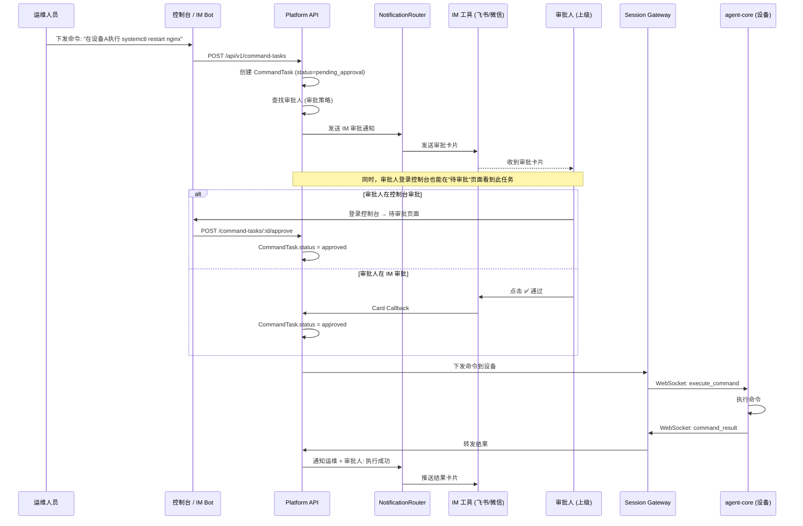
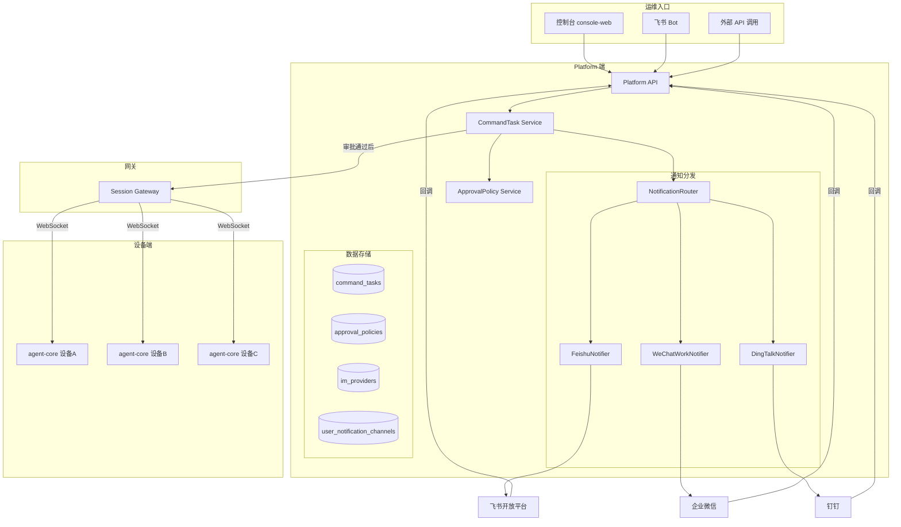
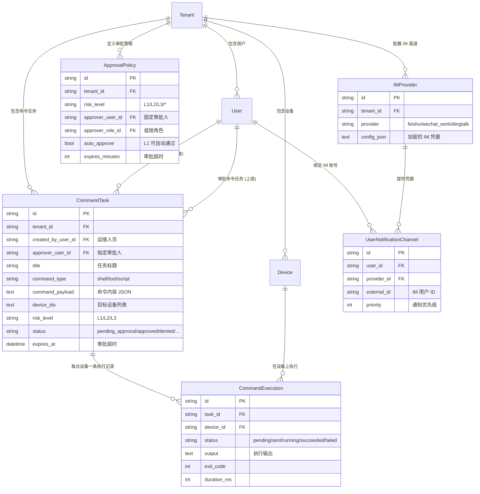
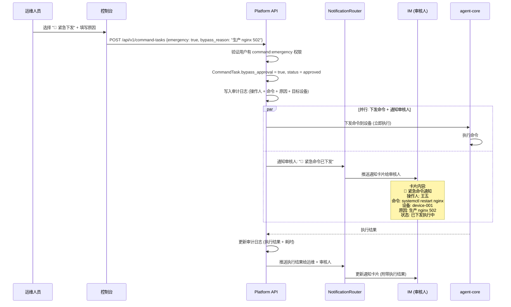

# 设计文档: 远程命令下发审批系统 — 运维下发命令 → 上级审批 → 设备执行

> 版本: v2.3 | 日期: 2026-03-31 | 分支: main

## 1. 需求背景

### 1.1 核心场景纠正

**之前的理解（错误）**：设备上执行命令需要设备用户审批。

**正确的理解**：
- **运维人员**通过控制台/飞书 Bot 向一台或多台设备下发执行命令
- 该命令需要**上级（审批人）审批**后才能在设备上执行
- 审批人可通过两种方式审批：
  - **控制台**：登录控制台 → "待审批" 页面 → 通过/拒绝
  - **IM 工具**：收到飞书/微信/钉钉审批卡片 → 点击通过或拒绝
- **客户端（agent-desktop）上不需要审批**，客户端只负责执行已审批的命令
- agent-desktop 的"待审批"页面将被移除

### 1.2 两套审批机制的区分

| 维度 | 本地对话审批（已有） | 远程命令下发审批（本次设计） |
|------|---------------------|--------------------------|
| **触发者** | 设备用户自己在 Desktop 对话 | 运维人员通过控制台/IM Bot 远程下发 |
| **审批人** | 设备用户自己（确认高危操作） | 运维的上级/指定审批人 |
| **审批目的** | 防止 LLM 误操作（安全确认） | 组织管控（权限审批） |
| **审批渠道** | Desktop 聊天流内联确认 | **控制台"待审批"页面** + IM 卡片（飞书/微信/钉钉） |
| **设备范围** | 单台（本机） | 单台或批量多台 |
| **Desktop 变更** | 不需要改动 | **移除"待审批"页面**（远程审批在控制台进行） |
| **是否需要改动** | 不需要，保持现有逻辑 | **本次设计重点** |

### 1.3 目标状态

```
运维在控制台/飞书 Bot 下发命令
  ↓
Platform API 创建审批请求
  ↓
通知审批人（上级）— 两个渠道同时可用
  ├── 控制台 → "待审批"页面 (审批人登录控制台审批) ⭐
  ├── 飞书 → 审批卡片 (✅通过 / ❌拒绝)
  ├── 企业微信 → 审批卡片
  └── 钉钉 → 审批卡片
  ↓
审批人在控制台或 IM 中点击通过
  ↓
Platform API → Session Gateway → agent-core (WebSocket)
  ↓
agent-core 执行命令
  ↓
执行结果回传 → Platform → 通知运维 + 审批人
```

---

## 2. 架构总览

### 2.1 完整流程时序图



### 2.2 系统架构图



---

## 3. 数据模型设计

### 3.1 新增模型

#### 3.1.1 CommandTask — 命令任务（核心）

运维下发的一次命令任务，可以针对单台或多台设备。

```go
// services/platform-api/internal/domain/command_task.go

type CommandTaskStatus string

const (
    CommandTaskPendingApproval CommandTaskStatus = "pending_approval"
    CommandTaskApproved        CommandTaskStatus = "approved"
    CommandTaskDenied          CommandTaskStatus = "denied"
    CommandTaskExecuting       CommandTaskStatus = "executing"
    CommandTaskPartialDone     CommandTaskStatus = "partial_done"  // 批量时部分完成
    CommandTaskCompleted       CommandTaskStatus = "completed"
    CommandTaskFailed          CommandTaskStatus = "failed"
    CommandTaskExpired         CommandTaskStatus = "expired"
    CommandTaskCancelled       CommandTaskStatus = "cancelled"
)

type CommandTask struct {
    ID              string            `json:"id"               gorm:"primaryKey;size:26"`
    TenantID        string            `json:"tenant_id"        gorm:"size:26;not null;index"`
    CreatedByUserID string            `json:"created_by"       gorm:"size:26;not null"`       // 运维人员
    ApproverUserID  *string           `json:"approver_id"      gorm:"size:26"`                // 指定审批人
    ApprovedByID    *string           `json:"approved_by"      gorm:"size:26"`                // 实际审批人
    Title           string            `json:"title"            gorm:"size:255;not null"`      // 任务标题
    CommandType     string            `json:"command_type"     gorm:"size:64;not null"`       // shell / tool / script
    CommandPayload  string            `json:"command_payload"  gorm:"type:text;not null"`     // 命令内容 JSON
    DeviceIDs       string            `json:"device_ids"       gorm:"type:text;not null"`     // 目标设备 ID 列表 JSON
    RiskLevel       string            `json:"risk_level"       gorm:"size:8;not null"`        // L1/L2/L3
    BypassApproval  bool              `json:"bypass_approval"  gorm:"not null;default:false"`  // 逃生通道: 跳过审批
    Status          CommandTaskStatus `json:"status"           gorm:"size:32;not null"`
    ApprovalNote    string            `json:"approval_note"    gorm:"type:text"`              // 审批备注
    ExpiresAt       time.Time         `json:"expires_at"       gorm:"not null"`               // 审批超时时间
    ApprovedAt      *time.Time        `json:"approved_at"`
    CompletedAt     *time.Time        `json:"completed_at"`
    CreatedAt       time.Time         `json:"created_at"`
    UpdatedAt       time.Time         `json:"updated_at"`
}

func (c *CommandTask) TableName() string { return "command_tasks" }
```

**CommandPayload 结构**：

```json
{
  "type": "shell",
  "command": "systemctl restart nginx",
  "timeout_seconds": 60
}
```

或：

```json
{
  "type": "tool",
  "tool_name": "service.restart",
  "params": {"service_name": "nginx"}
}
```

#### 3.1.2 CommandExecution — 命令执行记录（每台设备一条）

```go
// services/platform-api/internal/domain/command_execution.go

type CommandExecutionStatus string

const (
    ExecutionPending   CommandExecutionStatus = "pending"
    ExecutionSent      CommandExecutionStatus = "sent"
    ExecutionRunning   CommandExecutionStatus = "running"
    ExecutionSucceeded CommandExecutionStatus = "succeeded"
    ExecutionFailed    CommandExecutionStatus = "failed"
    ExecutionTimeout   CommandExecutionStatus = "timeout"
    ExecutionSkipped   CommandExecutionStatus = "skipped"  // 设备离线等原因
)

type CommandExecution struct {
    ID            string                 `json:"id"             gorm:"primaryKey;size:26"`
    TaskID        string                 `json:"task_id"        gorm:"size:26;not null;index"`
    DeviceID      string                 `json:"device_id"      gorm:"size:26;not null;index"`
    Status        CommandExecutionStatus `json:"status"         gorm:"size:32;not null"`
    Output        *string                `json:"output"         gorm:"type:text"`
    ErrorMessage  *string                `json:"error"          gorm:"type:text"`
    ExitCode      *int                   `json:"exit_code"`
    DurationMs    *int                   `json:"duration_ms"`
    SentAt        *time.Time             `json:"sent_at"`
    StartedAt     *time.Time             `json:"started_at"`
    FinishedAt    *time.Time             `json:"finished_at"`
    CreatedAt     time.Time              `json:"created_at"`
    UpdatedAt     time.Time              `json:"updated_at"`
}

func (c *CommandExecution) TableName() string { return "command_executions" }
```

#### 3.1.3 ApprovalPolicy — 审批策略

定义什么级别的命令需要谁审批。

```go
// services/platform-api/internal/domain/approval_policy.go

type ApprovalPolicy struct {
    ID              string    `json:"id"               gorm:"primaryKey;size:26"`
    TenantID        string    `json:"tenant_id"        gorm:"size:26;not null;index"`
    Name            string    `json:"name"             gorm:"size:128;not null"`
    RiskLevel       string    `json:"risk_level"       gorm:"size:8;not null"`          // L1/L2/L3 或 *
    ApproverUserID  *string   `json:"approver_user_id" gorm:"size:26"`                  // 固定审批人
    ApproverRoleID  *string   `json:"approver_role_id" gorm:"size:26"`                  // 或按角色
    AutoApprove     bool      `json:"auto_approve"     gorm:"not null;default:false"`   // L1 可自动通过
    ExpiresMinutes  int       `json:"expires_minutes"  gorm:"not null;default:30"`      // 审批超时
    Status          string    `json:"status"           gorm:"size:32;not null;default:active"`
    Priority        int       `json:"priority"         gorm:"not null;default:0"`
    CreatedAt       time.Time `json:"created_at"`
    UpdatedAt       time.Time `json:"updated_at"`
}

func (a *ApprovalPolicy) TableName() string { return "approval_policies" }
```

#### 3.1.4 IMProvider — IM 渠道配置（租户级）

```go
// services/platform-api/internal/domain/im_provider.go

type IMProviderType string

const (
    IMProviderFeishu     IMProviderType = "feishu"
    IMProviderWeChatWork IMProviderType = "wechat_work"
    IMProviderDingTalk   IMProviderType = "dingtalk"
    IMProviderSlack      IMProviderType = "slack"
)

type IMProvider struct {
    ID         string         `json:"id"          gorm:"primaryKey;size:26"`
    TenantID   string         `json:"tenant_id"   gorm:"size:26;not null;index"`
    Provider   IMProviderType `json:"provider"     gorm:"size:32;not null"`
    Name       string         `json:"name"         gorm:"size:128;not null"`
    ConfigJSON string         `json:"-"            gorm:"type:text;not null"`  // AES-256-GCM 加密
    WebhookURL string         `json:"webhook_url"  gorm:"size:512"`
    Status     string         `json:"status"       gorm:"size:32;not null;default:active"`
    CreatedAt  time.Time      `json:"created_at"`
    UpdatedAt  time.Time      `json:"updated_at"`
}

func (i *IMProvider) TableName() string { return "im_providers" }
```

#### 3.1.5 UserNotificationChannel — 用户 IM 绑定

```go
// services/platform-api/internal/domain/user_notification_channel.go

type UserNotificationChannel struct {
    ID           string    `json:"id"            gorm:"primaryKey;size:26"`
    UserID       string    `json:"user_id"       gorm:"size:26;not null;index"`
    TenantID     string    `json:"tenant_id"     gorm:"size:26;not null;index"`
    ProviderID   string    `json:"provider_id"   gorm:"size:26;not null"`
    Provider     string    `json:"provider"      gorm:"size:32;not null"`
    ExternalID   string    `json:"external_id"   gorm:"size:255;not null"` // IM 用户 ID
    ExternalName string    `json:"external_name" gorm:"size:128"`
    ChatID       string    `json:"chat_id"       gorm:"size:255"`          // 推送到指定群
    Priority     int       `json:"priority"      gorm:"not null;default:0"`
    Verified     bool      `json:"verified"      gorm:"not null;default:false"`
    Status       string    `json:"status"        gorm:"size:32;not null;default:active"`
    CreatedAt    time.Time `json:"created_at"`
    UpdatedAt    time.Time `json:"updated_at"`
}

func (u *UserNotificationChannel) TableName() string { return "user_notification_channels" }
```

### 3.2 ER 关系图



---

## 4. 核心服务设计

### 4.1 CommandTaskService — 命令任务服务

```go
// services/platform-api/internal/service/command/command_service.go

type Service struct {
    taskRepo       repository.CommandTaskRepository
    executionRepo  repository.CommandExecutionRepository
    policyService  *ApprovalPolicyService
    notifyRouter   *notification.Router
    gatewayClient  *infrastructure.GatewayClient
    auditRepo      repository.AuditRepository
}

// CreateTask — 运维创建命令任务
func (s *Service) CreateTask(ctx context.Context, req CreateTaskRequest) (*domain.CommandTask, error) {
    // 1. 验证目标设备存在且在线
    // 2. 评估风险等级 (根据命令类型)
    // 3. 创建 CommandExecution 记录 (每台设备一条，status=pending)
    for _, deviceID := range deviceIDs {
        execution := &domain.CommandExecution{
            TaskID:   task.ID,
            DeviceID: deviceID,
            Status:   domain.ExecutionPending,
        }
        s.executionRepo.Create(ctx, execution)
    }

    // 4. 判断是否跳过审批
    bypass := s.shouldBypassApproval(ctx, req)
    task.BypassApproval = bypass

    if bypass {
        // ===== 紧急下发: 跳过审批，直接执行 + 同时通知审核人 =====
        task.Status = domain.CommandTaskApproved
        task.BypassApproval = true
        s.taskRepo.Update(ctx, task)

        // 记录审计日志 (完整存档)
        s.recordAudit(ctx, task, "command.emergency_bypass", map[string]interface{}{
            "bypass_reason":     req.BypassReason,
            "bypass_type":       req.BypassType, // "emergency" / "auto_policy" / "privileged_user"
            "approver_notified": resolvedApproverID,
        })

        // 并行: 下发命令 + 通知审核人 (通知不阻塞执行)
        go s.dispatchToDevices(ctx, task)
        go s.notifyApproverEmergency(ctx, task, req)

        return task, nil
    }

    // 5. 查找审批策略
    policy := s.policyService.FindPolicy(ctx, req.TenantID, riskLevel)

    // 6. 如果策略允许自动审批 (如 L1 低风险)
    if policy != nil && policy.AutoApprove {
        task.Status = domain.CommandTaskApproved
        go s.dispatchToDevices(ctx, task)
        return task, nil
    }

    // 7. 需要审批 → 确定审批人
    approverID := s.resolveApprover(ctx, policy, req)
    task.ApproverUserID = &approverID
    task.Status = domain.CommandTaskPendingApproval
    s.taskRepo.Update(ctx, task)

    // 8. 发送审批通知到审批人的 IM
    go s.notifyRouter.SendApprovalRequest(ctx, notification.ApprovalNotification{
        ApprovalID:  task.ID,
        TenantID:    task.TenantID,
        TargetUser:  approverID,        // 审批人
        RequestedBy: req.CreatedByUserID, // 运维人员
        Title:       task.Title,
        CommandType: task.CommandType,
        RiskLevel:   task.RiskLevel,
        DeviceCount: len(deviceIDs),
        ExpiresAt:   task.ExpiresAt,
    })

    return task, nil
}

// shouldBypassApproval — 判断是否走逃生通道跳过审批
func (s *Service) shouldBypassApproval(ctx context.Context, req CreateTaskRequest) bool {
    // 情况 1: 用户显式请求逃生通道 (紧急模式)
    if req.Emergency {
        // 验证用户有 command:emergency 权限
        return s.hasPermission(ctx, req.CreatedByUserID, "command:emergency")
    }

    // 情况 2: 审批策略配置了自动通过
    policy := s.policyService.FindPolicy(ctx, req.TenantID, req.RiskLevel)
    if policy != nil && policy.AutoApprove {
        return true
    }

    // 情况 3: 用户角色拥有免审批特权 (如超级管理员)
    if s.hasPermission(ctx, req.CreatedByUserID, "command:bypass_approval") {
        return true
    }

    return false
}

// notifyApproverEmergency — 紧急下发时通知审核人 (不阻塞执行)
func (s *Service) notifyApproverEmergency(ctx context.Context, task *domain.CommandTask, req CreateTaskRequest) {
    // 查找审批策略中的审核人
    policy := s.policyService.FindPolicy(ctx, req.TenantID, task.RiskLevel)
    approverID := s.resolveApprover(ctx, policy, req)
    if approverID == "" {
        return
    }

    // 发送紧急通知卡片 (仅通知，无需操作)
    s.notifyRouter.SendEmergencyNotice(ctx, notification.EmergencyNotification{
        TaskID:       task.ID,
        TenantID:     task.TenantID,
        TargetUser:   approverID,         // 审核人 (上级)
        RequestedBy:  task.CreatedByUserID, // 运维人员
        Title:        task.Title,
        CommandType:  task.CommandType,
        CommandPayload: task.CommandPayload,
        RiskLevel:    task.RiskLevel,
        DeviceCount:  len(task.ParseDeviceIDs()),
        BypassReason: req.BypassReason,
    })
}

// ApproveTask — 审批人通过
func (s *Service) ApproveTask(ctx context.Context, taskID, approverUserID, note string) error {
    task, err := s.taskRepo.GetByID(ctx, taskID)
    // 验证: 状态必须是 pending_approval
    // 验证: 审批人有权限
    task.Status = domain.CommandTaskApproved
    task.ApprovedByID = &approverUserID
    task.ApprovalNote = note
    now := time.Now()
    task.ApprovedAt = &now
    s.taskRepo.Update(ctx, task)

    // 通知运维: 已通过
    go s.notifyRouter.SendTaskApproved(ctx, task)

    // 下发命令到设备
    go s.dispatchToDevices(ctx, task)

    return nil
}

// DenyTask — 审批人拒绝
func (s *Service) DenyTask(ctx context.Context, taskID, approverUserID, reason string) error {
    task, err := s.taskRepo.GetByID(ctx, taskID)
    task.Status = domain.CommandTaskDenied
    task.ApprovedByID = &approverUserID
    task.ApprovalNote = reason
    s.taskRepo.Update(ctx, task)

    // 通知运维: 已拒绝
    go s.notifyRouter.SendTaskDenied(ctx, task, reason)

    return nil
}

// dispatchToDevices — 审批通过后，下发命令到目标设备
func (s *Service) dispatchToDevices(ctx context.Context, task *domain.CommandTask) {
    deviceIDs := task.ParseDeviceIDs()
    for _, deviceID := range deviceIDs {
        execution, _ := s.executionRepo.GetByTaskAndDevice(ctx, task.ID, deviceID)
        execution.Status = domain.ExecutionSent
        now := time.Now()
        execution.SentAt = &now
        s.executionRepo.Update(ctx, execution)

        // 通过 Session Gateway WebSocket 下发到设备
        envelope := ws.EventEnvelope{
            EventType: "command.execute",
            DeviceID:  deviceID,
            SessionID: task.ID,
            Payload: map[string]interface{}{
                "task_id":         task.ID,
                "execution_id":    execution.ID,
                "command_type":    task.CommandType,
                "command_payload": task.CommandPayload,
            },
        }
        err := s.gatewayClient.SendToDevice(ctx, deviceID, envelope)
        if err != nil {
            execution.Status = domain.ExecutionSkipped
            errMsg := err.Error()
            execution.ErrorMessage = &errMsg
            s.executionRepo.Update(ctx, execution)
        }
    }
}
```

### 4.2 NotificationRouter — 通知路由服务

```go
// services/platform-api/internal/service/notification/router.go

type Notifier interface {
    ProviderType() domain.IMProviderType
    SendApprovalCard(ctx context.Context, channel *domain.UserNotificationChannel, req ApprovalNotification) error
    SendEmergencyCard(ctx context.Context, channel *domain.UserNotificationChannel, req EmergencyNotification) error
    SendResultCard(ctx context.Context, channel *domain.UserNotificationChannel, result ResultNotification) error
}

type Router struct {
    channelRepo  repository.UserNotificationChannelRepository
    providerRepo repository.IMProviderRepository
    notifiers    map[domain.IMProviderType]Notifier
}

// SendApprovalRequest — 向审批人发送审批卡片
func (r *Router) SendApprovalRequest(ctx context.Context, req ApprovalNotification) error {
    channels, err := r.channelRepo.ListActiveByUserID(ctx, req.TargetUser)
    if err != nil || len(channels) == 0 {
        slog.Warn("[notification] Approver has no IM channels", "user_id", req.TargetUser)
        return fmt.Errorf("approver has no notification channels configured")
    }

    for _, ch := range channels {
        notifier, ok := r.notifiers[domain.IMProviderType(ch.Provider)]
        if !ok {
            continue
        }
        if err := notifier.SendApprovalCard(ctx, ch, req); err != nil {
            slog.Error("[notification] Send failed, trying next", "provider", ch.Provider, "error", err)
            continue
        }
        return nil
    }
    return fmt.Errorf("all notification channels failed")
}

// SendTaskApproved — 通知运维: 任务已通过
func (r *Router) SendTaskApproved(ctx context.Context, task *domain.CommandTask) { ... }

// SendTaskDenied — 通知运维: 任务已拒绝
func (r *Router) SendTaskDenied(ctx context.Context, task *domain.CommandTask, reason string) { ... }

// SendEmergencyNotice — 紧急下发时通知审核人 (命令下发时立即发送)
func (r *Router) SendEmergencyNotice(ctx context.Context, req EmergencyNotification) error {
    channels, err := r.channelRepo.ListActiveByUserID(ctx, req.TargetUser)
    if err != nil || len(channels) == 0 {
        slog.Warn("[notification] Approver has no IM channels for emergency notice", "user_id", req.TargetUser)
        return nil // 不阻塞执行
    }
    for _, ch := range channels {
        notifier, ok := r.notifiers[domain.IMProviderType(ch.Provider)]
        if !ok {
            continue
        }
        if err := notifier.SendEmergencyCard(ctx, ch, req); err != nil {
            continue
        }
        return nil
    }
    return nil
}

// SendExecutionResult — 通知运维 + 审核人: 执行结果 (普通任务和紧急任务都会调用)
func (r *Router) SendExecutionResult(ctx context.Context, task *domain.CommandTask, results []*domain.CommandExecution) { ... }
```

### 4.3 agent-core 侧 — 接收远程命令

agent-core 通过 WebSocket 接收 `command.execute` 事件，直接执行（无需本地审批，因为已经在 Platform 侧完成审批）。

```go
// apps/agent-core/internal/session/ws_client.go — 新增 command.execute 处理

case "command.execute":
    payload := evt.Payload
    taskID := payload["task_id"].(string)
    executionID := payload["execution_id"].(string)
    commandType := payload["command_type"].(string)
    commandPayload := payload["command_payload"].(string)

    // 直接执行，不需要本地审批（Platform 已审批）
    go func() {
        result := executeCommand(commandType, commandPayload)
        // 回报执行结果
        sendEvent(ws.EventEnvelope{
            EventType: "command.result",
            SessionID: taskID,
            Payload: map[string]interface{}{
                "execution_id": executionID,
                "status":       result.Status,
                "output":       result.Output,
                "exit_code":    result.ExitCode,
                "duration_ms":  result.DurationMs,
            },
        })
    }()
```

### 4.4 agent-desktop 变更

#### 4.4.1 移除"待审批"页面

agent-desktop 的侧边栏 **"待审批"** 页面（`page-approvals`）将被移除。原因：
- 远程命令审批在**控制台**进行，不在客户端
- 本地对话的写操作确认是内联在聊天流中的，不需要独立页面

**需要移除的内容**：
- 侧边栏导航项: `<div class="nav-item" data-page="approvals">`
- 页面容器: `<div id="page-approvals" class="page">`
- 仪表盘卡片: "待审批" 数字卡片
- 相关 i18n 键: `nav_approvals`, `approvals_title`, `approvals_*`
- 相关 JS 函数: `loadApprovals()`
- 相关 CSS: `.approval-card` 等（聊天内联审批样式保留）

#### 4.4.2 本地对话确认 — 保持不变

Desktop 上的 Agent Loop 对话中，用户自己确认高危操作的内联弹窗**完全保持不变**：
- SSE 推送 `approval_required` → 聊天流中内联确认卡片
- 用户点击批准/拒绝 → Agent Loop 继续/中止
- 这是**安全确认**（防止 LLM 误操作），不是组织审批

---

## 5. 审批策略设计

### 5.1 策略匹配规则

```
运维下发命令
  ↓
评估风险等级 (L1/L2/L3)
  ↓
查找 ApprovalPolicy (tenant_id + risk_level, 按 priority 排序)
  ↓
├── 匹配到策略且 auto_approve=true → 自动通过，直接执行
├── 匹配到策略且有 approver_user_id → 发送给指定审批人
├── 匹配到策略且有 approver_role_id → 发送给该角色的所有用户（任一通过即可）
└── 未匹配到策略 → 使用默认策略（需要租户管理员审批）
```

### 5.2 风险等级评估

| 风险等级 | 命令类型 | 示例 | 默认策略 |
|---------|---------|------|---------|
| **L1** (低) | 只读诊断命令 | `systeminfo`, `df -h`, `ping` | 可配置自动通过 |
| **L2** (中) | 服务操作 | `systemctl restart nginx`, 清缓存 | 需要审批 |
| **L3** (高) | 系统级操作 | 修改配置文件, 安装/卸载软件 | 需要审批 + 备注 |

### 5.3 控制台审批策略配置

```
控制台 → 租户设置 → 审批策略
  ├── [L1 低风险] 自动通过 ✅ (可关闭)
  ├── [L2 中风险] 审批人: 张三 (运维主管) | 超时: 30 分钟
  └── [L3 高风险] 审批人: 李四 (技术总监) | 超时: 60 分钟
```

### 5.4 逃生通道 (Emergency Bypass)

在紧急情况下（如生产事故、服务宕机），运维需要**立即执行命令**，不能等待审批。系统提供三种逃生通道：

#### 5.4.1 三种逃生方式

| 方式 | 触发条件 | 说明 |
|------|---------|------|
| **紧急模式** | 运维在控制台勾选 "紧急执行" 或 Bot 中用 `/exec! <cmd>` | 需要 `command:emergency` 权限 |
| **特权用户** | 用户角色拥有 `command:bypass_approval` 权限 | 超级管理员/SRE 负责人 |
| **策略自动通过** | ApprovalPolicy.AutoApprove = true | L1 低风险命令可配置自动通过 |

#### 5.4.2 紧急模式流程

紧急下发的核心原则：**命令立即执行，同时通知审核人，完整存档审计日志**。



**关键点**：
- 命令下发和通知审核人是**并行**的，通知不阻塞执行
- 审核人收到的是**通知卡片**（仅告知，无需操作），不是审批卡片
- 审核人会收到**两次通知**：①命令下发时 ②执行结果出来后
- 全程**完整存档**到审计日志，可追溯

#### 5.4.3 审核人通知卡片样式

紧急下发时，审核人收到的 IM 卡片（以飞书为例）：

**第一次通知 — 命令下发时：**

```
┌──────────────────────────────────────┐
│  🚨 紧急命令通知 (已跳过审批)           │  ← 红色标题
│  ──────────────────────────────────── │
│  操作人: 王五 (运维工程师)               │
│  目标设备: device-001 (共 1 台)         │
│  命令: systemctl restart nginx         │
│  风险等级: L2 (中)                      │
│  紧急原因: 生产 nginx 502，需立即重启    │
│  时间: 2026-03-31 14:32:05             │
│                                        │
│  ⚠️ 此命令已通过紧急通道直接下发执行      │
│  ──────────────────────────────────── │
│  📋 来自 EnvNexus · 任务 01HXYZ...     │
└──────────────────────────────────────┘
```

**第二次通知 — 执行结果：**

```
┌──────────────────────────────────────┐
│  ✅ 紧急命令执行完成                     │  ← 绿色/红色 (成功/失败)
│  ──────────────────────────────────── │
│  操作人: 王五                           │
│  命令: systemctl restart nginx         │
│  设备: device-001                      │
│  结果: ✅ 成功 (耗时 1.2s)              │
│  输出:                                 │
│  ```                                   │
│  nginx.service restarted successfully  │
│  ```                                   │
│  ──────────────────────────────────── │
│  📋 任务 01HXYZ... · 紧急通道           │
└──────────────────────────────────────┘
```

#### 5.4.4 审计存档

每次紧急下发都会生成完整的审计记录，存储在 `audit_events` 表：

```json
{
  "event_type": "command.emergency_bypass",
  "tenant_id": "tenant-001",
  "device_id": "device-001",
  "session_id": "task-01HXYZ",
  "actor": "user-wang5",
  "data": {
    "task_id": "01HXYZ...",
    "command_type": "shell",
    "command": "systemctl restart nginx",
    "risk_level": "L2",
    "bypass_reason": "生产 nginx 502，需立即重启",
    "target_devices": ["device-001"],
    "approver_notified": "user-zhangsan",
    "notification_channels": ["feishu"],
    "execution_status": "succeeded",
    "execution_output": "nginx.service restarted successfully",
    "exit_code": 0,
    "duration_ms": 1200
  },
  "created_at": "2026-03-31T14:32:05Z"
}
```

管理员可在控制台 **审计事件** 页面通过筛选 `event_type = command.emergency_bypass` 查看所有紧急下发记录。

#### 5.4.5 安全保障

| 保障措施 | 说明 |
|----------|------|
| **权限控制** | 只有拥有 `command:emergency` 权限的用户才能使用紧急模式 |
| **强制填写原因** | 紧急执行必须填写原因 (`bypass_reason`)，不能为空 |
| **完整审计存档** | 所有紧急下发记录到 audit_events，包含操作人、原因、命令、设备、执行结果 |
| **实时通知审核人** | 命令下发时**立即**通知审核人（上级），审核人实时知晓 |
| **结果二次通知** | 执行结果出来后，再次通知审核人，确保全程可追踪 |
| **审计报表** | 管理员可在控制台筛选查看所有紧急下发记录，监控是否被滥用 |
| **权限可收回** | 管理员可随时收回 `command:emergency` 权限 |

#### 5.4.4 控制台 UI

新建命令任务表单中增加紧急模式选项：

```
┌─────────────────────────────────────────┐
│  新建命令任务                              │
│                                          │
│  ... (其他字段) ...                        │
│                                          │
│  ☐ 🚨 紧急执行 (跳过审批，直接下发)         │
│     ⚠️ 紧急执行将跳过审批流程，命令将立即     │
│     下发到目标设备。此操作会被完整记录。       │
│                                          │
│     紧急原因: [生产 nginx 502，需立即重启]   │
│     (必填)                                │
│                                          │
│  [取消]              [🚨 立即执行]          │
└─────────────────────────────────────────┘
```

#### 5.4.5 飞书 Bot 紧急命令

```
普通命令 (需审批):
  /exec device-001 systemctl restart nginx

紧急命令 (跳过审批):
  /exec! device-001 systemctl restart nginx
  Bot: ⚠️ 紧急模式: 请输入原因
  运维: 生产 502 紧急修复
  Bot: 🚨 紧急命令已下发 (跳过审批)
       命令: systemctl restart nginx
       目标: device-001
       原因: 生产 502 紧急修复
       ⚠️ 此操作已通知审批人 张三
```

#### 5.4.6 命令执行判断流程总览

```
运维下发命令
  ↓
是否紧急模式 (emergency=true)?
  ├── 是 → 验证 command:emergency 权限
  │         ├── 有权限 → ⚡ 直接执行 + 事后通知审批人
  │         └── 无权限 → ❌ 拒绝，提示无紧急执行权限
  ↓ 否
用户是否有 command:bypass_approval 权限?
  ├── 是 → ⚡ 直接执行 + 审计日志
  ↓ 否
查找审批策略 (ApprovalPolicy)
  ├── 策略 auto_approve=true → ⚡ 自动通过，直接执行
  ├── 策略有审批人 → ⏳ 等待审批 → IM 卡片通知
  └── 无策略 → ⏳ 默认需要租户管理员审批
```

---

## 6. IM 配置管理 ⭐

### 6.1 配置总览 — 三层配置，各归其位

```
控制台侧边栏
  │
  ├── [租户区域]
  │     ├── 设备 (已有)
  │     ├── 会话 (已有)
  │     ├── 命令任务 (新增)
  │     ├── 待审批 (新增)
  │     ├── 审批策略 (新增) ← 第③层: 配置审批人
  │     ├── 治理 (已有)
  │     ├── 审计事件 (已有)
  │     └── ...
  │
  └── [平台区域]
        └── 设置 ← 第①②层: IM 配置在这里
              ├── 集成管理 (新增 Tab) ← 第①层: 配置 IM 渠道凭据
              └── 通知渠道 (新增 Tab) ← 第②层: 用户绑定 IM 账号
```

### 6.2 第①层: IM 渠道配置 (管理员)

**路径**: 控制台 → 设置 → 集成管理
**权限**: `integration:manage` (管理员)
**作用**: 配置飞书/企微/钉钉的应用凭据（App ID、App Secret 等）

```
┌─────────────────────────────────────────────────────────────────────────────┐
│  设置                                                                       │
│  ─────────────────────────────────────────────────────────────────────────  │
│  [常规]  [集成管理] ←当前  [通知渠道]                                        │
│  ─────────────────────────────────────────────────────────────────────────  │
│                                                                            │
│  IM 渠道配置                                               [+ 添加渠道]    │
│                                                                            │
│  ┌────────────────────────────────────────────────────────────────────┐    │
│  │  🔵 飞书 (Feishu)                                  状态: ✅ 已连接 │    │
│  │  名称: 生产环境飞书机器人                                          │    │
│  │  App ID: cli_a5f****                                              │    │
│  │  Webhook: https://open.feishu.cn/open-apis/...                    │    │
│  │  创建时间: 2026-03-15                                              │    │
│  │                                                                    │    │
│  │  [测试连接]   [编辑]   [删除]                                      │    │
│  └────────────────────────────────────────────────────────────────────┘    │
│                                                                            │
│  ┌────────────────────────────────────────────────────────────────────┐    │
│  │  🟢 企业微信 (WeCom)                               状态: ⚠️ 未配置│    │
│  │  尚未配置企业微信集成                                              │    │
│  │                                                                    │    │
│  │  [配置]                                                            │    │
│  └────────────────────────────────────────────────────────────────────┘    │
└─────────────────────────────────────────────────────────────────────────────┘
```

**添加/编辑 IM 渠道表单**:

```
┌─────────────────────────────────────────┐
│  添加 IM 渠道                            │
│                                          │
│  渠道类型: [飞书 ▼]                       │
│                                          │
│  名称: [生产环境飞书机器人          ]     │
│                                          │
│  ── 飞书配置 ──                          │
│  App ID:     [cli_a5f***            ]     │
│  App Secret: [••••••••••••••••      ]     │
│  Webhook URL: [https://open.feishu...]    │
│                                          │
│  ⓘ App ID 和 Secret 可在飞书开放平台 →   │
│    应用管理 → 凭证与基础信息 中获取       │
│                                          │
│  [取消]       [测试连接]      [保存]      │
└─────────────────────────────────────────┘
```

> **安全**: App Secret 等敏感字段使用 AES-256-GCM 加密存储，API 响应中不返回明文。

### 6.3 第②层: 用户 IM 绑定 (每个用户)

**路径**: 控制台 → 设置 → 通知渠道
**权限**: 任何已登录用户（管理自己的绑定）
**作用**: 用户将自己的平台账号与 IM 账号关联，用于接收审批通知、命令结果等

```
┌─────────────────────────────────────────────────────────────────────────────┐
│  设置                                                                       │
│  ─────────────────────────────────────────────────────────────────────────  │
│  [常规]  [集成管理]  [通知渠道] ←当前                                        │
│  ─────────────────────────────────────────────────────────────────────────  │
│                                                                            │
│  我的通知渠道                                              [+ 绑定新渠道]   │
│                                                                            │
│  ┌────────────────────────────────────────────────────────────────────┐    │
│  │  🔵 飞书                                            ✅ 已验证      │    │
│  │  飞书用户: 张三 (zhangsan@company.com)                             │    │
│  │  绑定时间: 2026-03-20                                              │    │
│  │                                                                    │    │
│  │  [解绑]                                                            │    │
│  └────────────────────────────────────────────────────────────────────┘    │
│                                                                            │
│  ┌────────────────────────────────────────────────────────────────────┐    │
│  │  💬 尚未绑定其他 IM 渠道                                           │    │
│  │  绑定后可通过 IM 接收审批通知和命令执行结果                         │    │
│  │                                                                    │    │
│  │  [+ 绑定新渠道]                                                    │    │
│  └────────────────────────────────────────────────────────────────────┘    │
│                                                                            │
│  💡 也可以在飞书群中发送 /bindme your@email.com 快速绑定                    │
└─────────────────────────────────────────────────────────────────────────────┘
```

**绑定新渠道表单**:

```
┌─────────────────────────────────────────┐
│  绑定 IM 通知渠道                        │
│                                          │
│  选择渠道: [飞书 (生产环境飞书机器人) ▼]  │
│  (仅显示管理员已配置的 IM 渠道)           │
│                                          │
│  您的 IM 用户 ID: [ou_abc123def456  ]    │
│  ⓘ 飞书用户 ID 可在飞书管理后台查看，    │
│    或在飞书群中发 /bindme 自动获取        │
│                                          │
│  [取消]                    [发送验证码]   │
│                                          │
│  ── 验证 ──                              │
│  验证码: [______]                        │
│  ⓘ 验证码已发送到您的飞书，请查收         │
│                                          │
│  [取消]                    [确认绑定]     │
└─────────────────────────────────────────┘
```

### 6.4 用户 IM 绑定方式汇总

| 方式 | 操作 | 适用场景 |
|------|------|----------|
| **控制台手动绑定** | 设置 → 通知渠道 → 绑定新渠道 → 验证码确认 | 标准流程 |
| **IM Bot 自助绑定** | 飞书群发 `/bindme email@co.com` → 验证码 → `/verify 123456` | 推荐，最简单 |
| **管理员代绑** | 管理员在用户管理中为用户配置 IM 绑定 | 批量初始化 |
| **OAuth SSO** | 用飞书/企微 SSO 登录时自动关联 | 无感绑定（需额外开发） |

### 6.5 第③层: 审批策略 (管理员配置审批人)

**路径**: 控制台 → 侧边栏 → 审批策略
**详见**: §7.3 审批人配置

---

## 7. 运维入口设计

### 7.1 控制台 — 命令下发页面

在 console-web 中新增 **"命令任务"** 页面：

```
控制台侧边栏
  │
  ├── [租户区域]
  │     ├── 设备 (已有)
  │     ├── 会话 (已有)
  │     ├── 命令任务 (新增) ← 运维在这里下发命令
  │     │     ├── [+ 新建任务] 按钮
  │     │     ├── 任务列表 (状态筛选: 全部/待审批/已通过/已拒绝/执行中/已完成)
  │     │     └── 任务详情 → 查看每台设备的执行结果
  │     ├── 待审批 (新增) ← 审批人在这里审批 ⭐
  │     │     ├── 待审批列表 (仅显示当前登录用户需要审批的任务)
  │     │     ├── 审批操作 (通过 / 拒绝 + 备注)
  │     │     └── 角标提示未处理数量
  │     ├── 审批策略 (新增) ← 管理员配置审批人 (§7.3)
  │     ├── 治理 (已有)
  │     └── ...
  │
  └── [平台区域]
        └── 设置
              ├── 常规 (已有)
              ├── 集成管理 (新增) ← IM 渠道凭据配置 (§6.2)
              └── 通知渠道 (新增) ← 用户 IM 绑定 (§6.3)
```

**新建任务表单**：

```
┌─────────────────────────────────────────┐
│  新建命令任务                              │
│                                          │
│  任务标题: [重启生产环境 nginx        ]     │
│                                          │
│  命令类型: ○ Shell 命令  ○ 工具调用         │
│                                          │
│  命令内容: [systemctl restart nginx   ]     │
│                                          │
│  目标设备: [✓] 设备A  [✓] 设备B  [ ] 设备C  │
│            或: 按标签选择 [生产环境 ▼]       │
│                                          │
│  风险等级: ○ L1 低  ● L2 中  ○ L3 高       │
│                                          │
│  审批人: [张三 (运维主管) ▼] (自动匹配策略)  │
│                                          │
│  备注: [紧急修复，nginx 502 错误     ]      │
│                                          │
│  [取消]                    [提交审批]       │
└─────────────────────────────────────────┘
```

### 7.2 控制台 — 待审批页面（审批人视角）⭐

审批人登录控制台后，在侧边栏看到 **"待审批"** 入口（带角标显示待处理数量）。

**路由**: `/tenants/:tid/pending-approvals`

**待审批列表**：

```
┌─────────────────────────────────────────────────────────────────────────────┐
│  待审批                                                    3 条待处理       │
│  ─────────────────────────────────────────────────────────────────────────  │
│                                                                            │
│  ┌────────────────────────────────────────────────────────────────────┐    │
│  │  🔧 重启生产环境 nginx                          风险: L2 (中) 🟡   │    │
│  │  申请人: 王五 (运维工程师)     提交时间: 2 分钟前                    │    │
│  │  命令: systemctl restart nginx                                    │    │
│  │  目标设备: device-001, device-002                                  │    │
│  │  备注: 紧急修复，nginx 502 错误                                    │    │
│  │                                                                    │    │
│  │  [✅ 通过]   [❌ 拒绝]   [查看详情 →]                              │    │
│  └────────────────────────────────────────────────────────────────────┘    │
│                                                                            │
│  ┌────────────────────────────────────────────────────────────────────┐    │
│  │  🔧 清理 /tmp 临时文件                          风险: L1 (低) 🟢   │    │
│  │  申请人: 李四 (运维工程师)     提交时间: 15 分钟前                   │    │
│  │  命令: rm -rf /tmp/cache-*                                        │    │
│  │  目标设备: device-003                                              │    │
│  │                                                                    │    │
│  │  [✅ 通过]   [❌ 拒绝]   [查看详情 →]                              │    │
│  └────────────────────────────────────────────────────────────────────┘    │
│                                                                            │
│  ┌────────────────────────────────────────────────────────────────────┐    │
│  │  🔧 更新 Docker 镜像                           风险: L3 (高) 🔴   │    │
│  │  申请人: 赵六 (高级运维)       提交时间: 30 分钟前                   │    │
│  │  命令: docker pull && docker compose up -d                        │    │
│  │  目标设备: device-001, device-002, device-003                      │    │
│  │                                                                    │    │
│  │  [✅ 通过]   [❌ 拒绝]   [查看详情 →]                              │    │
│  └────────────────────────────────────────────────────────────────────┘    │
└─────────────────────────────────────────────────────────────────────────────┘
```

**审批操作弹窗**：

```
┌─────────────────────────────────────────┐
│  审批确认                                │
│                                          │
│  操作: ✅ 通过 / ❌ 拒绝                  │
│                                          │
│  审批备注: [同意执行，注意观察日志    ]     │
│  (可选)                                  │
│                                          │
│  [取消]                    [确认]         │
└─────────────────────────────────────────┘
```

**关键设计**：
- **数据来源**: `GET /api/v1/tenants/:tid/command-tasks?status=pending_approval&approver=me` — 仅返回当前登录用户作为审批人的任务
- **角标**: 侧边栏 "待审批" 入口显示待处理数量角标（轮询或 WebSocket 推送更新）
- **权限**: 需要 `command:approve` 权限才能看到此页面
- **审批后**: 通过 → 命令自动下发到设备; 拒绝 → 通知运维申请人
- **超时提醒**: 接近审批超时时间时，列表项显示倒计时警告

### 7.3 审批人配置 — 在哪里设置审批人 ⭐

审批人通过 **审批策略 (ApprovalPolicy)** 配置，在控制台的 **审批策略管理页** 中设置。

**配置路径**: 控制台 → 侧边栏 → 审批策略

**配置方式**：

```
┌─────────────────────────────────────────────────────────────────────┐
│  审批策略管理                                         [+ 新建策略]   │
│  ─────────────────────────────────────────────────────────────────  │
│                                                                     │
│  策略名称          风险等级    审批人            自动通过   超时(分)   │
│  ──────────────── ────────── ──────────────── ──────── ──────────  │
│  低风险自动通过     L1 (低)    —               ✅ 是     —          │
│  中风险运维主管审批  L2 (中)    张三 (运维主管)   ❌ 否     30         │
│  高风险总监审批      L3 (高)    李总 (技术总监)   ❌ 否     60         │
│  默认策略           *          管理员角色       ❌ 否     30         │
│                                                                     │
│  [编辑] [删除]                                                      │
└─────────────────────────────────────────────────────────────────────┘
```

**新建/编辑策略表单**：

```
┌─────────────────────────────────────────┐
│  新建审批策略                             │
│                                          │
│  策略名称: [中风险运维主管审批       ]     │
│                                          │
│  风险等级: ○ L1 (低)  ● L2 (中)  ○ L3 (高)  ○ * (所有) │
│                                          │
│  审批方式:                                │
│    ● 指定审批人: [张三 (运维主管) ▼]       │
│    ○ 按角色审批: [运维主管 ▼]             │
│      (该角色下任一用户通过即可)            │
│                                          │
│  ☐ 自动通过 (跳过审批，直接执行)          │
│                                          │
│  审批超时: [30] 分钟                      │
│  (超时后自动拒绝)                         │
│                                          │
│  优先级: [10] (数字越大优先级越高)         │
│                                          │
│  [取消]                    [保存]         │
└─────────────────────────────────────────┘
```

**审批人匹配流程**：

```
运维创建命令任务 (风险等级 = L2)
  ↓
查找 ApprovalPolicy (tenant_id + risk_level=L2, 按 priority DESC)
  ↓
├── 找到策略: approver_user_id = "张三"
│     → 张三是审批人，发送 IM 通知 + 控制台待审批列表可见
├── 找到策略: approver_role_id = "运维主管"
│     → 运维主管角色下所有用户都是审批人，任一通过即可
├── 找到策略: auto_approve = true
│     → 自动通过，不需要审批人
└── 未找到策略
      → 使用默认策略: 租户管理员审批
```

**总结 — 审批人在哪里配置**：

| 配置项 | 位置 | 说明 |
|--------|------|------|
| 审批人 (谁来审批) | 控制台 → 审批策略 → 指定用户或角色 | 管理员在审批策略中配置 |
| 审批人 IM 绑定 | 控制台 → 设置 → 通知渠道 / IM Bot `/bindme` | 审批人绑定自己的飞书/微信账号，用于接收 IM 通知 |
| IM 渠道凭据 | 控制台 → 设置 → 集成管理 | 管理员配置飞书/企微/钉钉的 App 凭据 |
| 审批操作 | 控制台 → 待审批页面 / IM 审批卡片 | 审批人可在控制台或 IM 中审批 |

### 7.4 飞书 Bot — 命令下发

已有的飞书 Bot 扩展新命令：

```
/exec <device_id> <command>     — 向单台设备下发命令
/exec-batch <tag> <command>     — 向标签匹配的设备批量下发
/tasks                          — 查看我的命令任务
/task <task_id>                 — 查看任务详情和执行结果
```

示例对话：

```
运维: /exec device-001 systemctl restart nginx
Bot:  📋 命令任务已创建
      任务: 01HXYZ...
      命令: systemctl restart nginx
      目标: device-001
      风险: L2 (中)
      审批人: 张三 (运维主管)
      状态: ⏳ 等待审批

      审批卡片已发送给张三。
```

```
审批人张三收到飞书卡片:
┌──────────────────────────────────┐
│  🔧 EnvNexus 命令审批请求          │
│  ─────────────────────────────── │
│  申请人: 王五 (运维工程师)          │
│  目标设备: device-001              │
│  命令: systemctl restart nginx    │
│  风险等级: L2 (中)                 │
│  备注: 紧急修复，nginx 502 错误     │
│                                   │
│  [✅ 通过]        [❌ 拒绝]         │
└──────────────────────────────────┘
```

---

## 8. API 设计

### 8.1 命令任务 API

```
POST   /api/v1/tenants/:tid/command-tasks              — 创建命令任务 (支持 emergency=true 逃生通道)
GET    /api/v1/tenants/:tid/command-tasks              — 列出任务 (支持状态筛选 + bypass_approval 筛选)
GET    /api/v1/tenants/:tid/command-tasks/:id          — 任务详情 (含执行记录)
POST   /api/v1/tenants/:tid/command-tasks/:id/approve  — 审批通过
POST   /api/v1/tenants/:tid/command-tasks/:id/deny     — 审批拒绝
POST   /api/v1/tenants/:tid/command-tasks/:id/cancel   — 取消任务
GET    /api/v1/tenants/:tid/pending-approvals          — 我的待审批列表 (当前用户作为审批人的 pending 任务)
GET    /api/v1/tenants/:tid/pending-approvals/count    — 待审批数量 (用于侧边栏角标)
```

> **`pending-approvals` 与 `command-tasks` 的区别**：
> - `command-tasks` 是运维视角 — 我创建的所有任务
> - `pending-approvals` 是审批人视角 — 需要我审批的任务（后端根据当前用户 + 审批策略过滤）

### 8.2 审批策略 API

```
POST   /api/v1/tenants/:tid/approval-policies          — 创建策略
GET    /api/v1/tenants/:tid/approval-policies          — 列出策略
PUT    /api/v1/tenants/:tid/approval-policies/:id      — 更新策略
DELETE /api/v1/tenants/:tid/approval-policies/:id      — 删除策略
```

### 8.3 IM 配置 API

```
POST   /api/v1/tenants/:tid/im-providers               — 创建 IM 渠道
GET    /api/v1/tenants/:tid/im-providers               — 列出 IM 渠道
PUT    /api/v1/tenants/:tid/im-providers/:id           — 更新配置
DELETE /api/v1/tenants/:tid/im-providers/:id           — 删除配置
POST   /api/v1/tenants/:tid/im-providers/:id/test      — 测试连接

GET    /api/v1/me/notification-channels                 — 我的通知渠道
POST   /api/v1/me/notification-channels                 — 绑定新渠道
DELETE /api/v1/me/notification-channels/:id              — 解绑渠道
```

### 8.4 IM 回调 API

```
POST   /webhook/feishu/card       — 飞书卡片回调 (已有，扩展)
POST   /webhook/wechat/event      — 企业微信回调 (新增)
POST   /webhook/dingtalk/card     — 钉钉回调 (新增)
```

---

## 9. 安全设计

### 9.1 权限控制

| 操作 | 所需权限 |
|------|---------|
| 创建命令任务 | `command:create` (运维角色) |
| 审批命令任务 | `command:approve` (审批人角色) |
| 紧急执行 (逃生通道) | `command:emergency` (SRE/高级运维) |
| 免审批特权 | `command:bypass_approval` (超级管理员) |
| 配置审批策略 | `policy:manage` (管理员角色) |
| 配置 IM 渠道 | `integration:manage` (管理员角色) |
| 绑定自己的 IM | 任何已登录用户 |

### 9.2 凭据安全

- IMProvider.ConfigJSON 使用 AES-256-GCM 加密存储
- 加密密钥来自 `ENX_ENCRYPTION_KEY` 环境变量
- API 响应中不返回 ConfigJSON 明文

### 9.3 审批安全

| 措施 | 说明 |
|------|------|
| 超时自动过期 | 默认 30 分钟，可在策略中配置 |
| 幂等性 | 同一任务只能审批一次 |
| IM 回调签名验证 | 飞书 verification_token / 企微 signature |
| 审计日志 | 所有操作记录到 audit_events，逃生通道额外记录 bypass_reason |
| 逃生通道事后通知 | 紧急执行后自动通知审批人，确保上级知情 |
| 逃生通道滥用监控 | 管理员可查看逃生通道使用频率报表 |
| 命令执行沙箱 | agent-core 使用超时 + 输出截断 |

---

## 10. 开发计划

### Phase 1: 数据基础 (P0)

| 任务 | 说明 |
|------|------|
| M8.1 | `domain/command_task.go` — CommandTask 模型 |
| M8.2 | `domain/command_execution.go` — CommandExecution 模型 |
| M8.3 | `domain/approval_policy.go` — ApprovalPolicy 模型 |
| M8.4 | `domain/im_provider.go` — IMProvider 模型 |
| M8.5 | `domain/user_notification_channel.go` — UserNotificationChannel 模型 |
| M8.6 | Repository 实现 (GORM) |
| M8.7 | SQL Migration 脚本 |
| M8.8 | `infrastructure/crypto.go` — AES-256-GCM 加密 |

### Phase 2: 命令任务核心 (P0)

| 任务 | 说明 |
|------|------|
| M9.1 | `service/command/command_service.go` — 创建/审批/执行 |
| M9.2 | `service/command/risk_evaluator.go` — 风险等级评估 |
| M9.3 | `service/command/approval_policy_service.go` — 审批策略匹配 |
| M9.4 | `handler/http/command_task_handler.go` — REST API |
| M9.5 | `handler/http/approval_policy_handler.go` — 策略 API |

### Phase 3: 通知路由 (P0)

| 任务 | 说明 |
|------|------|
| M10.1 | `service/notification/types.go` — Notifier 接口 |
| M10.2 | `service/notification/router.go` — 路由核心 |
| M10.3 | `service/notification/feishu_notifier.go` — 飞书 Notifier |
| M10.4 | IM Provider API + 用户通知渠道 API |

### Phase 4: agent-core 远程命令执行 (P0)

| 任务 | 说明 |
|------|------|
| M11.1 | WebSocket 新增 `command.execute` 事件处理 |
| M11.2 | WebSocket 新增 `command.result` 事件回报 |
| M11.3 | Platform 侧接收执行结果并更新 CommandExecution |

### Phase 5: 控制台 UI (P1)

| 任务 | 说明 |
|------|------|
| M12.1 | 命令任务列表页 + 新建任务表单 |
| M12.2 | 任务详情页 (执行结果) |
| M12.3 | 审批策略管理页 |
| M12.4 | IM 集成管理页 |
| M12.5 | 用户通知渠道页 |
| M12.6 | i18n |

### Phase 6: 飞书 Bot 扩展 + 更多 IM (P2)

| 任务 | 说明 |
|------|------|
| M13.1 | 飞书 Bot: `/exec`, `/exec-batch`, `/tasks` 命令 |
| M13.2 | 飞书 Bot: `/bindme`, `/verify` 自助绑定 |
| M13.3 | 飞书审批卡片扩展 (命令任务审批) |
| M13.4 | 企业微信集成 |
| M13.5 | 钉钉集成 |

---

## 11. 兼容性

| 场景 | 行为 |
|------|------|
| Desktop 本地对话 | **完全不变**。用户在 Desktop 对话触发的写操作审批仍走本地 SSE 弹窗确认 |
| 未配置审批策略 | 默认需要租户管理员审批 |
| 未配置 IM 渠道 | 审批通知无法发送，运维需在控制台查看审批状态 |
| 审批人未绑定 IM | 同上，审批人需在控制台操作 |
| 紧急模式 (逃生通道) | 跳过审批直接执行，事后通知审批人，完整审计日志 |
| 现有飞书 Bot | 保持现有功能，扩展新命令 (`/exec`, `/exec!`) |
| 现有 Policy Engine | 保持不变，Policy Engine 处理的是治理策略（基线漂移等），与命令审批是独立系统 |

---

## 12. 测试计划

| 测试场景 | 预期结果 |
|----------|---------|
| 运维在控制台创建 L1 命令 + 自动审批策略 | 自动通过，直接执行 |
| 运维在控制台创建 L2 命令 | 审批人 IM 收到审批卡片 |
| 审批人在飞书点击通过 | 命令下发到设备执行，运维收到结果通知 |
| 审批人在飞书点击拒绝 | 运维收到拒绝通知，命令不执行 |
| 审批超时 (30 分钟) | 任务自动过期，通知运维 |
| 批量下发到 3 台设备 | 3 台设备各自执行，汇总结果 |
| 目标设备离线 | 该设备标记为 skipped，其他设备正常执行 |
| Desktop 本地对话触发写操作 | 仍走本地 SSE 审批弹窗，不走 IM |
| 飞书 Bot `/exec` 命令 | 创建任务 + 发送审批卡片 |
| 飞书 Bot `/exec!` 紧急命令 | 跳过审批直接执行 + 事后通知审批人 |
| 紧急模式 — 有权限 | 跳过审批，直接执行，审计日志记录 bypass_reason |
| 紧急模式 — 无权限 | 拒绝执行，提示无 command:emergency 权限 |
| 紧急模式 — 未填原因 | 拒绝执行，提示必须填写紧急原因 |
| 特权用户 (bypass_approval) | 所有命令自动跳过审批 |
| 审批人未绑定 IM | 创建任务成功但通知失败，运维收到提示 |
