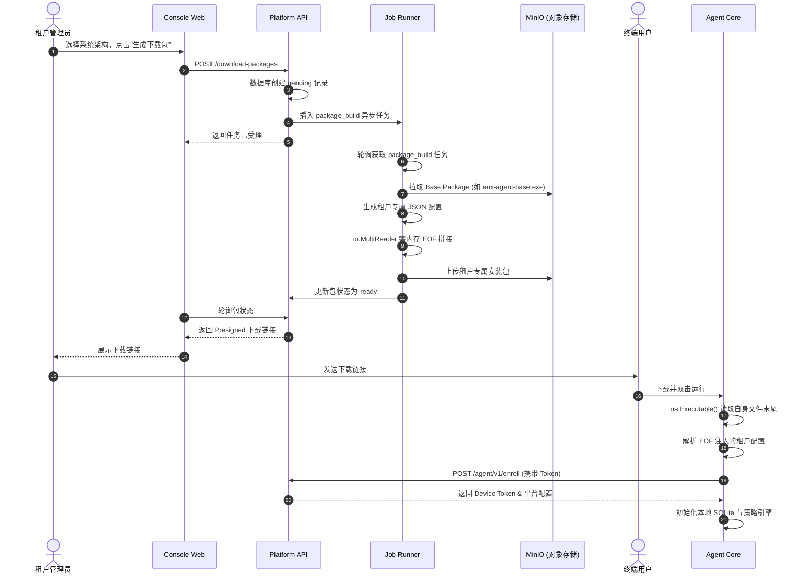
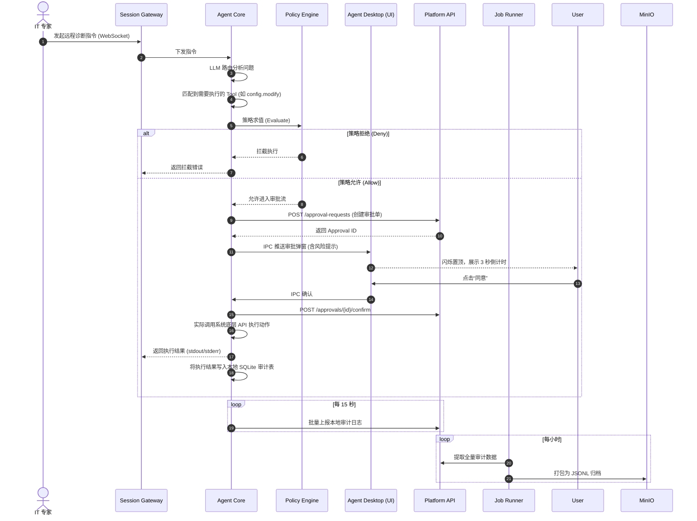

# EnvNexus 技术架构与实现方案

> **文档版本**：v1.0
> **目标读者**：研发架构师、后端工程师、DevOps 团队
> **项目状态**：已完成 MVP 闭环与产品级核心特性

---

## 1. 系统总体架构

EnvNexus 采用现代化的**云边协同（Cloud-Edge）微服务架构**，代码库采用 **Monorepo** 模式管理。系统整体分为三层：云端平台层（Platform）、通信网关层（Integration）和本地终端层（Endpoint）。

### 1.1 架构拓扑图

```text
[ Admin Browser ]
       | (HTTPS)
       v
+---------------------------------------------------+
|               Console Web (Next.js)               |
+---------------------------------------------------+
       | (REST API)
       v
+---------------------------------------------------+
|               Platform API (Go/Gin)               | <--- [ Webhooks / 3rd Party ]
|  - Auth & RBAC                                    |
|  - Tenant & Profile Management                    |
|  - Device Enrollment                              |
+---------------------------------------------------+
       |                   |                   |
       v                   v                   v
   [ MySQL 8 ]         [ Redis ]           [ MinIO ]
  (Core State)    (Pub/Sub & Cache)   (Artifacts & Audit)
       ^                   ^                   ^
       |                   |                   |
+---------------------------------------------------+
|   Job Runner (Go)   |  Session Gateway (Go/WS)    |
| - Package Build     | - WebSocket Multiplexing    |
| - Audit Flush       | - Event Routing             |
| - Cleanup Tasks     | - Connection Management     |
+---------------------------------------------------+
                               | (WebSocket w/ JWT)
                               v
+---------------------------------------------------+
|               Agent Core (Go)                     |
|  - LLM Router       - Policy Engine               |
|  - Tool Registry    - Diagnosis Engine            |
|  - Local SQLite     - Audit Reporter              |
+---------------------------------------------------+
       ^ (Local HTTP / IPC)
       |
+---------------------------------------------------+
|            Agent Desktop (Electron/React)         |
|  - Chat UI          - Approval Dialogs            |
+---------------------------------------------------+
```

---

## 2. 核心技术栈选型

*   **云端后端**：`Go 1.21+` + `Gin` + `GORM`。选择 Go 是为了满足高并发 WebSocket 网关和低内存占用的微服务需求。
*   **云端前端**：`Next.js` + `React` + `TypeScript` + `TailwindCSS`。
*   **桌面端 UI**：`Electron` + `React`。
*   **桌面端内核**：`Go`。编译为无外部依赖的独立二进制文件，便于跨平台分发和执行底层系统命令。
*   **基础设施**：
    *   `MySQL 8.0`：主业务数据库。
    *   `Redis 7.0`：会话状态维持、跨实例 Pub/Sub 事件路由、限流。
    *   `MinIO`：S3 兼容的对象存储，用于存放客户端安装包、诊断日志和离线审计归档。

---

## 3. 核心子系统设计

### 3.1 Platform API (平台核心服务)
*   **架构模式**：严格遵循 **DDD (领域驱动设计)** 架构（`domain` -> `repository` -> `service` -> `handler`）。
*   **安全机制**：
    *   基于 JWT 的三级令牌体系：User Token（管理员）、Device Token（设备身份）、Session Token（单次诊断会话）。
    *   基于中间件的 RBAC（Role-Based Access Control）五级权限控制。
*   **职责**：处理所有 CRUD 操作，管理 Profile（模型/策略），签发下载链接。

### 3.2 Session Gateway (会话网关)
*   **职责**：维持与海量 Agent 的 WebSocket 长连接。
*   **高可用设计**：无状态设计。Agent 连接到任意网关节点后，网关通过 Redis Pub/Sub 订阅该设备的专属 Channel。当 Platform API 需要向设备下发指令时，将消息推送到 Redis，由持有该连接的网关节点负责转发。

### 3.3 Job Runner (异步任务调度)
*   **职责**：处理耗时任务，解耦核心 API。
*   **并发控制**：基于 MySQL 的 `FOR UPDATE SKIP LOCKED` 实现轻量级、无死锁的分布式任务抢占。
*   **核心 Worker**：
    *   `package_build`：处理客户端分发包的流式注入。
    *   `audit_flush`：将高频的审计事件批量打包写入 MinIO。
    *   `approval_expiry`：清理超时的审批请求。

### 3.4 Agent Core (本地执行内核)
*   **工具注册表 (Tool Registry)**：所有系统操作（如读文件、查进程、改配置）被抽象为独立的 Tool。每个 Tool 必须显式声明其是否为 `ReadOnly`。
*   **LLM 路由 (LLM Router)**：内置对 OpenAI, Anthropic, DeepSeek, Ollama 等多家大模型 API 的标准化适配，支持断网时回退到本地 Ollama 模型。
*   **策略引擎 (Policy Engine)**：在执行任何非 ReadOnly 工具前，必须经过本地策略求值。如果命中 Deny 规则，直接在内核层拦截，不予执行。

---

## 4. 关键技术实现细节与交互时序

### 4.1 零编译流式注入分发 (EOF Injection)
为了解决 SaaS 平台为每个租户打包专属客户端导致 CI 资源耗尽的问题，系统实现了产品级的 **EOF 二进制注入分发**。
1.  **预置基础包**：CI 仅编译一次不含租户信息的 `enx-agent-base.exe` 并存入 MinIO。
2.  **零内存流式拼接**：当用户请求下载时，`Job Runner` 使用 Go 的 `io.MultiReader`，将 MinIO 中的基础包下载流与内存中动态生成的租户 JSON 配置流（带有 `ENX_CONF_START:` 魔数）无缝拼接，直接上传为租户专属包。全程**零内存拷贝，耗时毫秒级**。
3.  **客户端自解析**：Agent 启动时，调用 `os.Executable()` 读取自身文件末尾 4KB，解析出 JSON，实现免填参数的静默激活。

**分发与激活时序图：**


### 4.2 诊断与审批状态机
每一次环境修复都必须经历严格的状态流转，由 `Platform API` 维护全局状态机：
`Pending_User` (等待用户同意) -> `Approved` (已同意) -> `Executing` (执行中) -> `Completed` / `Failed`。
Agent Core 只有在轮询/接收到状态变为 `Approved` 后，才被允许调用底层 OS API 执行写入动作。

**诊断与审批执行时序图：**


### 4.3 离线与降级容灾
*   **审计回退**：当 MinIO 宕机时，`Job Runner` 的 `audit_flush` worker 会自动降级，将审计日志写入本地文件系统（FS Fallback），确保合规数据不丢失。
*   **Agent 离线模式**：当 Agent 无法连接云端时，会自动切换到 Offline 模式。此时仅开放只读工具，允许用户通过本地 UI 导出加密的诊断包（Diagnostic Bundle），通过 U 盘等物理媒介转移给专家分析。

---

## 5. 数据模型设计 (核心 Schema)

系统包含 13 张基础表与 12 张扩展表。核心表关系如下：
*   `tenants` (租户) 1:N `devices` (设备)
*   `devices` 1:N `sessions` (诊断会话)
*   `sessions` 1:N `tool_invocations` (工具调用记录)
*   `tool_invocations` 1:1 `approval_requests` (审批请求，仅针对高危操作)
*   `audit_events` (全局审计日志，Append-Only，定期归档到 MinIO)

---

## 6. 部署与运维规范

*   **开发与测试环境**：提供 `docker-compose.yml`，一键拉起 MySQL, Redis, MinIO 及所有 Go 微服务。
*   **生产环境 (私有化交付)**：提供标准 Kubernetes Helm Chart。
    *   支持 `Ingress` 暴露 Web 与 WebSocket 端口。
    *   支持 `Secrets` 注入敏感环境变量（如 JWT Secret, DB 密码）。
    *   通过 `PodDisruptionBudget (PDB)` 保证网关服务的高可用性。